[title]: # (Google Cloud Platform Discovery and Service Accounts)
[tags]: #	(GCP, discovery, service account, google cloud platform)
[priority]: # (1000)
[display]: # (all)

# Google Cloud Platform Discovery and Service Accounts

## Overview

Secret Server can manage Google Cloud Platform (GCP) service accounts and VM instances. This feature allows users to run discovery to pull and manage VM Instances, as well as import and manage GCP service accounts.

## Configuration

### Task 1: Creating GCP Service Accounts

These are special accounts created in GCP to make authorized API calls for Compute Engine and other GCP applications.

> **Note:** See [GCP Service Accounts](https://cloud.google.com/iam/docs/service-accounts) for more information.

Secret Server uses the GCP service account to make authorized API calls to GCP to pull projects, zones, instances, service accounts and service account keys.

To create the service account:

1. Click the **IAM & Admin** dropdown list in the left menu in GCP and select **Service Accounts**. A list of service accounts appears.

3. Click the **+ Create Service Account** button. The "Service account details" page of the Create Service Account wizard appears:

   

3. Type the service account name in the **Service Account Name** text box.

3. Start to type the service account ID name and select the service account in the **Service Account Name** text/list box.

3. Click the **Create** button. The "Grant this service account access to project (optional)" page appears:

   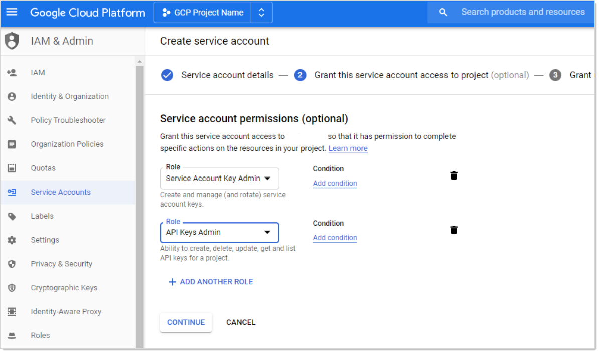

3. Click the **Role** list box and select **Service Account Key Admin**.

3. Click the **+ Add Role** button to add another role.

3. Click the new **Role** list box and select **API Keys Admin roles**.

3. Click the **Continue** button.  The "Grant users access to this service account (optional)" page appears:

   

3. Click the **+ Create Key** button in the **Keys** section. The "Create key (optional)" popup appears:

   

3. Click to select the **JSON** selection button.

3. Click the **Create** button.  This creates and downloads a JSON private key file. A confirmation popup appears:

   

3. Click the **Close** button in the bottom right. The service account is created, and its JSON private key is on your computer.

> **Note:** Note where you downloaded the file. You will need it later in this instruction.

> **Note:** For more information on this process, see [Creating and managing service accounts](https://cloud.google.com/iam/docs/creating-managing-service-accounts#creating) on the GCP website.

### Task 2: Setting GCP Permissions

GCP permissions are IAM permissions from the IAM & Admin section of GCP. Without the proper permissions, GCP discovery, RPC, and heartbeat may not function properly.

For the service accounts to have access to a project, you must add the service account IAM permissions in each Project. If you did not add the permissions when you created the service account, you need to add the IAM permissions in the project they were created in as well.

#### Discovery

To run discovery in Secret Server, the GCP service account needs the "project viewer" read only permission, which can list projects, zones, service accounts, and instances.

To add the permission In GCP:

1. Click the **IAM & Admin** dropdown list in the left menu in GCP and select **IAM**. The "Permissions for project…" page appears.

1. Click the **Add** button. The "Add member to…" page appears.

1. Type the service account email address in the **Members** text box.

1. Click the **Roles** dropdown list to select **Project \> Viewer** (you can also type it).

1. Click the **Add** button. The new member appears in the table on the "Permissions for project…" page.

#### RPC/Heartbeat

To run RPC/Heartbeat in Secret Server, the service account needs the "service account key admin" permission, which can create, delete, and rotate service account keys.

To add the permission In GCP:

1. Click the **IAM & Admin** dropdown list in the left menu in GCP and select **IAM**. The "Permissions for project…" page appears.

1. Click the **Add** button. The "Add member to…" page appears.

1. Type the service account email address in the **Members** text box.

1. Click the **Roles** dropdown list to select **Service Account Key Admin** (you can also type it).

1. Click the **Add** button. The new member appears in the table on the "Permissions for project…" page.

### Task 3: Creating a GCP IAM Service-Account Secret

Secret Server now has a build in GCP IAM Service Account Key template.

> **Note:** To create a Secret using GCP IAM service account key template, you must have the service account’s JSON private key file from GCP (created earlier).

Create a new secret (see [Creating Secrets](../../secret-management/procedures/creating-secrets/index.md) for details):

1. Click the **+** on the **Secrets** item on the main menu. The "Create New Secret" page appears:

   

1. Select **Google IAM Service Account Key** as the template. Another "Create New Secret" page, tailored to GCP, appears:

   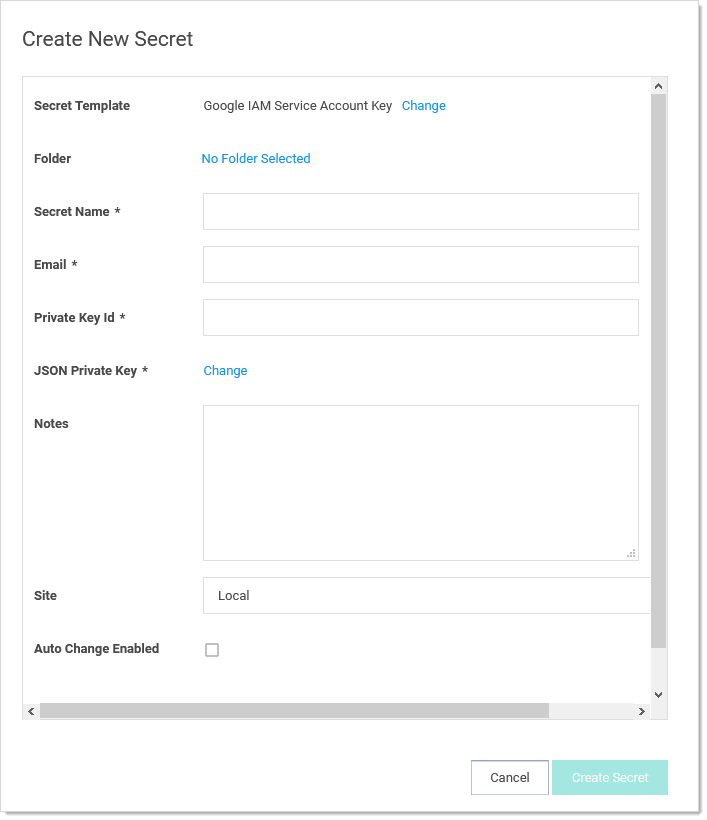

1. Click to select a folder for the new secret.

1. Type the secret's name in the **Secret Name** text box.

1. Type the service account email address (use client_email from the JSON private key file) in the **Email** text box.

1. Type the private key ID (use private_key_id from the JSON private key file) in the **Private Key ID** text box.

1. Click the **Change** button to upload the JSON private key file you created earlier.

1. Click the **Create Secret** button.

### Task 4: Creating an RPC/Heartbeat Password Changer

Secret Server can check if a service Account key is valid and can rotate the Service Account key. This should work the same as any other RPC or Heartbeat. **Note:** RPC and Heartbeat must be enabled

RPC/Heartbeat can be tested from the Password Changers page

1. In SS, go to **Admin \> Remote Password Changing**:

   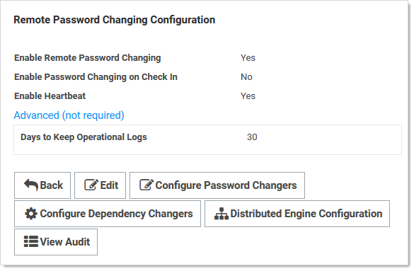

1. Click the Configure Password Changers button. The Password Changers Configuration page appears:

   

1. Click the **Google IAM Service Account Key** link. The "Google IAM Service Account Key" page appears:

   

1. Test the heartbeat: Click the **Test Action** button in the **Verify Password Changed Commands** section. The Test Action popup appears:

   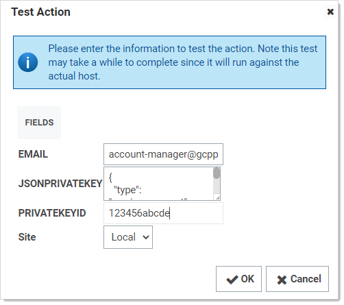

1. Ensure that the **JSONPRIVATEKEY** text box is populated. The others are optional.

1. Click the **OK** button. The popup goes away. If successful, this appears on the previous page:

   

1. Test RPC: Click the **Test Action** button in the **Password Change Commands** section. The Test Action popup appears:

   

1. Ensure that the **JSONPRIVATEKEY** and **Email** text boxes are populated. The others are optional.

1. Click the **OK** button. The popup goes away. If successful, this appears on the previous page:

   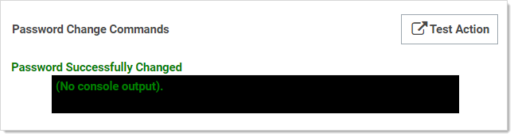

1. Test RPC with admin credentials: Click the **Test Action** button in the **Password Change By Admin Credentials Commands** section. The Test Action popup appears:

   

1. Ensure that all text boxes are populated except  **JSONPRIVATEKEY**, **Admin Email**, and **Admin PRIVATEKEYID**, which are optional.

1. Click the **OK** button. The popup goes away. If successful, this appears on the previous page:

   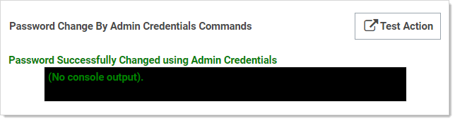

### Task 5: Creating a GCP Discovery Source

Secret Server now has a built-in GCP discovery source wizard that creates the scanners to pull the projects, zones, service accounts. To create a GCP discovery source:

1. In SS, go to **Admin \> Discovery**:

   

1. Click the **Create Discovery Source** dropdown list and select **GCP (Google Platform)**. The GCP Discovery Source wizard Overview page appears:

   

1. Click the **Next** button. The Discovery Source Name page appears:

   

1. Type the name of the GCP discovery source in the **Discovery Source Name** text box.

1. Click the **Next** button. The Site page appears:

   

1. Click the **Add Site** list box to select the site.

1. Click the **Next** button. GCP Service Account Scanner page appears:

   

1. Click the **Next** button.

   

1. Click to select the **Scan GCP Instances** check box.

1. Click the check boxes for the scanners you desire. Currently, there are four discovery scanners for the GCP discovery source.

   > **Note:** In the future, we may add an Instance Local Account and a Service Account Dependency scanner.

   - **GCP Project Scanner**: This is a host range scanner that scans the GCP and pulls all of the projects that the provided GCP service account secret has access to.

   - **GCP Windows Instance Scanner**: This is a machine scanner that scans each project and pulls all of the GCP Windows OS VM instances.

   - **GCP (Non-Windows) Instance Scanner**: This is a machine scanner that scans each project and pulls all of the GCP Non-Windows OS VM instances.

   - **GCP Service Account Scanner**: This is an account scanner that scans each project and pull all of the GCP Service accounts.

1. Click the **Next** button. The Credential Secrets page appears:

   

1. Click the **Add Secret** link. The Select a Secret popup appears:

   

1. Navigate the folder tree and select the secret you created earlier. As soon as you select the check box, the popup disappears and the secret appears under the Add Secret link.

1. Click the **Finish** button.

## Viewing Discovery Scanners for the GCP Discovery Source

To view these scanners:

1. In SS, go to **Admin \> Discovery**:

1. Go to **Admin \> Discovery**.

1. Click the discovery source name link in the table. The Discovery Source page for it appears.

1. Click the **Scanner Settings** button in the top right of the page. The Discovery Source Scanner Settings page appears, which lists the scanners.

## Instance Custom Filter

This option is only available for the instance scanners. The Custom Filter Setting can be used to include or exclude instances using a filter expression on the name, label, or any other field allowed by GCP. The filter must:

- Be a string, number, or Boolean value

- Use these comparison operators: =, \!=, \>, or \<

- Use parentheses ( ) around each filter

- Combine different filters using AND or OR (all caps). For example: `(name="instanceName") AND (labels.key="value")`

> **Note:** See [Method: instances.aggregatedList](https://cloud.google.com/compute/docs/reference/rest/v1/instances/aggregatedList#query-parameters) for more on filtering instances.

Other useful filters:

Status:

`status=”StatusValue”`

`StatusValue` can be `Running` or `Terminated`

Zone:

`zone=https://www.googleapis.com/compute/v1/projects/{ProjectName}/zones/{ZoneName}`

> **Note:** Unfortunately, at this time of this topic, Google has an [open issue](https://issuetracker.google.com/issues/143463446) of the tag filter not working.

## Importing Service Accounts

From the Discovery Network View, Secret Server can import Service Account keys and automatically take over the account. This import process will create a new Secret for the Service Account key, delete the associated key, create a new key, and save the json private key file with the Secret, so this can be easily managed by Secret Server.

To Import a Service Account

1. Go to **Admin \> Discovery**.

1. Click the **Discovery Network View** button. The Discovery Network View page appears.

1. Select the **Domain\Cloud Account** tab

1. Click to select the Service Account(s) to import in the unlabeled Domain/Cloud tree on the left.

1. Click the **Import** button. The importation wizard begins:

   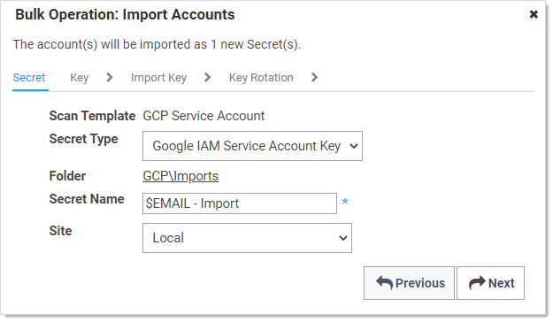

1. For secrets:

   1. Click the **Secret Type** dropdown list and select **Google IAM Service Account Key**.
   1. Click the link after **Folder** to select a folder.
   1. Type a name in the **Secret Name** text box (It auto fills `$EMAIL`).
   1. Click the Site dropdown list to select a site.

1. Click the **Next** button. The Key page appears:

   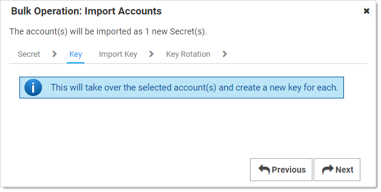

1. When importing GCP service account keys, the only option is take over the account. Meaning, SS triggers a remote password change on import to rotate the imported key and obtain a new JSON private key file. With the JSON private key file, SS can then manage the GCP service account.

1. Click the **Next** button. The Import Key page appears:

   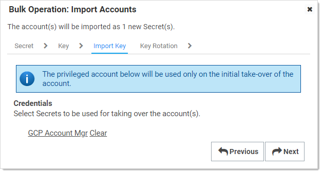

1. Click the link to select a secret to use for the initial take over of the account.

1. Click the **Next** button. The Key Rotation page appears:

    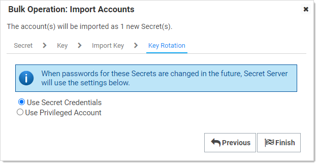

1. For key rotation, click one of two selection button options to choose a secret for future key rotations. Either option would need the permissions mentioned above. When the password for the chosen secret are changed in the future, SS will use one of these two options:

   - **Use Secret Credentials**: Use the imported service account to rotate itself, and it has permissions to rotate keys.

   - **Use Privileged Account**: Use another service account that has permissions to rotate keys

1. Click the **Finish** button.

## GCP APIs

### Overview

To make API calls to GCP, you need to enable the following APIs to use GCP discovery in SS. More information can be found on the [GCP Getting Started](https://cloud.google.com/apis/docs/getting-started) page. The APIs are:

- **Cloud Resource Manager API**: Used for managing GCP resource containers, such as Projects.

- **Compute Engine API**: Used for managing GCP instances (virtual machines).

- **Identity and Access Management (IAM) API**: Used for managing identity and access control for GCP resources, such as service accounts.

### Enabling GCP APIs

In GCP:

1. In GCP, click the **APIs & Services** menu item and select **Library**. The Library page appears.

2. Type the name of the API in the Search text box and press **\<Enter\>**. Matching APIs appear:

   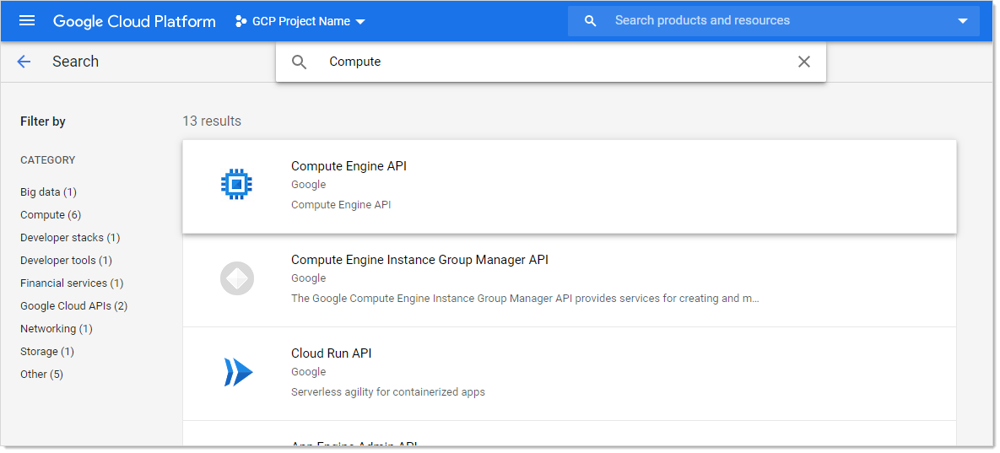

4. Click the button for the desired API. That API's page appears:

   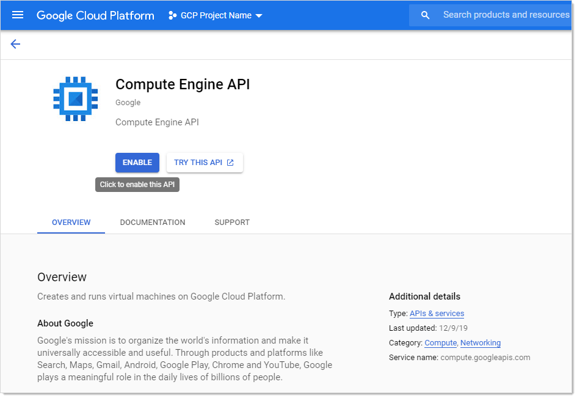

4. Click the **Enable** button.

## Errors and Solutions

### Create Keys Failed: Access Denied

#### Error

`Create Keys Failed: AccessDenied, Google.Apis.Requests.RequestError Permission iam.serviceAccountKeys.create is required to perform this operation on service account projects/-/serviceAccounts/discovery-me@gcpprojectname.iam.gserviceaccount.com. [403] Errors [ Message[Permission iam.serviceAccountKeys.create is required to perform this operation on service account projects/-/serviceAccounts/discovery-me@gcpprojectname.iam.gserviceaccount.com.] Location[ - ] Reason[forbidden] Domain[global] ]`

#### Likely Cause

The service account used to rotate the key does not have necessary permission to perform this task.

#### Solution

1. Go to the GCP console.

1. Select **IAM \> Permissions**.

1. Select the service account.

1. Add the **Service Account Key Admin** permission.

1. Once the service account has permission:
   1. In SS, select the secret to rotate.
   1. Stop the current rotation.
   1. Try the operation again.

### Create Keys Failed: Maximum Number of Keys on Account Reached

#### Error

`Create Keys Failed: ArgumentError, Google.Apis.Requests.RequestError  Maximum number of keys on account reached. [429] Errors [  Message[Maximum number of keys on account reached.] Location[ - ]  Reason[rateLimitExceeded] Domain[global] ]`

#### Likely Cause

The rotated service account has reached the maximum number of keys allowed. GCP maximum is 10 keys.

#### Solution

1. Go to the GCP console.

1. Select **IAM \> Permissions**.

1. Remove the unused keys.

1. Once the service account has less than 10 keys, in SS:
   1. In SS, select the secret to rotate.
   1. Stop the current rotation.
   1. Try the operation again.

### Discovery Consumer: Syncing OUs Failed

#### Error

`DiscoveryConsumer: Synchronizing Organizational Units failed for [Our Google Cloud]! Error: An issue was encountered during the scan. Google.Apis.Requests.RequestError Access Not Configured. Compute Engine API has not been used in project 123456 before or it is disabled. Enable it by visiting https://console.developers.google.com/apis/api/compute.googleapis.com/overview?project=123456 then retry. If you enabled this API recently, wait a few minutes for the action to propagate to our systems and retry. [403] Errors [ Message[Access Not Configured. Compute Engine API has not been used in project 123456 before or it is disabled. Enable it by visiting https://console.developers.google.com/apis/api/compute.googleapis.com/overview?project=123456 then retry. If you enabled this API recently, wait a few minutes for the action to propagate to our systems and retry.] Location[ - ] Reason[accessNotConfigured] Domain[usageLimits] ] , -2146233088`

#### Likely Cause

The discovery service account used for has access to a GCP project that has not been set up or is disabled.

#### Solution

1. Go to GCP console.

1. Go to  **Compute Engine \> VM Instances**.

1. Set up the compute engine

> **Note:** This requires billing information.

### Discovery Consumer: Syncing Machines Failed

#### Error

`DiscoveryConsumer: Synchronizing Machines failed for [GCP Discovery Source]! Error: An issue was encountered during the scan. Google.Apis.Requests.RequestError Invalid value for field 'filter': 'filtername="value"'. Invalid list filter expression. [400] Errors [ Message[Invalid value for field 'filter': 'filtername="value"'. Invalid list filter expression.] Location[ - ] Reason[invalid] Domain[global] ] , -2146233088 Exception Caught: Google.Apis.Requests.RequestError Invalid value for field 'filter': 'filtername="value"'. Invalid list filter expression. [400] Errors [ Message[Invalid value for field 'filter': 'filtername="value"'. Invalid list filter expression.] Location[ - ] Reason[invalid] Domain[global] ] Attempting GCP scan for Instances Parameters are valid. Checking for permissions to list Projects.. Has permissions to list Projects.. Starting scan..`

#### Likely Cause

The instance scanner custom filter is not valid.

#### Solution

1. In SS, go to the GCP discovery source.

1. Edit the instance scanner.

1. Update the "custom filter" setting.

> **Note:** See [Method: instances.aggregatedList](https://cloud.google.com/compute/docs/reference/rest/v1/instances/aggregatedList#query-parameters) for more on filtering instances.

### Discovery Consumer: Machine Scan Completed but Computers Failed Authentication

#### Error

`DiscoveryConsumer: Synchronizing Machines failed for [GCP Discovery Source]! Error: An issue was encountered during the scan. Google.Apis.Requests.RequestError Invalid value for field 'filter': 'filtername="value"'. Invalid list filter expression. [400] Errors [ Message[Invalid value for field 'filter': 'filtername="value"'. Invalid list filter expression.] Location[ - ] Reason[invalid] Domain[global] ] , -2146233088 Exception Caught: Google.Apis.Requests.RequestError Invalid value for field 'filter': 'filtername="value"'. Invalid list filter expression. [400] Errors [ Message[Invalid value for field 'filter': 'filtername="value"'. Invalid list filter expression.] Location[ - ] Reason[invalid] Domain[global] ] Attempting GCP scan for Instances Parameters are valid. Checking for permissions to list Projects.. Has permissions to list Projects.. Starting scan..`

#### Likely Cause

The instance scanner custom filter is not valid.

#### Solution

1. In SS, go to the GCP discovery source.

1. Edit the instance scanner.

1. Update the "custom filter" setting.

> **Note:** See [Method: instances.aggregatedList](https://cloud.google.com/compute/docs/reference/rest/v1/instances/aggregatedList#query-parameters) for more on filtering instances.

### Invalid Grant: Account Not Found

####  Error

`An issue was encountered during the scan. Error:"invalid_grant", Description:"Invalid grant: account not found", Uri:"", -2146233088`

#### Likely Cause

The service account does not exist in GCP. There may be a typo or it was deleted.

#### Solution

1. Go to GCP console.

1. Create a service account to use. See [Task 1: Creating GCP Service Accounts](#Task-1:-Creating-GCP-Service-Accounts).

### Request Error: Caller Does Not Have Permission

#### Error

`An issue was encountered during the scan. Google.Apis.Requests.RequestError The caller does not have permission [403] Errors [Message[The caller does not have permission] Location[ - ] Reason[forbidden] Domain[global]], -2146233088`

#### Likely Cause

The service account does not have permissions in IAM.

#### Solution

1. Go to GCP console.

1. Select IAM.

1. Click the **Service Account** menu item to create a service account with the desire permissions. See [Task 1: Creating GCP Service Accounts](#Task-1:-Creating-GCP-Service-Accounts) and [Task 2: Setting GCP Permissions](#Task-2:-Setting-GCP Permissions).

