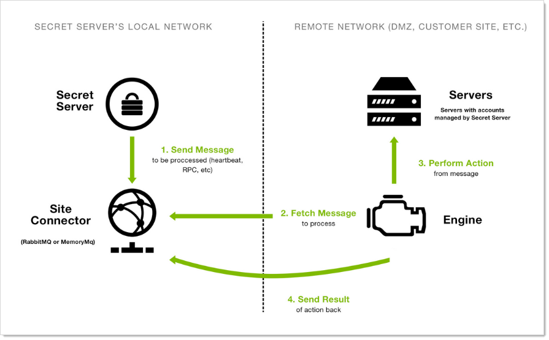

[title]: # (Distributed Engines)
[tags]: # (Distributed Engines)
[priority]: # (1000)

# Distributed Engines

> **Note:** Please click the table of contents on the left to see any sub-pages to this one. Click the table of contents on the right to see headings on this page.

## Overview

Out of the box, SS performs all functions from the Web server it is installed on; however, specific features can be routed through a distributed engine for enhanced performance. For example, synchronize and authenticate AD users can be done in SS via your local site or from a distributed engine (DE).

You can install a DE in a remote site and allow it to operate many functions. Communication with Secret Server Cloud also requires the distributed engine to be installed.

## Architecture and Workflow

### Main Components

DEs support heartbeat, Remote Password Changing (RPC), and discovery. A DE is composed of site connectors, sites, and engines:

- An **engine** is a Windows service that does the actual work, such as password changing, heartbeat, Discovery, and more. Each engine belongs to a site.
- A **site** can be thought of as a bucket of work items for a particular network area. Each engine is assigned to a single site, but each site can include multiple engines, significantly increasing throughput.
- A **site connector** is a Windows service that holds the work items for a number of sites. The site connector can be either [RabbitMQ](https://www.rabbitmq.com/) or MemoryMQ (a built-in service developed by Thycotic). Each site can only be assigned to a single site connector, but you can have multiple site connectors running on separate machines, each storing work items for multiple sites. Those sites, in turn, distribute the work items among multiple engines. The ability to add new Site Connectors, Sites, and Engines as needed makes Distributed Engine a highly-scalable solution.

> **Note:** For the highest scalability and reliability, Thycotic recommends using RabbitMQ. MemoryMQ is an easier but less capable alternative for customers who do not need many engines or sites.

**Figure:** Distributed Engine Components

> **Note:** The above diagram is a simplified, conceptual one, not a network diagram. It does not show a callback port from the DE to SS. DEs require either an HTTPS or TCP port to communicate with SS for initial activation, updates, and continuous periodic check of site and site connector settings.

### Ports

DEs have two configurable ports: one for connecting to the site connector, and one for the engine to retrieve configuration information from SS at regular intervals. The callback port from an engine to SS can be configured to contact the website directly over HTTP, HTTPS, or TCP. HTTP and HTTPS connections use the existing IIS port bindings. All connections are outbound—no inbound connections are made from SS or the site connectors to the remote networks.

> **Note**: If using Secret Server Cloud, port 9354 must also be opened for outbound messages.

Default ports:

- RabbitMQ: 5672 (non-SSL), 5671 (SSL)
- MemoryMQ: 8672 (non-SSL), 8671 (SSL)
- Secret Server: existing IP address bindings or custom port over TCP. We reserve one port for legacy upgrades, usually port 9999.
- Secret Server Cloud:
    - 443 (Web sockets—the default)
    - 5671 and 5672 (AMQP)

    >**Note:** These ports are used for outbound traffic for engines to communicate with SSC instances. They are set by the "Azure ServiceBus Transport Type" global engine setting.

### Security

 Distributed engines have multiple security layers:

- Engines must be approved within SS before they will be given access to a site.
- Work items are encrypted with a site-specific symmetric key prior to sending them to the site connector.
- Communication to the site connector supports SSL and TLS.
- Direct communication from engine to SS uses a public-private key exchange.
- The engine configuration file is DPAPI encrypted.

For more information about DE security, see the [Distributed Engine Security Guide](https://updates.thycotic.net/secretserver/documents/SS_Sec_DistributedEngine.pdf).

### Engine Workflow

When an engine Windows service starts, the following steps occur:

1. The service contacts SS directly using the engine callback port.

1. The service receives configuration information for the site connector to connect to and what site to process work items for.

1. The service connects to the site connector and registers with the site for work item processing.

1. The service fetches a work item from the site.

1. The service processes the work item.

1. The service gives the site the result of the processing, such as heartbeat success or discovery results.

1. The service fetches another work item, and the process continues.

## Configuring Distributed Engines

Below is a summary of the steps required to configure DEs:

1. Enable the DE and specify the engine callback settings.

1. Configure and Install the site connector.

   - If you plan to use RabbitMQ (recommended), follow the instructions [here](https://thycotic.force.com/support/s/article/How-to-install-RabbitMq). You can find general information on using RabbitMQ Helper to install RabbitMQ can be found in [Thycotic’s GitHub Repository](https://thycotic.github.io/rabbitmq-helper/)

   - If you plan to use MemoryMQ, create the site connector record within SS then click the **Download Site Connector Installer** button to get the MSI. Run the MSI on the desired host.

1. Setup sites.

1. Install engines.

1. Assign secrets to sites. Secrets can be assigned to a site through their Remote Password Changing tab or via a bulk operation on the SS dashboard. Once assigned to a site, all heartbeat or password changing operations take place through that site.

1. Assign discovery sources to sites. To run discovery through a site, edit the discovery source and assign     the site. Once assigned, all discovery operations for that discovery source take place through that site.

## FAQ

**What happens if SS sends work items to the site connector, but no engines are running to consume them?**

Work items continue to build up in the site connector until a limit is reached. Heartbeat work items have a Time To Live (TTL) of 5 minutes, Password Changing work items have a TTL of 20 minutes. Expired work items are thrown away and will not be processed. Once a heartbeat or password changing work item is sent to the site connector, SS will not send the same work item to the queue until 5 minutes after the TTL is up (10 and 25 minutes for heartbeat and password changing, respectively). This prevents multiple pending heartbeat or password changing work items for the same secret at the same time.

**How many Sites can a Site Connector hold?**

MemoryMQ supports up to 100. RabbitMQ supports up to 200.

**Can I cluster Site Connectors?**

RabbitMQ supports clustering, MemoryMQ does not.

**Can I use both RabbitMQ and MemoryMQ?**

Yes. You can have as many site connectors, of either type, installed as needed. Note that while you can have both RabbitMQ and MemoryMQ installed on a single machine, you cannot have two RabbitMQ instances or two MemoryMQ instances on the same machine.

 **Can I convert a site connector from MemoryMQ to RabbitMQ or vice versa?**

Yes. You can install the new site connector, swap the sites over to the new service, and then decommission the old site connector.
