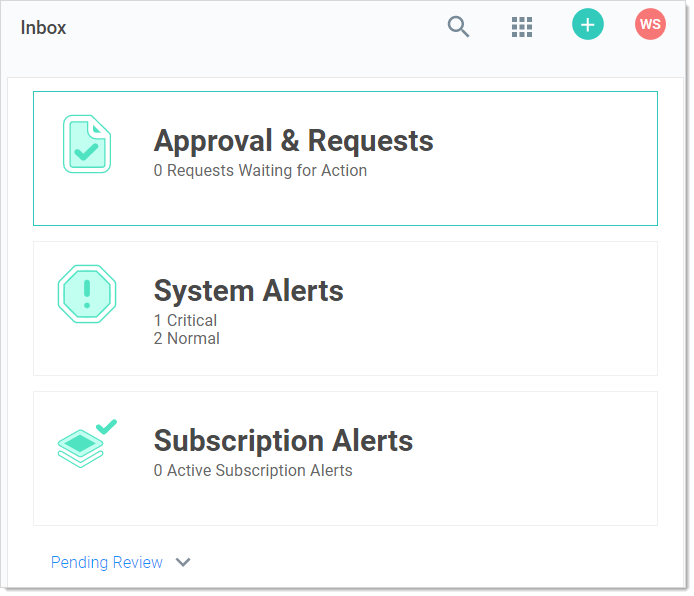
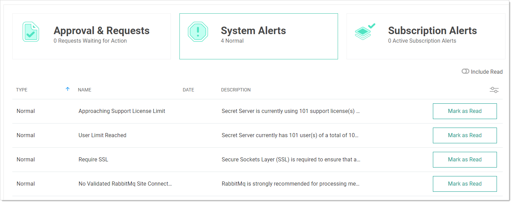

[title]: # (Alert Notification Center)
[tags]: # (Alert, Inbox)
[priority]: #

# Alert Notification Center (Inbox)

The _Alert Notification Center_ page shows event subscriptions, access requests, and other configuration alerts in a single interface. You can access the alert notification center by clicking the **Inbox** button on the main menu.

Event subscriptions disappear from the notification center after you view them. System alerts and access requests stay active until resolved.

## Marking Alerts as Viewed

1. Access the alert notification center by clicking the **Inbox** button on the main menu. The Inbox appears:

   

1. Click the **System Alerts** button. The System Alerts page appears:

   

1. Click the **Mark as Read** button for the each alert you no longer wish to view. The alert disappears, but you can still see it if you click the **Include Read** toggle button.
