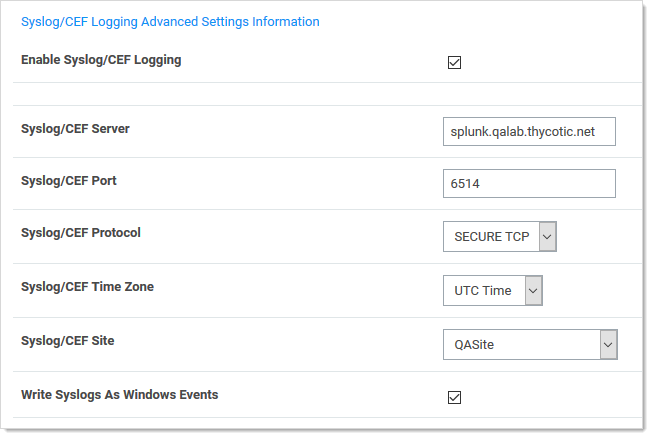
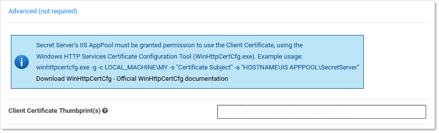

[title]: # (Secure Syslog/CEF Logging)
[tags]: # (Events, Alerts, syslog, CEF)
[priority]: # (1000)

# Secure Syslog/CEF Logging

## Overview

Secret Server can send a copy of important log messages to an external syslog server for added security using the following protocols:

> **Note:** Common Event Format (CEF) is an industry-standard format on top of syslog messages that ensures event  interoperability between different platforms.

**Table:** Syslog Transportation Protocols

| **Protocol** | **Encrypted** | **Notes** |
| ------------ | ------------- | ------------------------------------------------------------ |
| UDP | No | Least reliable. User Datagram Protocol (UDP) traffic is fire-and-forget with no assurance messages are delivered and no error checking. |
| TCP | No | More reliable. Transmission Control Protocol (TCP) ensures messages arrive in order, missing messages are resent, and has built in error checking. |
| Secure TCP | Yes | Establishes a secure connection — Transport Layer Security (TLS) 1.1 or 1.2 only. Syslog Server’s certificate is validated by Windows to ensure it is trusted and not revoked. Can be used with or without client certificates (configured in **Configuration \> Security tab \> TLS Auditing \> Advanced**). |

Due to the sensitive nature of SS logs, we strongly recommend using Secure TCP.

## Configuring a Secure TCP Syslog/CEF External Audit Server in Secret Server

### Compatible Audit Servers 

- syslog-ng
- Any Audit server that accepts TLS encrypted messages using the BSD syslog protocol

### Configuring an External Audit Server

1. Navigate to **Admin** > **Configuration**.

1. Click the **General** tab.

1. Click the **Edit** button at the bottom of the page.

1. Go to the **Application Settings** section.

1. Click to select the **Enable Syslog/CEF Logging** check box. A syslog/CEF section appears:
   
   
   
   > **Note**: syslog/CEF may require an additional license key. To install licenses, navigate to **Admin** > **Licenses** > **Install New License**. Once installed, the license requires activation. Contact your Thycotic Sales Representative with any questions. 
   
1. Type IP address or name for the IIS server hosting the syslog/CEF server in  the **Syslog/CEF Server** text box.

1. Type the port number where the logging information will be passed (6514 is the default port for secure TCP syslog) in the **Syslog/CEF Port** text box.
   
   > **Note**: SS requires outbound access to this server and port so communication can pass freely. 
   
1. Click the **Syslog/CEF Protocol** dropdown list and select **Secure TCP**. Secure TCP means either TLS v1.2 or v1.1  because other versions of SSL, such as SSL v3 and TLS v1.0, have known weaknesses.

1. Click to select **Syslog/CEF Time Zone** list box to **UTC Time** or **Server Time**, depending on your preference.

1. Click the **Save** button.

## Caching Syslog Audits

If the connection between the external syslog server and SS breaks once secure syslog logging is enabled in SS, syslog failure notification messages is cached in the SS database and re-sent at regular intervals until the connection between the syslog server and SS is reestablished.

## Configure Auditing for TLS Connections

To track problems with TLS connections (including whenever the connection fails), enable the TLS certificate chain policy and error auditing in S: 

1. Navigate to **Admin** > **Configuration**.
1. Click the **Security** tab. 
1. Click the **Edit** button at the bottom of the page.
1. Scroll to the **TLS Auditing** section.
1. Ensure the **Apply TLS Certificate Chain Policy and Error Auditing** check box is enabled. If not, you cannot use client certificates.

> **Note:** If secure TCP is used for the syslog/CEF protocol and there are one or more client certificate thumbprints entered, SS checks the local computer’s Web hosting and personal certificate store and uses the first one it finds. 

## Adding Client Certificate Thumbprints

1. Navigate to **Admin** > **Configuration**.

1. Click the **Security** tab. 

1. Click the **Edit** button at the bottom of the page.

1. Scroll to the **TLS Auditing** section.

1. Click the **Advances (not required)** link. A client certificate thumbprint section appears:

   

1. Copy and paste a list of SHA1 SSL certificate thumbprints into the **Client Certificate Thumbprints(s)** text box. Separate each thumbprint (40 characters each) with a semicolon. Up to ten are allowed.

> **Note:** SS's IIS application pool must be granted permission to use the client certificates, using the 
>  Windows HTTP Services Certificate Configuration Tool (WinHttpCertCfg.exe). For example: 
>  `winhttpcertcfg.exe -g -c LOCAL_MACHINE\MY -s "Certificate Subject" -a "HOSTNAME\IIS APPPOOL\SecretServer"` You can view the tool’s at 
>  [Windows HTTP Services Certificate Configuration Tool (WinHttpCertCfg.exe)](https://www.microsoft.com/en-us/download/details.aspx?id=19801) and the documentation at [WinHttpCertCfg.exe, a Certificate Configuration Tool](https://msdn.microsoft.com/en-us/library/windows/desktop/aa384088(v=vs.85).aspx).                                        

## Determining the Status of a Remote Audit Server

 To view the logs for any TLS-Connection related errors, perform the following: 

1. Open the **Microsoft SQL Server Management Studio**.
1. Navigate to your SecretServer database at **\<DB Machine Name\>** > **Databases** > **SecretServer**).
1. Set up a new query.
1. Type and enter `select from tbSecurityAuditLog` to view the events from the TLS audit.

> **Note:** For more detailed troubleshooting reporting, reference the logs on the SS Web server at `C:\inetpub\wwwroot\SecretServer\log`). View the `SS.log`, `SS-BSSR.log` (background scheduler), and `SS-BSWR.log` (background worker) for any errors.

## Compatibility Notes for Client Certificates

### IIS Application Pool Certificate Permissions

SS's IIS application pool must be granted permission to use the client certificates, using the 
 Windows HTTP Services Certificate Configuration Tool (WinHttpCertCfg.exe). 

For example: 
`winhttpcertcfg.exe -g -c LOCAL_MACHINE\MY -s "Certificate Subject" -a "HOSTNAME\IIS APPPOOL\SecretServer"` 

You can download the tool at:

 [Windows HTTP Services Certificate Configuration Tool (WinHttpCertCfg.exe)](https://www.microsoft.com/en-us/download/details.aspx?id=19801) 

You can view the documentation at:

[WinHttpCertCfg.exe, a Certificate Configuration Tool](https://msdn.microsoft.com/en-us/library/windows/desktop/aa384088(v=vs.85).aspx)             

Otherwise, if SS is configured to use a client certificate, and IIS does not have permission, errors like this may appear in the logs:

**TLS Error Detected (Authentication Error connecting to IP:PORT) - The credentials supplied to the package were not recognized.**

If you are using a client certificate, and a syslog-ng logging server, the following message may occasionally appear in the main syslog-NG log file:

**SSL error while reading stream; tls_error='SSL routines:ssl_get_prev_session:session id context uninitialized'**

 On the SS side, this appears:

**TLS Error Detected (Authentication Error connecting to IP:PORT) - Authentication failed because the remote party has closed the transport stream.**

This is caused by Windows trying to cache secure connections when client certificates are used, but because syslog-ng has not configured the OpenSSL “session id context”, OpenSSL displays this error when it tries to resume a previous session. 

SS automatically reconnects and resends any missed messages, so the errors should not have an impact. However, you can disable Window’s secure connection caching by adding the [ClientCacheTime](https://docs.microsoft.com/en-us/windows-server/security/tls/tls-registry-settings) setting set to 0 in the Registry and then rebooting. This did not cause any significant performance impact in internal testing.

> **Note**: If changing back to a previous syslog IP address and port, you will receive a closed connection TLS error on the first attempted syslog connection after making the change. A subsequent call will succeed as the first failure will clear the cached connection on Windows. This is due to the issue with syslog-ng.

> **Note**: If syslog-ng configures their OpenSSL session id context, this error message correction is no longer needed.

### AlienVault

It is common for people to incorrectly use the client certificate thumbprints feature when setting up secure AlienVault for syslog. This can cause SS to try to connect to LDAPS with the AlienVault certificate, which can break LDAPS. Users should not use the SS client certificates thumbprint for specifying one certificate for syslog and another for LDAP. The certificate list is intended for each SS or DE to have its own, unique certificate.

 