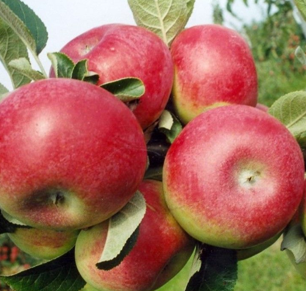

[title]: # (Macintosh Apple)
[tags]: # (folder structure)
[priority]: # (205)
# Macintosh Apple

The McIntosh, McIntosh Red, or colloquially the Mac, is an apple cultivar, the national apple of Canada. The fruit has red and green skin, a tart flavour, and tender white flesh, which ripens in late September.

