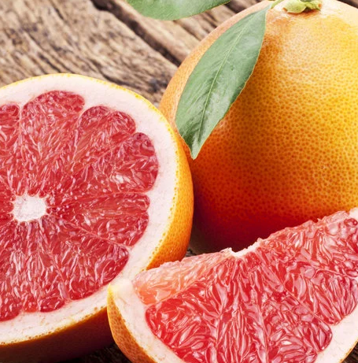

[title]: # (Star Ruby)
[tags]: # (folder structure)
[priority]: # (5)
# Star Ruby

The Star Ruby is the darkest of the red varieties. Developed from an irradiated Hudson grapefruit,[19] it has found limited commercial success because it is more difficult to grow than other varieties.

