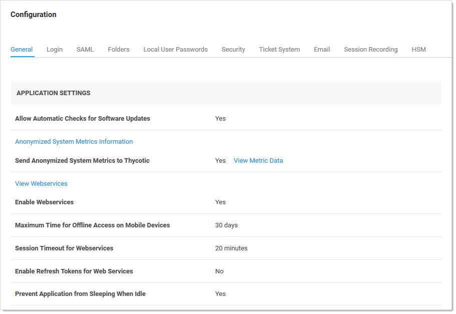
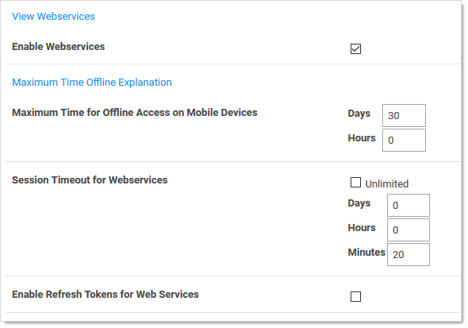

[title]: # (Mobile Computing)
[tags]: # (mobile computing,tablets, smart phones)
[priority]: # (1000)

# Setting Maximum Time for Offline Caching

## Overview  

The **Maximum Time for Offline Access on Mobile Devices** setting in Secret Server determines how long to cache secret data on the mobile device. Once the device is not in contact with the server for longer than the specified amount of time, the device removes its cache of the stored secrets. The only way to view secrets on the device once the cache is cleared is to connect to SS again so that the secrets can be re-downloaded and cached. 

## Procedure

To set the maximum time:

1. In Secret Server dashboard, click **Admin \> Configuration**. The Edit Configuration page appears:

   

1. On the **General** tab, click the **Edit** button at the bottom of the page. 

1. Click to select the **Enable Webservices** check box in the **Application Settings** section:

   

1. Type your preferred interval in the **Days** and **Hours** text boxes in the **Maximum Time for Offline Access on Mobile Devices** section.

   > **Note:** Setting the Maximum Time Offline to less then hour prevent the device from caching as the cache window is too small.
   
   > **Note:** Because caching all secrets creates an audit record in the database for each secret, we recommend not setting the window too short so that users constantly need to cache all secrets.

1. Click the **Save** button at the bottom of the page.

## Example

An example of a cache window:

If Maximum Offline Time is set to 7 days, a iPhone user can cache secrets. If the iPhone has connectivity every hour the iPhone is used, it will check in with the server. Each time the iPhone checks in the 7 days, the cache window is extended. Thus, if the user uses the app once every 7 days, the app cache will remain. If the user does not have connectivity (such as in Airplane Mode) or does not turn on the app for longer than 7 days, then the next time the app is used the cache will be cleared because the maximum allowed time offline has been surpassed.

 