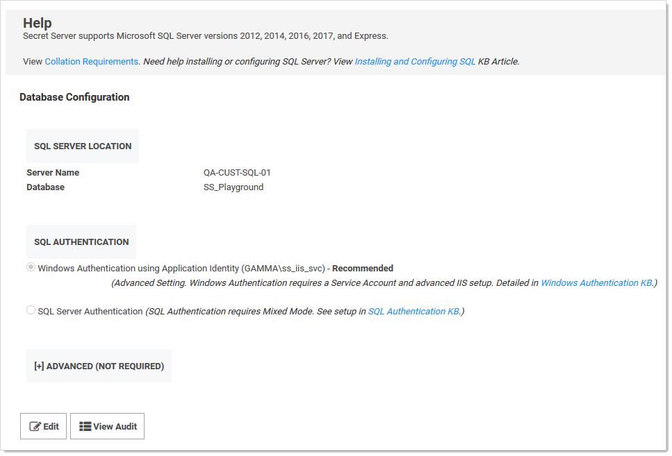
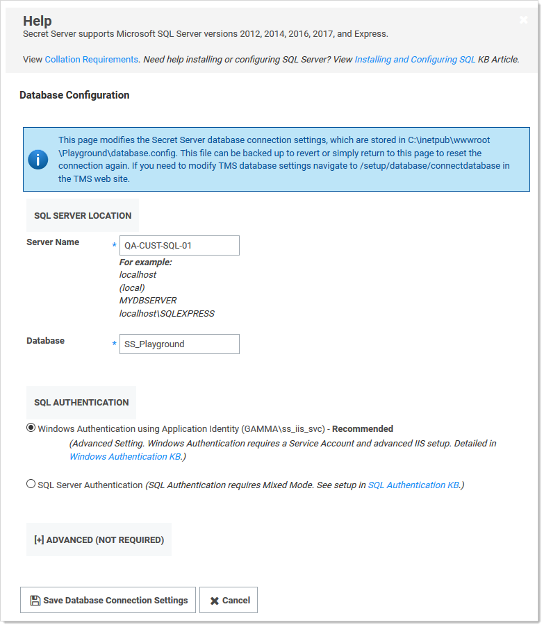

[title]: # (Changing SQL Server Connection Parameters)
[tags]: # (Database,SQL Server,Networking)
[priority]: # (1000)

# Changing SQL Server Connection Parameters

> **Note:** This is for Secret Server version 7.1 and later.

Once Secret Server is installed, it may be necessary to change the connection string that SS uses to connect to its database. You must be authenticated to access SS and have the Administer Configuration role permission.

1. Click **Admin \> See All**.

1. Type **Database** in the search text box and select **Database** in the dropdown list. The Database Configuration page appears:

   

1. Click the **Edit** button. The page enters edit mode:

   

1. Edit the parameters as desired.

1. Click the **Save Database Connection Settings** button. A confirmation message appears. SS recycles its application pool (needed to clear the connection string cache), and then returns you to the SS dashboard.
