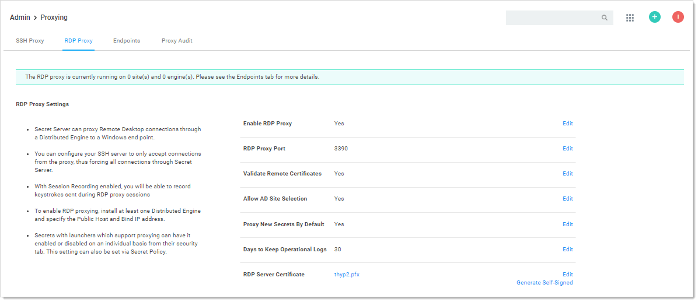

[title]: # (RDP Proxy Configuration)
[tags]: # (RDP Proxy,Networking)
[priority]: # (1000)

# RDP Proxy Configuration

## Overview

The RDP Proxying feature allows RDP connections, established using a launcher, to be routed through SS. You can set it up one of two ways:

- Recommended method: The launcher connects to the newer RDP proxy with temporary credentials, and the RDP proxy connects to the remote server using the protected credentials from the secret. This method is preferred because it prevents the secret credentials from reaching the client machine. For this method, you simply configure the RDP proxy.
- Alternative method: The launcher uses an SSH proxy to tunnel a local RDP connection to a remote server. This method does not protect the credential from reaching the client machine. For this method you configure the SSH proxy and enable SSH tunneling.

>**Note:** We provide the alternate method to support legacy installations and troubleshooting (it can potentially be more stable when the RDP proxy does not work).

These two approaches to RDP proxying are not compatible—you may use one or the other but not both. We performance tested both methods. Either can support 100 concurrent connections.

## Recommended Method

### How It Works

1. The user clicks the RDP launcher in SS.

2. The launcher executes on the client's machine.

3. The launcher establishes a connection to the RDP Proxy using credentials generated for the session. These credentials are short lived and can only be used once.

4. Once the launcher has successfully authenticated with the RDP proxy, the RDP proxy looks up the credentials and target hostname to connect to.

   > **Note:** The secret credentials *do not* get served to the client machine in this flow, which improves credential security.

5. The RDP proxy connects to the desired remote host with the secret credentials.

6. The RDP session is established.

6. RDP traffic is sent back and forth over the RDP proxy, session keystrokes are monitored if session recording is enabled.

### Configuration

1. Navigate to the **Admin \> Proxying** page.

1. Click the **RDP Proxy** tab.

2. If necessary, enable the RDP proxy.

3. Click the **Endpoints** tab to ensure that your server nodes, sites, and engines are properly configured.

4. Proxied RDP secrets now launch into the RDP proxy using short-lived credentials, protecting the secret credentials from the client machine.

### Configuration Settings

The RDP proxy configuration settings for the recommended method:

- **Enable RDP Proxy:** This setting determines whether or not the RDP proxy is enabled
- **RDP Proxy Port:** This setting is the port that the RDP proxy runs on (defaulting to 3390). You usually cannot set this to 3389 as that port is already occupied by default by the Windows operating system.
- **Validate Remote Certificates:** Thycotic recommends that you operate in an environment where RDP server certificates are created by a controlled CA and are trusted by machines in the domain. If that is not possible, you can disable remote certificate validation to allow connection to machines that do not serve trusted certificates.
- **Allow AD site selection:** This setting allows you to select any configured sites when using the RDP launcher on an Active Directory secret. This allows a secret credential to access machines that may exist in different network boundaries.
- **Proxy New Secrets By Default:** This setting determines if SSH and RDP secrets are created with "Proxy Enabled" set by default. This setting is shared with the SSH proxy configuration.
- **Days To Keep Operational Logs:** This setting determines how long, in days, the operational logs for the RDP proxy are kept.
- **RDP Server Certificate:** This setting is the certificate that is served to the clients who connect to the RDP proxy. You can generate a certificate for a given DNS name, or you can upload your own.

## Alternative Method

> **Note:** This approach is not recommended as it exposes the secret credentials to the client machine.

### How It Works

1. The user clicks the RDP launcher in SS.

2. The launcher executes on the client's machine.

3. The launcher establishes a connection to the SSH proxy to begin port forwarding.

3. The launcher authenticates with the SSH Proxy.

3. The launcher opens a socket.

3. The launcher listens for a connection on an available ephemeral port (the forwarding port) on the client's machine.

5. RDP launches on the client machine using the secret credentials and connects locally to the forwarding port.

6. All RDP traffic for this session is routed through the SSH tunnel to SS, then forwarded to the target machine.

7. The RDP session is established.

### Configuration

1. Navigate to the **Admin \> Proxying** page.

2. Enable the **Enable SSH Tunneling** option.

3. Click the **Endpoints** tab to ensure that your server nodes, sites, and engines are properly configured.

4. Proxied RDP secrets now launch into the SSH proxy using local port forwarding.

## Known Issues

### "Could not load file or assembly..." Error

Error appears in SS.log or DE.log. Install the most recent version of the .NET Framework to correct it.

### RDP Proxy Does Not Work with FIPS Validation

RDP proxy does not work on machines the have the FIPS validation security policy active. No fix is currently available.
