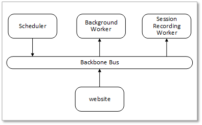
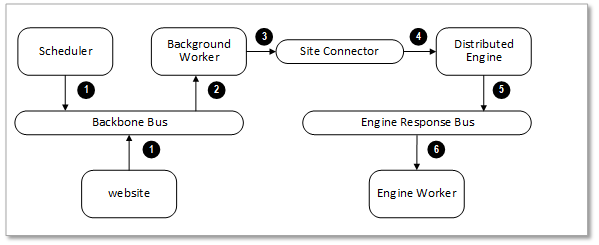
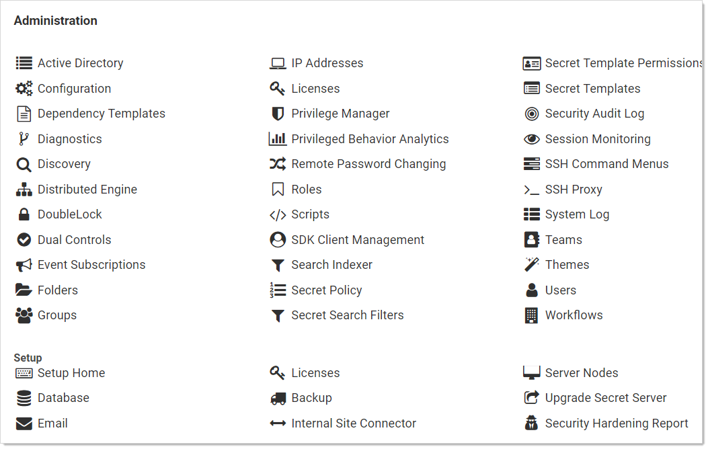
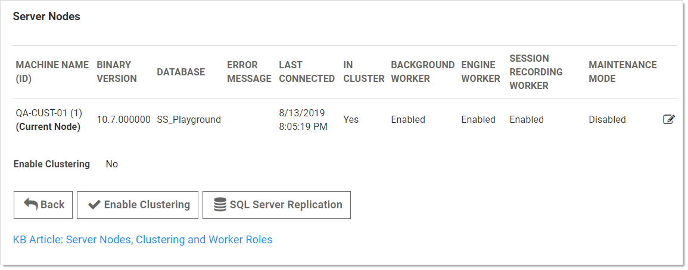

[title]: # (Secret Server Clustering)
[tags]: # (Clustering, Networking)
[priority]: # (1000)

# Secret Server Clustering

> **Note:** Please click the table of contents on the left to see any sub-pages to this one. Click the table of contents on the right to see headings on this page.

This document is a guide to Thycotic's Secret Server (SS) clusters for administrators and advanced users. SS can run with multiple front-end Web servers. For a critical instance, clustering offers a redundant system to limit potential down time from a single point of failure. Clustering also allows users to load balance for better performance. 

## Overview

### Clustering and Background Thread Changes in 10.7.

There are two major architectural changes in SS 10.7: 

> **Note:** The first change is obvious in the SS user interface, and the second is hidden but very important to those supporting SS.

- **Primary Node:** We eliminated "primary nodes." Previously, some important background operations, such as password changing and heartbeat, would only run from the primary node. Now they run from all nodes. Given that, there is no longer a “Make Primary” button, and the ValidPrimaryNode setting no longer applies.  
- **Background Operations:** There are no longer background threads for scheduled operations. Instead, operations are scheduled by Quartz. 

### Clustering Overview

With SS clustering, you can easily scale SS for redundancy and performance. Basic SS clustering is simple—you install SS and then copy the installation to to another machine. SS clustering has four core concepts or components:

#### Nodes

Each machine with SS installed on it, pointing to the same database, is a *node*. All nodes respond to Web requests and thus are Web servers.

#### Backbone Bus

The backbone bus Internally handles all communication between the roles. In a clustered environment, the backbone bus should always be an installed RabbitMq messaging queue.  This allows every node in the cluster to help with the workload.  If the backbone bus is set to “internal,” then each node is using its own internal backbone bus.

#### Engine Response Bus

The engine response bus facilitates communication from SS to distributed engines and back.

#### Worker Roles 

Each node can optionally run one or more worker roles: background Worker, engine worker, and session recording worker.  Though they may run on the same machine, the roles do not directly communicate with each other. 

Each node that is set to run the background worker role automatically runs the scheduler role as well.  The scheduler role is responsible for running the vast majority of SS background operations.  It uses Quartz to run “trigger jobs” that send a message on the backbone bus for each scheduled operation. One or more background worker roles then processes those messages.

> **Note:** See the article [Troubleshooting Quartz Trigger Jobs](https://thycotic.force.com/support/s/article/SS-TSG-EXT-Quartz-Trigger-Jobs) for more information about Quartz.

#### Component Communication

**Figure:** Secret Server Internal Cluster-Component Communication



Messages are placed on the backbone bus by the Scheduler role and the website. Messages are retrieved from the backbone bus.

**Figure:** Secret Server Distributed Engine Communication



1. Manual or scheduled operation.
2. Background worker processes a message.
3. Outbound messages (password changes, heartbeats, and others) are placed on the site connector.
4. Distributed engine performs the operation.
5. Engine worker processes the response.

#### Server Node Configurations

The work an individual node handles depends entirely on which boxes are checked on the Server Nodes page (in edit mode):


- **In Cluster** is a toggle that turns a server node on or off. If enabled this node can process Web requests, and (if configured) will run the background, engine, and session recording roles. If disabled, the node is just a backup—it cannot run any roles, and trying to access the website on the node will redirect to the server nodes page. 
- **Background Worker** is a toggle for all background operations, such as password changing, heartbeat, and discovery. When it is set to false, only the bulk operations, password generation, email, and secret import operations run on the node. See the list of background operations below.      
- The **Background Worker**, **Engine Worker**, and **Session Recording Worker** check boxes enable the corresponding roles for that node.  
- **Engine Worker** enables or disables the engine worker role, which processes responses from distributed engines.
- **Session Recording Worker** enables or disables the session recording role, which encodes session videos.
- **Maintenance Mode** enables or disables a read-only mode where the node cannot change secrets or related data.

####  Scheduled Background Operations

 The current scheduled background operations operations in SS are:
- ActiveDirectorySynchronizationMonitor
- BackgroundWorkerTaskTriggerJob
- BackupMonitor
- Bulk Operations When triggered by user
- CheckOutMonitor
- ComputerScanMonitor
- ConnectWiseMonitor
- DatabaseCleanupTriggerJob
- DiscoveryMonitor
- EventQueueMonitor
- ExpiredSecretPasswordChangeTriggerJob
- ExpiringLicenseTaskTriggerJob
- ExpiringSecretTaskTriggerJob     
- HeartbeatMonitor
- Local Heartbeat Trigger Job
- Local Password Change Trigger Job
- NodeClusteringMonitor
- NodeTaskTriggerJob       
- PasswordRequirementTriggerJob
- PbaDirectiveTriggerJob
- PbaMetadataUploadTriggerJob
- PrimaryNodeTaskMonitor
- Process Field Encryption Changes Task
- ProcessDashboardJsonValidationTask
- ProcessSecretPolicyChangesMessage
- ScheduledReportMonitor
- SecretComputerMatcherMonitor
- SecretItemHashMonitor
- SqlReplicationConflictMonitor    
- TelemetryTriggerJob
- ThycoticOneSyncUserTriggerJob
- TruncateDatabaseCacheTriggerJob
- TruncateEngineLogTriggerJob
- VideoConversionTriggerJob

To see the current state of these jobs, such as the last time they ran and how long until they run again, go to **Admin \> Diagnostics**.  

## Procedures

### **Setting up Clustering**

> **Note:** Clustering requires a Secret Server Premium add-on or Enterprise Plus edition license.

1. Have SS upgraded or installed and running on a server.

1. Enable clustering on the node:
    
    1. In SS, click **Admin \> See All**. The Administration page appears:
    
        
    2. Click the **Server Nodes** button in the **Setup** section. The Server Nodes page appears:
    
        
    
    3. Click the **Enable Clustering** button.
1. Copy the entire SS application folder (typically `c:\inetpub\wwwroot\SecretServer`) from the existing node to the secondary node. 

1. Follow the steps in the Installation Guide for setting up the application pool and virtual directory in IIS. 
  
   > **Note:** If you use DPAPI encryption for your encryption.config file, you need to transfer the non-DPAPI-encrypted version of the file to the secondary node. You can turn on DPAPI encryption from that server node locally after SS is running. This setting can be found at **ADMIN > Configuration ** on the **Security** tab.
  
1. If running SS 8.9.300000 or later, ensure that both servers are using the same date and time.

1. Once the secondary server is running, navigate to its SS using a Web browser.

1.  Reset the database connection, following the instruction in [this KB article](https://thycotic.force.com/support/s/article/ka0370000005RBqAAM/Changing-SQL-Connection-Details).
    
1. Activate licenses for the new node. You can do this on either server once the database connection is established on the secondary node.
   
1. Configure your load balancer for the two sites to have "sticky sessions" to prevent a user from bouncing between server on each request.

1. Configure the worker roles for the cluster:

    - Each server node can optionally run the background worker, engine worker, and session recording worker roles.
    - At least one instance of **each** type of those roles must be active in the cluster for the clustered SS application to function.
    - You may run more than one instance of each role as desired to improve the performance of the clustered SS application.
> **Note:** For more information on what the various roles do, please see the [Worker Roles](#worker-roles) section.

### Upgrading Secret Server in a Clustered Environment

#### Overview

SS has a built-in Web installer. That installer is a series of pages inside SS for downloading and updating SS.  SS is accessible by users for most of the upgrade process. You can stop outside access to the site if you want to prevent users from making changes during the upgrade. Preventing user access will make restoring the database and site backups simpler if you decide to roll back the upgrade immediately afterward.

> **Warning:** Before upgrading, **backup your SS folder and database**. See [**Upgrading Secret Server - Single Instance and Web Clustering**](http://support.thycotic.com/KB/a17/upgrading-secret-server-single-instance-web-clustering.aspx) for important steps for ensuring your data is backed up.

> **Important:** Upgrading to SS version 8.9.000000+ requires Windows Server 2008 R2 or greater.

> **Important:** If upgrading to SS version 8.5.000000+, there are changes in the required .NET Framework that may require additional steps in the upgrade process. For more information, see [Secret Server Moving to .NET Framework 4.5.1](http://support.thycotic.com/KB/a388/secret-server-moving-to-net-framework-451.aspx).

> **Important:** Upgrading to SS 10.0.000000 and above requires configuring integrated pipeline mode on the SS application pool. Please see [Configuring IIS for Installing or Upgrading to Secret Server 10](http://updates.thycotic.net/link.ashx?IisPiplineIntegratedKnowledgeBase) for details. 

> **Important:** If using Integrated Windows authentication you will also need to update IIS authentication settings as detailed in [Setting Up Integrated Windows Authentication in Secret Server 10.0+](http://updates.thycotic.net/link.ashx?SS_10_IntegratedWindowsAuthentication). If you are at version 9.1.000000 and below, you will need to first upgrade to 9.1.000001 before you can upgrade to 10.0.000000+.

> **Note:** You do **not** need to download the SS installer to perform an upgrade.

#### Procedure

1. Before you start:
   - Ensure that you have account credentials information and access for the server hosting SS and the SQL Server instance hosting your SS database.
    
    - Have a recent backup of the application files and database available.
    - Stop the application pools on all of the servers except the one that you have chosen to upgrade.
    
1. Choose one SS server to upgrade

1. Perform a backup of that server.

1. Stop the Web servers of all other nodes. 

1. Perform the upgrade using the same procedure as a single instance.

    > **Note:** If applicable, see [Upgrading Secret Server without Outbound Access](https://thycotic.force.com/support/s/article/Upgrading-Secret-Server-without-outbound-access). 

1. Once SS is upgraded and working, copy the Web application folder (without the database.config or encryption.config files) to all other servers.

    > **Warning:** Never overwrite or delete the encryption.config file on a SS server.
    
    > **Note:** Both encryption.config and database.config are  automatically propagated to the new servers from the original. If you need to copy those files because of database configuration changes and are using DPAPI, disable DPAPI encryption in SS by going to **Admin \> Configuration** on the **Security tab**. and clicking **Decrypt Key to not use DPAPI** *before* copying those files to secondary servers.
    
    > **Note:** EFS encryption is tied to the user account running the SS application pool, so it is not machine-specific. Thus, it is not necessary to copy EFS encrypted files between SS instances, but it is allowed.
    
1. If Thycotic management server (TMS) is installed and clustered, copy the TMS directory to the secondary servers as well. The TMS directory is included by default for new installs of SS 10.2+. TMS is used by advanced session recording and Privilege Manager. If the TMS folder and site does not exist in IIS, then no additional actions are needed.

1. Start the secondary servers to confirm they still work.

### Upgrading Database Mirroring

1. If there is more than one Web server running SS, ensure all instances are pointing to their primary database.

2. Select one server to perform the upgrade on, stop all other web servers.

3. Perform the upgrade on the single instance.

4. Once upgraded and working, copy the Web application folder to all other Web servers.

5. Start all other Web servers and confirm they work

6. Ensure all instances are properly activated

7. Ensure that the primary database changes have been replicated to the mirror database.

8. If one of the servers was pointing originally to the secondary database, adjust it to point there again.

###  Upgrading Disaster Recovery Installations

1. Perform the upgrade on the production instance.

2. Backup the production instance.

3. Copy the database backup to the remote DR instance and restore the database.

4. Once the database is upgraded and working, copy the web application folder (but not the database.config or encryption.config files) to the remote DR instance, overwriting the existing files.

5. Restart IIS or recycle the application pool running SS on the remote DR instance.

6. Confirm that the remote DR instance is working correctly.

### Load Balancing Secret Server Clusters

In a clustered Secret Server environment set up behind a load balancer, the accessible outside URL may be something other than the server name.

#### Custom URL Configuration

In SS 8.5 and later, the Custom URL setting can be configured to ensure that links and resources are resolved correctly and are not based upon the server name:

1. Navigate to **Admin \> Configuration**.

1. On the **General** tab, click the **Edit** button.

1. Go to the **Application Settings** section.

1. Click to select the **Custom URL** check box.

1. Type the desired URL in the **Secret Server Custom URL** text box.

#### SSL Recommendations

For the best security, we recommend placing the SSL certificate on each of the Web servers. This ensures the traffic leaving the server is encrypted by SSL. Optionally, the load balancer would need the certificates as well for adding the client's IP address.

If the connection between the load balancer and the server is isolated in a security zone, you could leave HTTP between the load balancer and the server and have the SSL on the load balancer.

#### Configuring Client's IP Address (X-Forwarded-For) 


Routing traffic through a load balancer will cause SS to audit the IP address of the load balancer instead of the end user. To avoid this:

First, configure the load balancer to pass along the client's IP address in the header. 

Then add the `appSettings` key `IpAddressHeader` with the value of the name of the header field containing the client's IP address. This setting must be added to **all** SS Web servers. Depending on your SS version, do this in one of two ways:

For SS prior to 10.5.000000:

In the `web-appSetting.config` file in your SS directory, add the following key:

```xml 
<?xml version="1.0" encoding="utf-8" ?>
<appSettings>
  <add key="IpAddressHeader" value="X-Forwarded-For" />
</appSettings>
```

For SS 10.5.000000 and later:   

1. Go to `https://<SecretServerAddress>/ConfigurationAdvanced.aspx`.

1. Scroll to the bottom and click **Edit**.

1. Locate the **IP Address Header** text box, type `X-Forwarded-For`.

1. Click the **Save** button.

> **Note:** The SSL certificate needs to exist on the load balancer and the Web server to ensure it has access to add the client IP address header.

## Clustering Errors

The following errors may arise when setting up or operating SS clustering:

- Encryption configurations do not match: See the [Encryption Key Does Not Match Error](https://thycotic.force.com/support/s/article/Encryption-key-doesnt-match-error) knowledge base article.

- Server dates do not match: If the Web server dates do not match, the audit records could be bad. The fix is to set the servers to the same time.

  > **Note:** This only applies to SS before version 8.9.300000.

- SS version does not match: If some of the cluster nodes have been upgraded and others have not, their versions will conflict, producing this error. Nodes which have the wrong (older) version will not function correctly. To fix this issue, ensure that all the nodes in your cluster are upgraded. For nodes that are having this issue, you can copy the application folder (minus the database.config file) to replace the server files with the correct version.

 