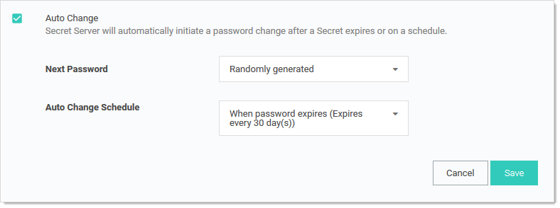
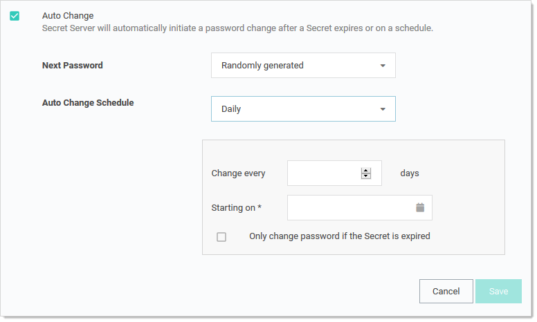

[title]: # "Automatic Remote Password Changing"
[tags]: # "Automatic Remote Password Changing"
[priority]: # "1000"

# Automatic Remote Password Changing

The Remote Password Changing tab contains the settings for configuring RPC on an individual secret. Enabling RPC _auto change_ on a secret allows SS to remotely change the password when it expires. The user must have owner permission on the secret to enable auto change.

> **Note:** If the password change fails, SS flags the secret as out of sync and continue to retry until it is successful. If the secret cannot be corrected or brought In sync, manually disabling auto change stops the secret from being retried.

## Auto Change Schedule

The Auto Change Schedule button is visible on the secret View RPC tab when RPC and autochange is enabled on a secret.

The Auto Change Schedule section, which appears when you set the Auto Change Schedule list box to other than “When password expires,” allows you to specify an interval (daily, weekly, or monthly), start date, start time, and time frame (interval count) for when the password can be changed:

This setting is useful for having the RPC occur during off-hours in order to prevent disruptions. By default, this setting is "When password expires,” which allows the secret to be changed immediately upon expiration. 

> **Note:** There is a check box in the auto change schedule settings labeled "Only change password if the secret is expired.” When it is enabled, auto change will not change the password until after the secret expires. The auto change occurs on the first scheduled time after the secret expires. If the box is unchecked, auto change occurs on the defined schedule, whether or not the secret has expired.

> **Note:** While the password change is waiting for this next scheduled time, the RPC Log (visible by navigating to **Configuration > Remote Password Changing**) reports the secret could not be changed because of a time schedule. The secret also remains expired until this auto change schedule is reached, even if the secret was forced to expire.

