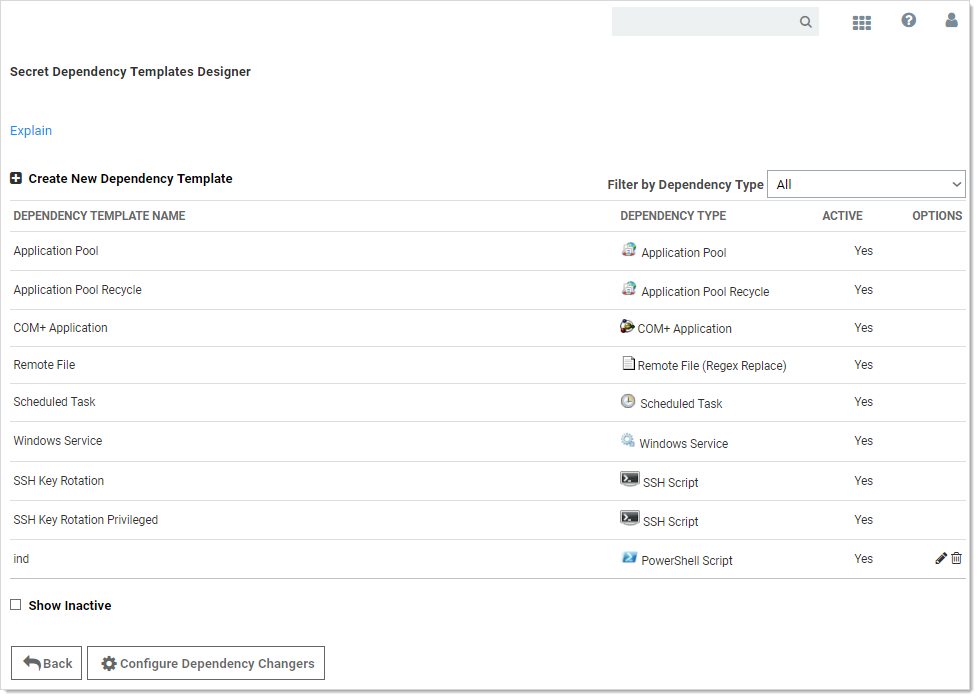

[title]: # (Configuring Secret Dependencies for RPC)
[tags]: # (Configuring Secret Dependencies for RPC)
[priority]: # (1000)

# Configuring Secret Dependencies for RPC

> **Note:** Please click the table of contents on the left to see any sub-pages to this one. Click the table of contents on the right to see headings on this page.

_Secret dependencies_ are items that rely on the username, password, or SSH private key stored in the secret. By adding them to the Dependencies tab, they are automatically updated when the secret's password is changed, ensuring they are up to date with the account on which they depend.

Adding a custom dependency template may require additional settings (these settings are described in the following section):
