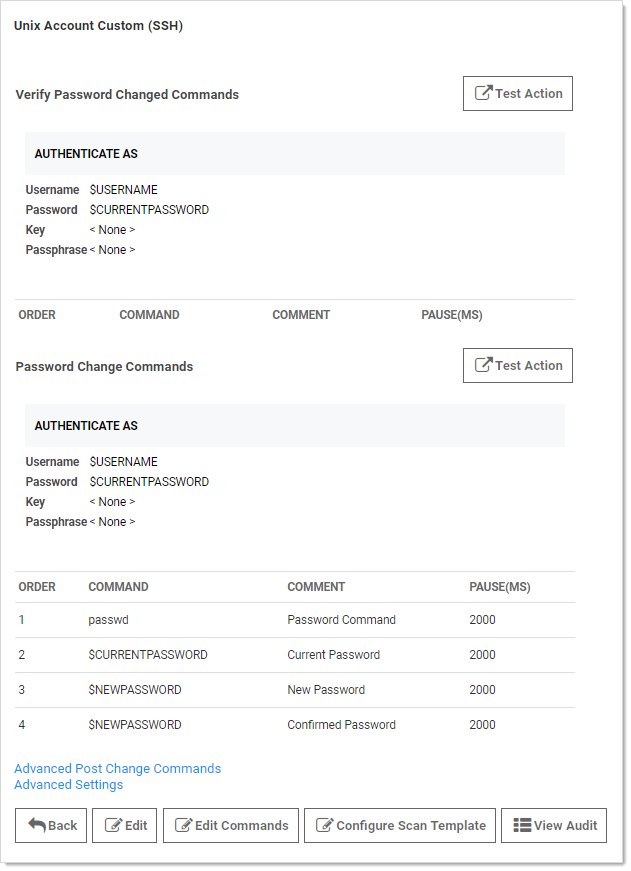

[title]: # (Mapping an SSH Key or Private Key Passphrase for Authentication)
[tags]: # (Mapping an SSH Key or Private Key Passphrase for Authentication)
[priority]: # (70)

# Mapping an SSH Key or Private Key Passphrase for Authentication

Some password changers may be customized to use SSH key authentication. SS needs to know which text-entry fields contain the key and the passphrase. These text-entry fields can be specified after clicking **Edit** from the password changer page.

The key and passphrase must be identified by a `$` sign and the secret text-entry field name, which can be obtained from the secret template.

To set which text-entry fields are your key and passphrase, go to the extended mappings for a secret template by clicking **Extended Mappings** from the **Secret Template Edit** page. Select the text-entry fields that correspond to the SSH private key and passphrase if applicable. No matter what you name your key text-entry field, SS knows what it is. This is set up by default, so you should not need to do this unless you've created custom Unix templates you want to use keys with.

Once SS knows which text-entry fields contain the private key and private key passphrases, it can automatically use them as a part of launchers.
