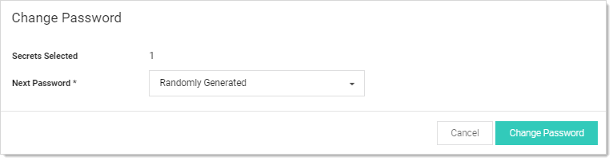

[title]: # (Running a Manual RPC)
[tags]: # (XXX)
[priority]: # (170)

# Running a Manual RPC

On the RPC tab there is a button called Change Password Remotely button that allows the use to change the password immediately instead of waiting for it to expire. When this button is clicked the user is taken to the Change Password Remotely page where they can enter in or generate the new password for the account. When the user clicks the Change button the secret enters the queue for having its password changed. The RPC Log found on the Remote Password Changing page details the results of the password change attempts and can be used for debugging.

If the secret is a Unix or Linux account and uses a password changer that supports SSH key rotation, the user can change the account's password, public and private keypair, and the private key passphrase. The user can enter or generate any of these items.

> **Note:** If the password change fails, SS continues to retry until it is successful, or the change is canceled by the user. To manually cancel the change, click Cancel Password Change on the RPC tab.

To run a manual RPC:

1. From **Dashboard**, click its check box to select secret you want to test.

1. Click the Change Password Remotely button. The Change Password popup page appears:

   

1. Click to select the **Next Password** dropdown list and select **Manual** or **Randomly Generated**. If you chose manual:

   1. The Password text box appears.
   1. Type the new password in the **Password** text box.
   1. Click the **Change Password** button.

    Otherwise, click the  **Change Password** button. The password change is now queued.

1. You can verify that the password change completed either by unmasking the password on this screen (click the lock icon beside the password field) or by looking at the **Remote Password Changing** log. You can find the Remote Password Changing log by going to **Admin \> Remote Password Changing**.
