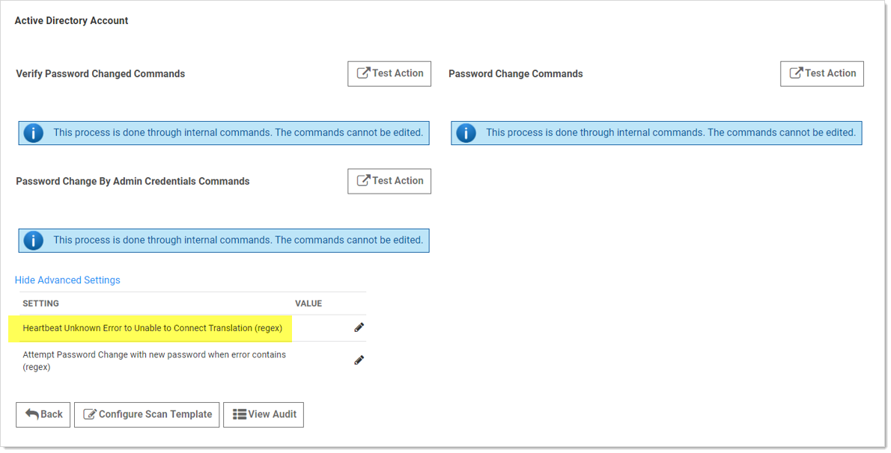
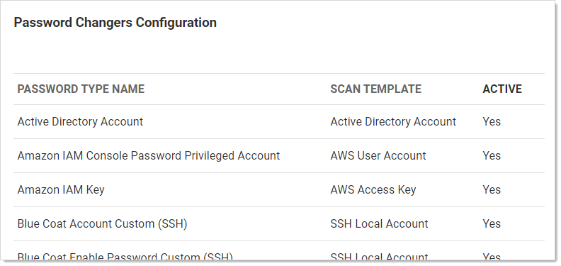

[title]: # (Treating Specific Heartbeat “Unknown Errors” as Connection Failures)
[tags]: # (Unknown Errors)
[priority]: # (1000)

# Treating Specific Heartbeat “Unknown Errors” as Connection Failures

> **Note:** This setting was previously called “Password Change Error Code Translation (regex).”

The SS “Heartbeat Unknown Error to Unable to Connect Translation (regex)” setting can translate UnknownError heartbeat errors into connection errors based on text, such as the error code, in the error message. Using a regular expression, which you define, SS scans heartbeat UnknownError messages for specific text strings. When there is a match, SS changes the UnknownError to an “Unable to Connect” heartbeat error.  This setting is useful if a custom command error is interpreted as UnknownError but the message indicates it actually was unable to connect. The translated connection error will cause SS to attempt another heartbeat.

**Figure:** Heartbeat Unknown Error to Unable to Connect Translation (regex) Setting

> **Note:** The UnknownError error is very common when running scripts and commands, making the regex discrimination desirable.

Logic:

(RPC UnknownError) AND (Regex match in error message) \=\> RPC status changed to “Unable to Connect”

Example:

`.*error code is 10060.*`  (any error with the code 10060 changes the RPC status to “Unable to Connect”)

#### Procedure

To configure the unknown errors to trigger connection failures:
$1
$2
   
$1
$2
   
$1
$2
   
$1
$2$1
$2$1
$2$1
$2$1
$2