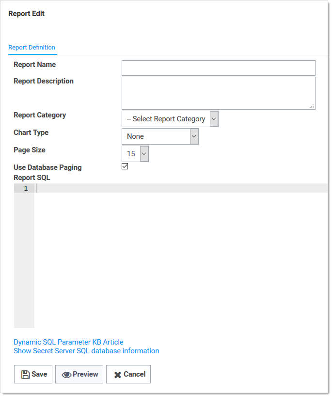
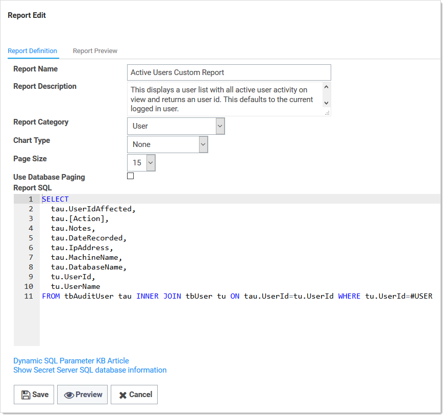
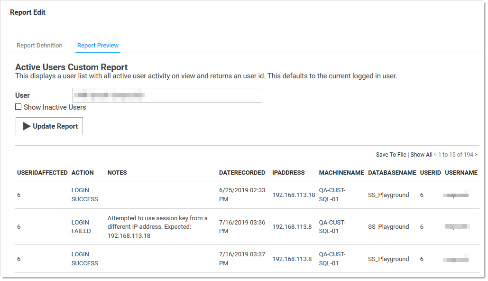
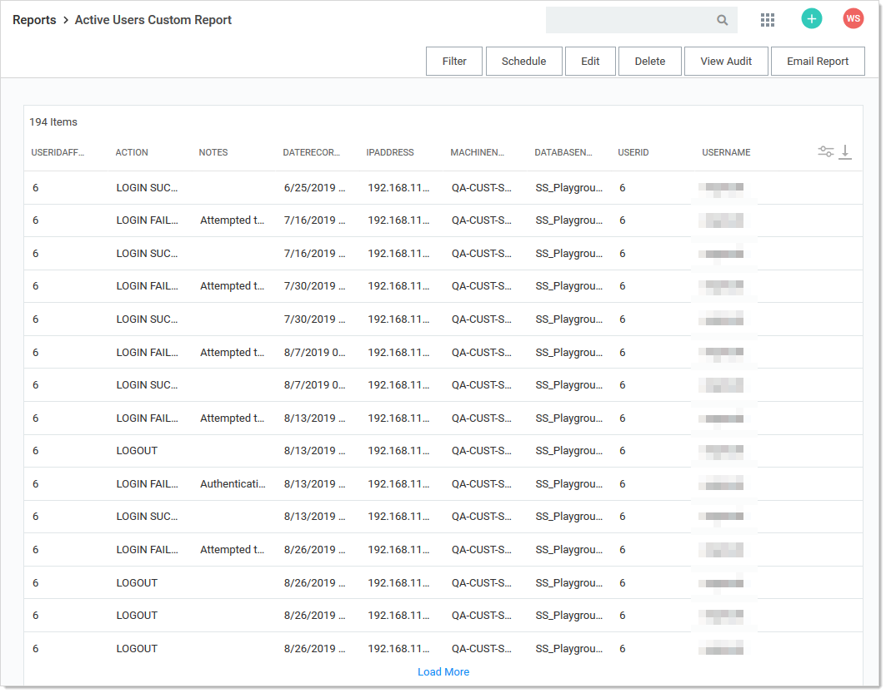
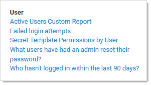

[title]: # (Creating and Editing Reports)
[tags]: # (Creating and Editing Reports)
[priority]: # (1000)

# Creating and Editing Reports

There are two ways to create a Report. From the Reports Edit page, click the **Add New** link at the bottom of a Report Category. Or alternatively, from the Reports View page, click the **Create it** link at the bottom of that page.

## Creating a Custom Report

1. Click the **+** icon on the right side of the **Reports** menu item. The Report Edit page appears:

   

1. Type the report name in the **Report Name** text box. This is the name that is displayed on the Reports page as a link underneath its containing category.

1. Type a description in the **Report Description** text box. This is displayed in the Report View page. It is also used as the Tooltip for the Report name on the Reports page.

1. Click the **Report Category** dropdown list to select the category the report will appear in on the Reports page.

1. Click the **Chart Type** dropdown list to select the type of chart to use for displaying the results. If set to None, a grid displays.

1. Click the **Page Size** dropdown list to select the page size limit for the data displayed in the grid.

1. Click to select the **Use Database Paging** check box if desired. See [Database Paging](#database-paging).

1. Paste your script in the Report SQL text box. See [Report SQL Scripts](#report-sql-scripts). Our completed report looks like this:

   

1. (optional) Click the **Preview** button to see your report before creating it. Our preview looks like this:

   

1. Click the **Report Definition** tab to return to your editing.

1. Click the **Save** button. The new report’s page appears:

   

1. The new report now appears on the Reports page:

   

## Editing Reports

To edit a report:

1. Click the **Reports** menu item. The Reports page appears, listing all the reports.
1. Click the name of the report, which is a link. That report’s page appears.
1. Click the **Edit** button. The Report Edit page appears. See [Creating a Custom Report](#creating-a-custom-report) for details about the parameters.

> **Note:** The SQL script text cannot be edited for non-custom (built-in) reports.

## Report SQL Scripts

### Overview

The best way to create SQL scripts is to view existing ones and the SS database structure. Click any existing report’s link to arrive at its page. Then click the **Edit** button. The SQL appears in the Report SQL text box.

> **Note:** Even though you are pressing the Edit button, you cannot edit non-custom reports. You can view their parameters, including their SQL script.

### Dynamic Parameters

Reports support the embedding of certain parameters into the SQL so you can dynamically change the resulting data set. Another option available for custom reports is to apply a different color to returned rows dependent on certain conditions. For more information as well as examples, see the [Using Dynamic Parameters in Reports](../using-dynamic-parameters-reports/index.md) topic.

### Viewing Secret Server SQL Database Information

You can show SS's SQL database information to assist with creating custom reports. By selecting the SQL Table from the list, the details of the table's columns display in a grid. Click the **Show SS SQL database information** link to see the SQL Table list and SQL Table Columns grid. The link is also available on the Report Edit page.

You can click **Preview** button at the bottom of the page to see a preview of the chart. The resulting chart displays in the Report Preview section at the bottom of the page.

## Database Paging

Database paging allows the database to load large reports more quickly. We recommend database paging if the query is expected to pull large amounts of data for the report. Implementing database paging may not work if the SQL query uses some keywords, including `TOP`, `OPTION`, `INSERT`, `UNION`, `WITH`, or aliases containing the word `FROM`.

Example queries:

- Works using database paging: `SELECT * FROM tbSecret WHERE NAME LIKE 'Test%'`

- Does not work using database paging: `SELECT TOP 10 * FROM tbSecret WHERE SecretName LIKE 'Test%'`