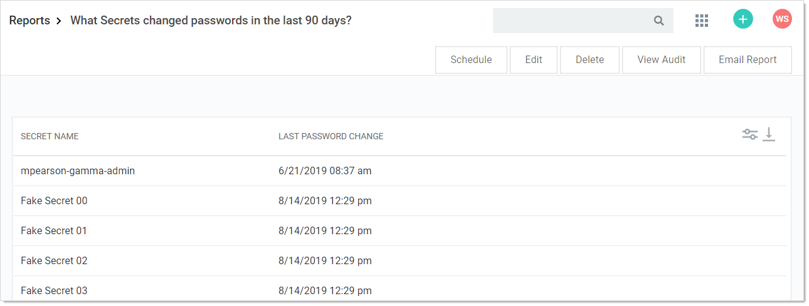
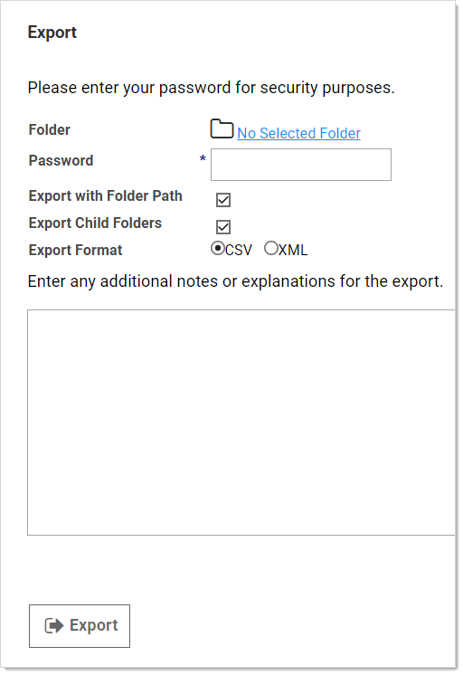

[title]: # (Saving Reports to File)
[tags]: # (Saving Reports to File)
[priority]: # (50)

# Saving Reports to File

1. Click the **Reports** menu item. The Reports page appears:

   

1. Click the link for the desired report. Its page appears:

   

1. Click the  button in the top right of the page and select Export. The Export page appears:

   

1. Click the **No Selected Folder** link to choose a folder.

1. Type your SS password to ensure "you" are you.

1. Click the **Export with Folder Path** check box to recreate the secret folder hierarchy in the OS folder.

1. Similarly, click the **Export Child Folders** check box to include any child folders.

1. Click the **Export Format** option button to select an output folder type.

1. Type any notes in the unlabeled note text box.

1. Click the **Export** button.
