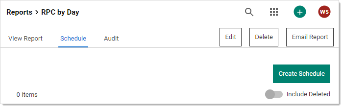
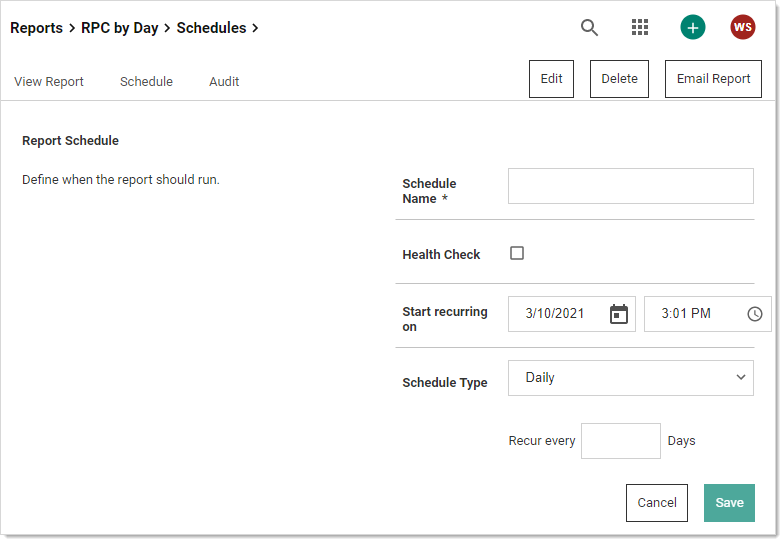
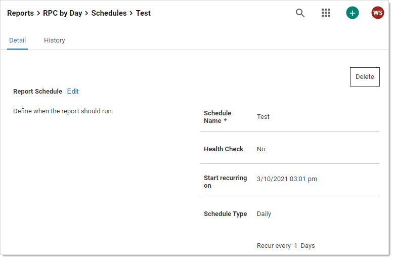
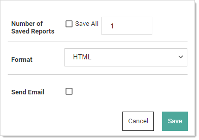

[title]: # (Scheduled Reports)
[tags]: # (Scheduled Reports)
[priority]: # (1000)

# Scheduled Reports

## Creating New Schedules for Reports

1. To create a schedule for a report, click the **Schedules** tab on the **Report View** page:

   

1. Click the **Create Schedule** button. The Report Schedule page appears:

   

1. Configure the report settings as listed in [Editing Schedule Settings](#editing_schedule_settings)

1. Click the **Save** button. The page for the new report schedule appears:

   

1. The report will now be saved for you, saving only one report at a time. If you want more saved or want it emailed to you according the the schedule:

   1. Click the **Edit** link in the **Report Distribution** section. The section becomes editable:

      

   1. Either click to select the **Save All** check box or type a new number in the **Number of Saved Reports** text box. Remember, saving reports can use a lot of disk space.

   1. Click the **Format** dropdown list to select the report format:

      - HTML: Save the report as an HTML file.
      - CSV: Save the report as a comma separated value file for importation into a spreadsheet.

   >**Important:** The CSV feature is part of the early release of Secret Server 10.11. The general release is not till April 12, 2021 (on-premises version) and April 12, 2021 (cloud version).

   1. Click to select the **Send Email** check box to have the report emailed to you at the reporting interval. An email section appears:

      

   1. Click the **All** dropdown list in the **Report Subscribers** section to choose the domain to look for users and groups.

   1. Click the check boxes next to the users or groups you want to send the report to in the **Report Subscribers** section. You can also search for the same in the provided search box at the top of the section. The users or groups appear in the Selected Groups text box.

   1. Type any additional email addresses in the **Additional Email Recipients** text box.

   1. Click the **Save** button.

## Viewing Existing Report Schedules

1. To view existing schedules for a report, click **Schedule** on the Report View screen. A list of existing schedules for the report appear in the grid.

1. To view the details of a schedule, click the schedule name in the grid.

1. (Optional) Deleted schedules can be made visible by checking the **Show Deleted** box at the bottom of the grid.

1. Click the **View** link in the History column of the grid to view the history of all generated reports for that schedule.

## Editing Schedule Settings

When viewing a report, click Schedule and then the name of the report schedule to modify it. The following configuration options are available:

- **Schedule Name:** This is the name of the schedule for the report. This name must be unique to the SS installation.

- **Health Check:** This sends an email notification only when the report contains data.

- **Recurrence Schedule:** This specifies the schedule runs every X number of days, weeks, or months, with the option to specify days of the week or month as well. The date and time that the report schedule is effective can be specified in this section as well.

- **Save Generated Reports:** This saves the history of generated reports in the database for later viewing. Enabling this setting also allows you to specify the number of generated reports to save.

- **Send Email:** SS sends an email containing the generated report every time the schedule runs. Enabling this setting also allows you to specify whether the email is sent with the high priority flag and a list of SS users or groups that receive the generated report email. Add additional email recipients in the text box below the subscribers, separating recipients with a semi-colon.

The following configuration options appear if the report being scheduled contains at least one dynamic parameter in the SQL of the report:

- **User Parameter Value:** Value of the `#USER` parameter to set in the report when it is generated.

- **Group Parameter Value:** Value of the `#GROUP` parameter to set in the report when it is generated.

- **Start Date Parameter Value:** Value of the `#STARTDATE` parameter to set in the report when it is generated.

- **End Date Parameter Value:** Value of the `#ENDDATE` parameter to set in the report when it is generated.
