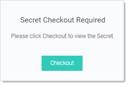

[title]: # (Configuring a Secret for Check Out)
[tags]: # (Check Out)
[priority]: # (30)

# Configuring a Secret for Check Out

Enable “Require Check Out” for the secret—users are then prompted for check out when attempting to view that secret.

