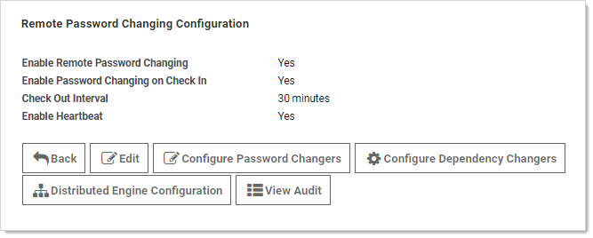

[title]: # (Configuring Password Changing on Check in)
[tags]: # (XXX)
[priority]: # (40)

# Configuring Password Changing on Check in

To configure password checking on check in, navigate to the **Remote Password Changing Administration** page and set **Enable Password Changing on Check In**. If RPC is turned off, enable it before configuring checkout. Once RPC and checkout are enabled, secrets can be configured for interval that specifies how long a user has exclusive secret access.

