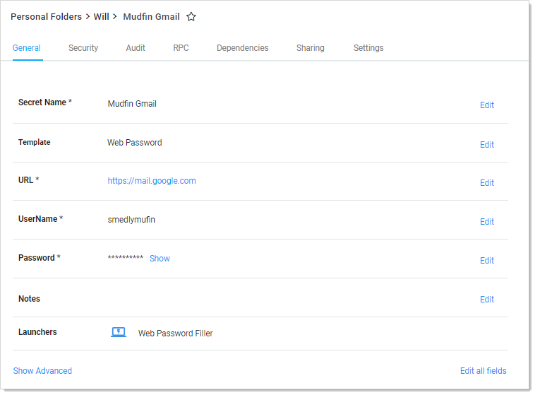
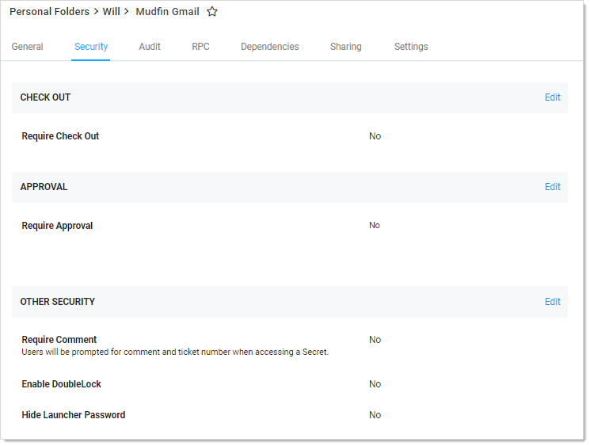
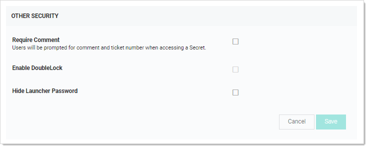

[title]: # (Assigning a DoubleLock to a Secret)
[tags]: # (XXX)
[priority]: # (20)

# Assigning a DoubleLock to a Secret

1. Navigate to the secret you wish to doublelock by clicking **Secrets** on the main menu. 

1. Either drill down to the desired secret in the folders on the main menu, or click the secret in the **All Secrets** table to arrive at the secret's page:

   

1. Click the **Security** tab.

   

1. Click the **Edit** link for the **Other Security** section. The section becomes editable:

   

1. Click to select the **Enable DoubleLock** check box. The DoubleLock dropdown list appears.

1. Click to select the doublelock you created earlier.

   > **Important:**  Enabling doublelock on this secret only grants users access if they have access to to the doublelock and enter their doublelock password. Enabling doublelock disables the RPC features for the secret.

1. Click the **Save** button. The doublelock is now enforced for the secret.
