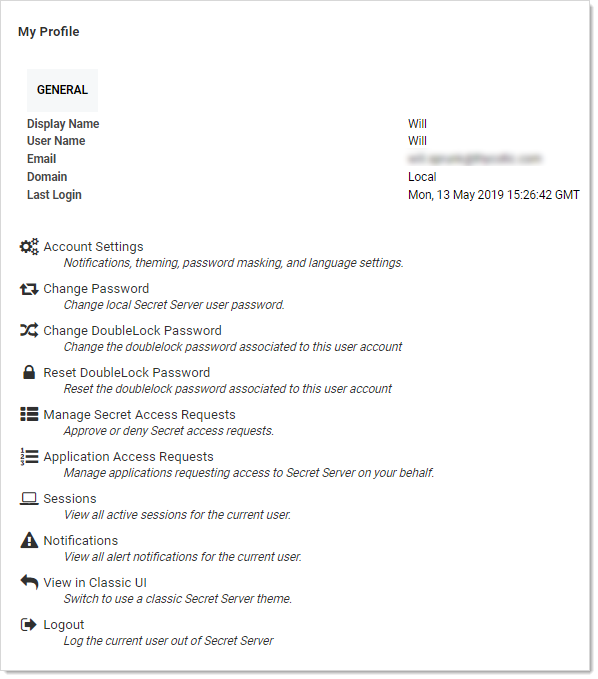
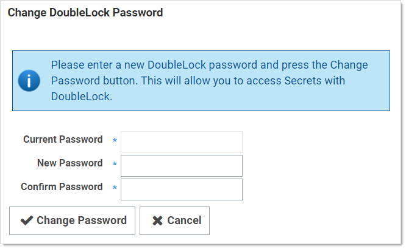

[title]: # (Assigning a User a DoubleLock Password)
[tags]: # (XXX)
[priority]: # (30)

# Assigning a User a DoubleLock Password

1. Click the icon at the top right of SS. Your My Profile page appears:

   

1. Click the **Change DoubleLock Password** button. The Change DoubleLock Password page appears:

   

1. Type your current doublelock password in the **Current Password** text box.

   > **Note:** You cannot create a doublelock password until you are associated with a doublelock. When you access your first doublelock, you are prompted to create a password.

1. Type your desired doublelock password in the **Password** and **Confirm Password** text boxes. 

   > **Important:** It is critical that you remember or securely store this password. It cannot be recovered.

1. Click the **Change Password** button. The password is created.
