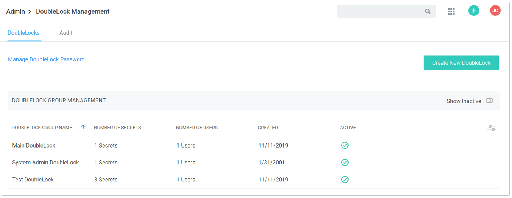
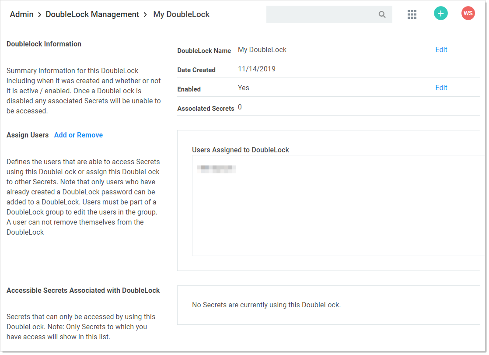
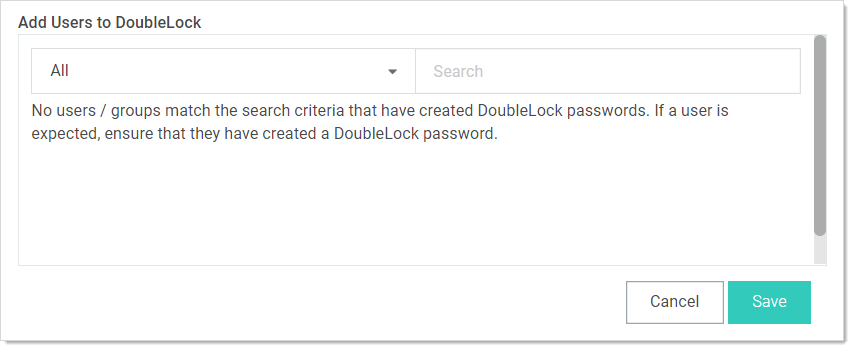
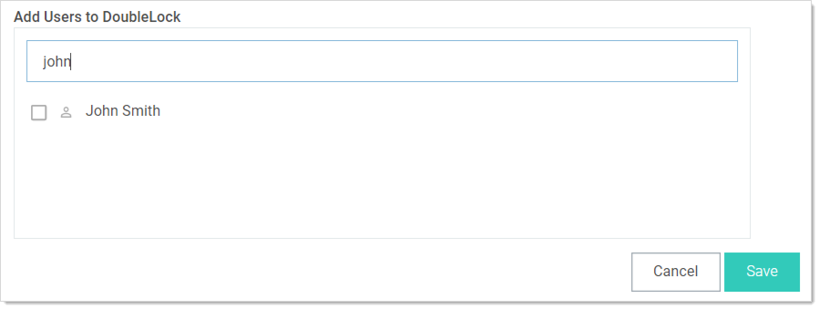

[title]: # (Assigning Users to Existing DoubleLocks)
[tags]: # (XXX)
[priority]: # (40)

# Assigning Users to Existing DoubleLocks

1. Navigate to **Admin \> See All**. The Administration page appears:

   

1. Type and then click **DoubleLock** in the search text box. The DoubleLock Management page appears:

   

1. Click the desired doublelock. Its page appears:

   

1. Click the **Add or Remove** link in the **Assign Users** section. An Add Users to DoubleLock section appears:

   

1. (Optional) Click the dropdown list to limit the user search to a specific domain.

1. Type the user’s name in the search text box. The matching users appear below the search text box:

   

1. Click to select the check box next to the desired user. The users that appear do not already have a doublelock assigned to them.

1. Repeat the process for other users.

1. Click the **Save** button.
