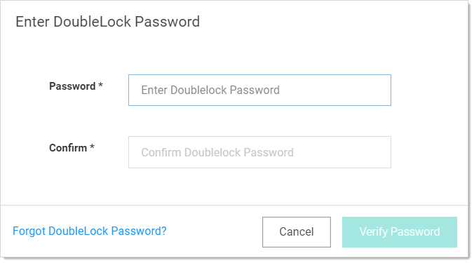
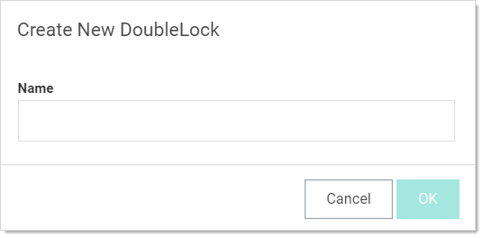
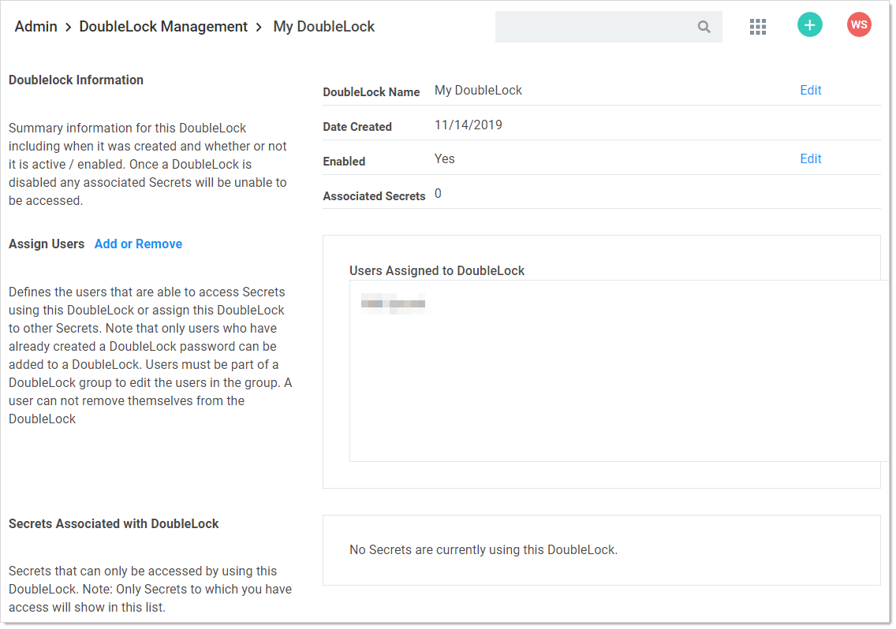

[title]: # (Creating a DoubleLock and a DoubleLock Password)
[tags]: # (DoubleLock)
[priority]: # (50)

# Creating a DoubleLock and a DoubleLock Password

1. Navigate to **Admin \> See All**. The Administration page appears:

   

1. Type and then click **DoubleLock** in the search text box. The DoubleLock Management page appears:

   

1. Click the **Create New DoubleLock** button. If you have never created a doublelock before, you will have to create a doublelock password first:

   

   > **Important:** It is critical that you remember or securely store this password. It cannot be recovered.

   Type the doublelock password in the **Password** and **Confirm** text boxes, and then click the **Verify Password** button.

   Otherwise, you go directly to the Create New DoubleLock popup page because you already have a doublelock password in the system:

   

   > **Note:** Because it is a secondary password, your doublelock password does not have to (but can) meet the same strong requirements as regular SS passwords (as defined by your admin). Think of it as more of a PIN than a password.

   > **Note:** A new doublelock and doublelock password are created together. In fact, it is impossible to create a doublelock password without immediately assigning it to a doublelock. For an existing doublelock, you are assigned access to it by its creator. Upon first accessing it, you must create *your* doublelock password for it. At least one other user will already have created their password for the same doublelock—the creator plus anybody else they granted access to.

1. Type the new doublelock’s name in the **Name** text box.

1. Click the **OK** button. The new doublelock’s page appears:

   

   > **Important:** It is critical that you remember or securely store this password. It cannot be recovered.

1. Click the **Create Password** button. The password is created, and the DoubleLocks page reappears.

   > **Note:** The newly created doublelock does **not** appear on the page.

   > **Note:** A new doublelock and doublelock password are created at the same time. In fact, it is impossible to create a doublelock password without immediately assigning it to a doublelock. For an existing doublelock, you are assigned access to it. Upon first access, you must create a doublelock password if you do not already have one.
