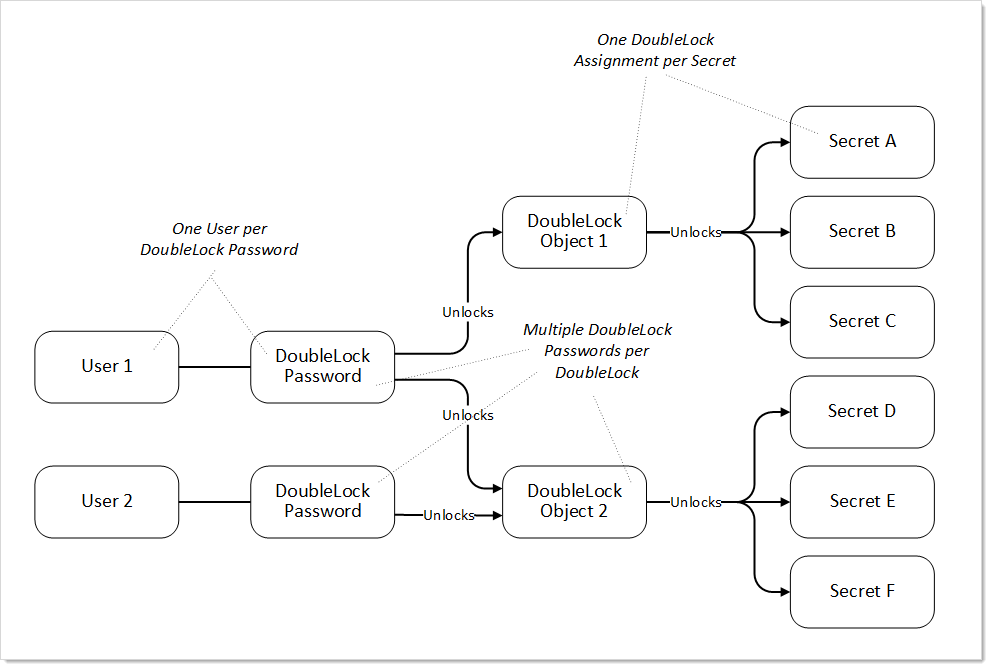

[title]: # (DoubleLock Objects and Relationships)
[tags]: # (DoubleLock)
[priority]: # (10)

# DoubleLock Objects and Relationships

The doublelock system is a group of interrelated objects (see the following diagram):

- **Doublelock object:** A named object that is associated with one or more secrets and one or more users (via password objects). Doublelock objects, or simply *doublelocks*, point to secrets (what can be accessed) and doublelock password objects (who can access it).
- **Doublelock password object:** An encrypted password that is associated with one user. The same doublelock password object, or simply *doublelock password*, is used for all doublelocks to which a user has access. Once a user is assigned to a doublelock, that user has access to any secret using that doublelock, using a single password. A doublelock password has nothing to do with the user's SS access password. 
- **Secret:** A secret that has a single doublelock assigned to it. Multiple secrets can have the same doublelock assigned to them.
- **User:** A SS user, which can have a single doublelock password assigned to it.

**Figure:** DoubleLock Object Relationships 

