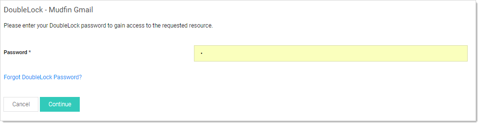
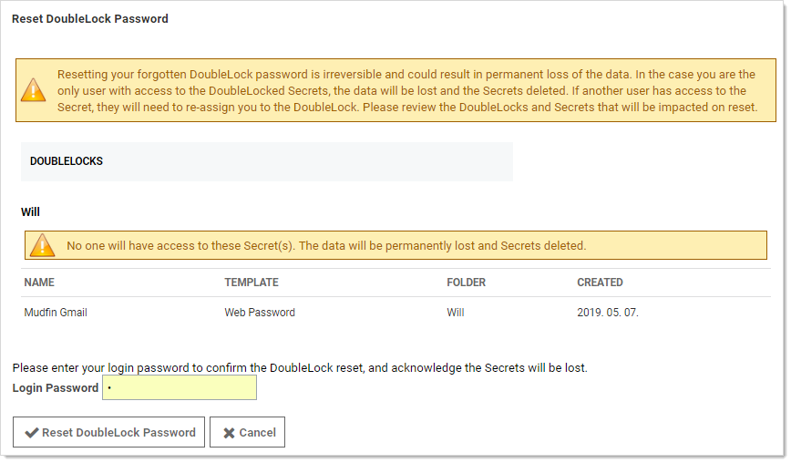

[title]: # (Resetting a DoubleLock Password)
[tags]: # (DoubleLock)
[priority]: # (1000)

# Resetting a DoubleLock Password

When users forget their doublelock passwords, there are multiple steps and considerations. Data loss may or may not result from resetting:
$1
$2
   
$1
$2
   
$1
$2
   - You are the only one with access to the doublelocked secret: When you reset the doublelock password, the secret and its data is deleted. **This is permanent**.
   - Others have access to the secret via that doublelock: You can reset the doublelock, and you lose access to the secret, but it is not deleted. You must ask one of those others to re-assign you to the doublelock after you reset it.
$1
$2$1
$2$1
$2