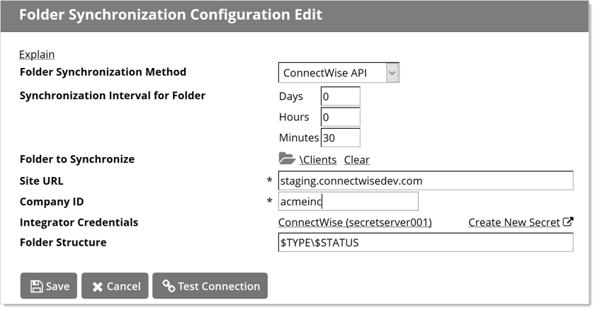
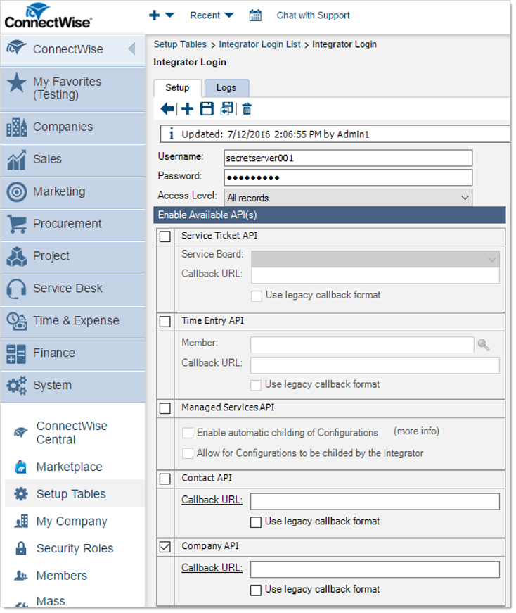
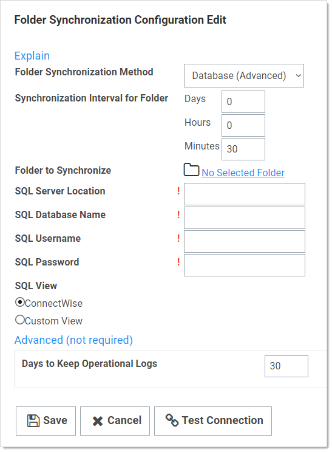

[title]: # (Folder Synchronization)
[tags]: # (Folder)
[priority]: # (30)

# Folder Synchronization

To setup this feature, navigate to **Administration > Folder Synchronization**. To edit the settings, you must have a role assignment with Administer ConnectWise Integration permissions.

Enabling folder synchronization requires specifying the synchronization interval in days, hours, and minutes. The "Folder to Synchronize" is the parent folder where you create the folder structure. There are two methods of Folder Synchronization, through the ConnectWise API or through a database view.

## Synchronizing with the ConnectWise API

The ConnectWise API is the recommended way to sync folders from ConnectWise. To sync:

1. Select ConnectWise API from the Folder Synchronization Method list.

1. Enter your ConnectWise site name.

1. Select a ConnectWise Integrator Secret for API Access.

   

> **Note:** The Integrator account must have access to the Company API in ConnectWise and access to all records

Folder structure defines how folders are named under the client's folder. By default, `$TYPE\$STATUS` creates sub-folders based on the customer type in ConnectWise, then further sorted by the active status in ConnectWise. For example, the active prospect "Acme Inc" in ConnectWise would get the following folder created: Clients\Prospects\Active\Acme Inc

The supported folder structure tokens are:

- **$COMPANYINITIAL:** First letter of company name. Use to organize companies into subfolders of A, B, C, and the like.

- **$STATUS:** Company status, such as active, inactive, or not-approved.

- **$TYPE:** Company type, such as competition, customer, partner, prospect, suspect, or vendor.

When configured, save and scroll down to the bottom and click **Synchronize Now** to run the synchronization

> **Note:** See the [How to create a custom view for ConnectWise synchronization](https://updates.thycotic.net/links.ashx?SecretServerConnectWiseConfigurationKnowledgeBase) KB article for more advanced technical information on setting up the SQL View.

## Synchronizing with a Database (Advanced)

The database synchronization method queries an on-premises database for a custom view and parse company information out of it.

Enter the SQL Server location, SQL database name, and the credential information for accessing the reference database, for example, to your ConnectWise instance. The SQL view defaults to a standard ConnectWise customer layout but can be customized to meet the desired folder Layout.

“Days to Keep Operational Logs” sets the period to keep folder-synchronization-related logs that might contain PII. SS automatically deletes logs older than that (in days).
