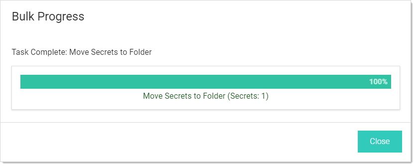

[title]: # (Adding and Moving Secrets Between Folders)
[tags]: # (Folder)
[priority]: # (1000)

# Adding and Moving Secrets Between Folders
$1
$2
   - To add or move a secret to a folder, you must have Edit permission on that folder (either direct or through inheritance).

   - To move a secret from a folder, you must have Edit permission on that secret. If the secret has the "Inherit Permissions from folder" setting enabled, then you must have Owner permission to move that secret to a new folder.

   - When a secret is moved to a folder, it automatically gets the "Inherit Permissions from folder" setting even if it had specific permissions before the move.
$1
$2$1
$2
   1. Hover the mouse pointer over the secret. A check box appears on the left end.

   1. Click to select the check box. A command row of icons appears:

      

     1. Click the Move to Folder icon. The move Secrets pop-up page appears:

      
$1
$2$1
$2

1. The secret moves to the selected folder.