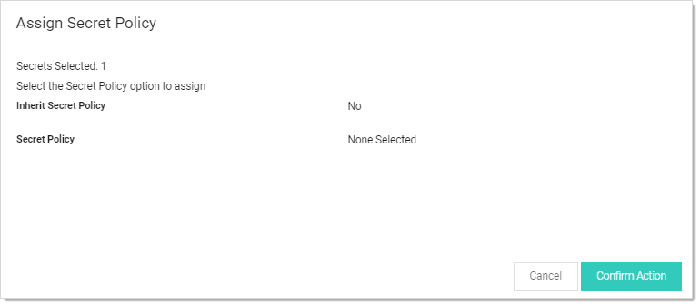

[title]: # (Assigning Secret Policies to Folders)
[tags]: # (Folder)
[priority]: # (1000)

# Assigning Secret Policies to Folders

1. Navigate to the folder containing the secret you want to assign a policy to.

1. Hover the mouse pointer over the secret. A check box appears on the left end.

1. Click to select the check box. A command row of icons appears:

   

1. Click the Assign Secret Policy  icon. The Assign Secret Policy pop-up page appears:

   

1. Click the **Confirm Action** button.
