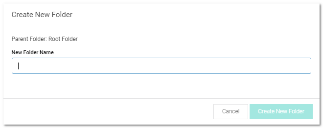

[title]: # (Creating Folders)
[tags]: # (Folder)
[priority]: # (1000)

# Creating Folders

To create a folder:

> **Note:** To create folders, you must have a role with the Administer Folder permission. You also must have Edit or Owner permission for the parent folder.

1. Click the parent folder for the new folder in the folder tree in the main menu. If you do not select one, the root is assumed. The secrets and folders belonging to that folder appear.

1. Right click the folder and select **Add Subfolder**. The Create New Folder pop-up page appears:

   

1. Type the folder name in the **New Folder Name** text box.

1. Click the **Create New Folder** button. The new folder appears in the folder tree under its parent folder.

1. Proceed to [Editing Folder Permissions](../editing-folder-permissions/index.md) to customize permissions for the new folder.
