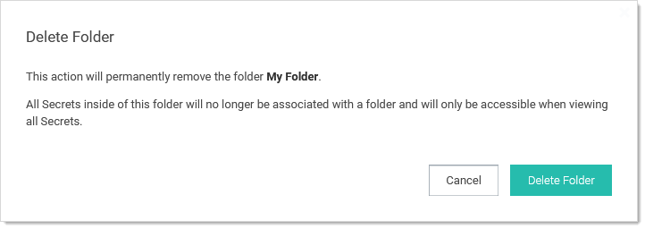

[title]: # (Deleting Folders)
[tags]: # (Folder)
[priority]: # (1000)

# Deleting Folders

To create a folder:

> **Note:** To create folders, you must have a role with the Administer Folder permission. You also must have Edit or Owner permission for the parent folder.

1. Navigate to the folder in the folder tree on the main menu.

1. Right click the folder and select **Delete Folder**. The Delete Folder pop-up page appears:

   

1. Click the **Delete** Folder button.