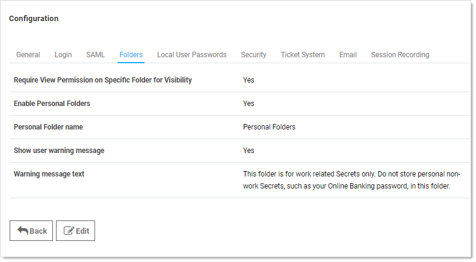
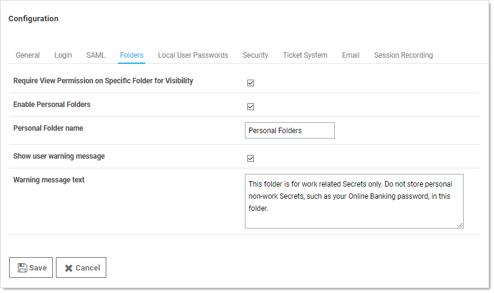

[title]: # (Enabling Personal Folders)
[tags]: # (Folder)
[priority]: # (1000)

# Enabling Personal Folders

To use personal folders, you must first enable them:

1. Click **Admin \> Configuration**.

1. Click the **Folders** tab:

   

1. Click the **Edit** button:

   

1. Click to select the **Enable Personal Folders** check box.

1. (Optional) Type a new folder name in the **Personal Folder name** text box to customize the root-level folder that contains all personal folders.

1. (Optional) If you want to display a warning message to users when placing secrets in their personal folders:

   1. Click to select the  **Show user warning message** check box.
   1. (Optional) Edit the **Warning message text** box.

1. Click the **Save** button. A personal folder for each user is now created in a root-level folder with the personal folder name specified.

> **Note:** When personal folders are enabled, a user requires the Personal Folders role permission in their role to be able to view and use their own personal folder.
