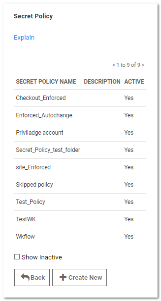
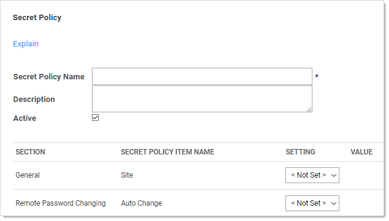
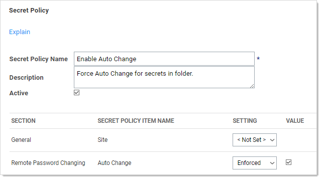

[title]: # (Modifying Folders with Secret Policies)
[tags]: # (Folder)
[priority]: # (1000)

# Modifying Folders with Secret Policies

You can configure secret policies to apply RPC and security settings to an entire folder of secrets.

To create a new secret policy:
$1
$2
   
$1
$2
   
$1
$2$1
$2
   - **Default:** The policy is applied to all secrets in the folder initially, but it **is** possible to manually change the applied secret settings as well.

   - **Enforced:** The policy is applied to all secrets in the folder initially, and it **is not** possible to change those applied settings on secrets in that folder.
$1
$2
   
$1
$2
   > **Note:** To deactivate a policy that you no longer want, edit the policy and deselect the **Active** check box. For information about applying a secret policy to a folder, see [Editing Folder Permissions](../editing-folder-permissions/index.md).
