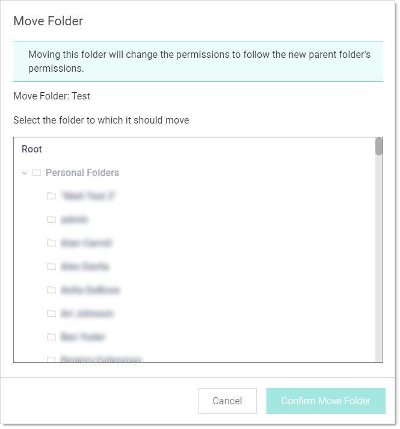

[title]: # (Moving Folders)
[tags]: # (Folder)
[priority]: # (70)

# Moving Folders

There are two ways to move folders. The **easiest way is to drag a folder** over another and drop it. The other way is as follows:

1. Ensure that you have edit permission for both the source and destination folders.

1. Right click the folder in the navigation pane and select **Move Folder**. The Move Folder page appears:

   

1. Navigate to and select the destination folder in the folder tree.

1. Click the **Confirm Move** button.
