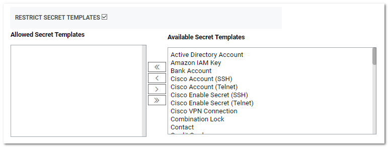
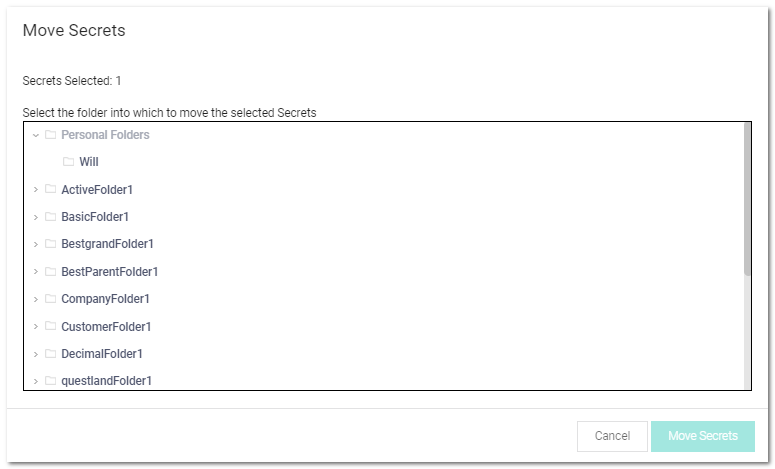

[title]: # (Restricting Secret Templates for Folders)
[tags]: # (XXX)
[priority]: # (80)

# Restricting Secret Templates for Folders

1. On the **Edit Existing Folder** page, click to select the **Restrict Secret Templates** check box. The Allowed and Available Secret Template lists appear:

   

1. Select one or more of the secret templates in the **Available Secret Templates** list and use the arrow buttons to move the template to the **Allowed Secret Templates** list. 

1. Click the **Save** button.

### Adding and Moving Secrets Between Folders

1. Consider the following before moving a secret between folders:

   - To add or move a secret to a folder, you must have Edit permission on that folder (either direct or through inheritance).

   - To move a secret from a folder, you must have Edit permission on that secret. If the secret has the "Inherit Permissions from folder" setting enabled, then you must have Owner permission to move that secret to a new folder.

   - When a secret is moved to a folder, it automatically gets the "Inherit Permissions from folder" setting even if it had specific permissions before the move.

1. Navigate to the folder containing the secret or secrets you want to move.

1. For each secret:

   1. Hover the mouse pointer over the secret. A check box appears on the left end.

   1. Click to select the check box. A command row of icons appears:

      

     1. Click the Move to Folder   icon. The move Secrets pop-up page appears:

      

1. Navigate to and select the target folder for the secret or secrets.

1. Click the **Move Secrets** button. The Bulk Progress popup appears:

   

1. The secret moves to the selected folder.
