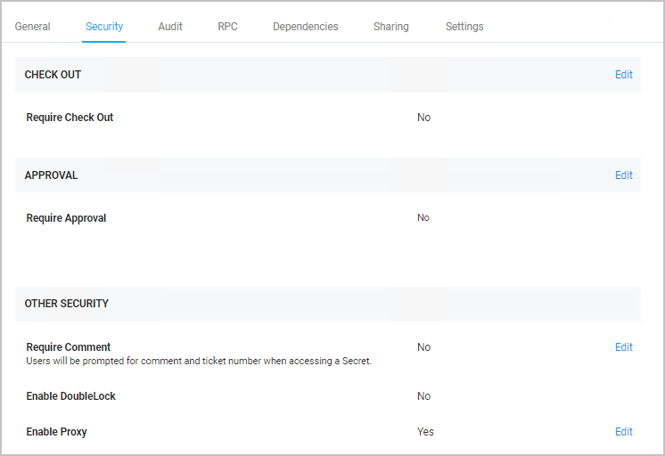
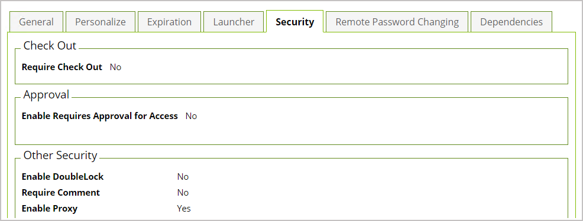
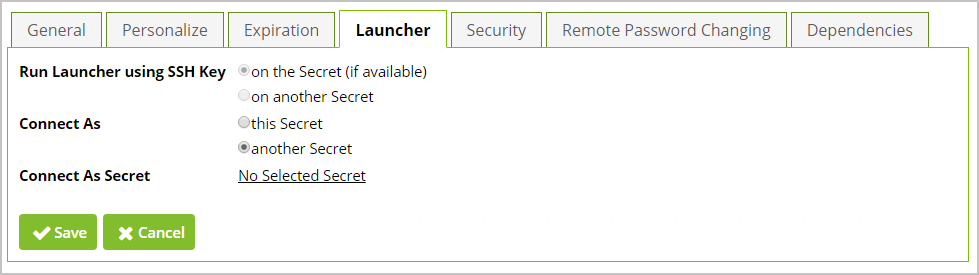

[title]: # (Using Connect As Command and SSH Proxy with PuTTY launcher)
[tags]: # (Connect As Command,PuTTY launcher,SSH proxy,Unix, root account)
[priority]: # (1000)
[display]: # (all)

# Using Connect As Command and SSH Proxy with PuTTY Launcher

The Connect As Command advanced setting for the PuTTY launcher type is used to automatically su or sudo from a Unix account secret after launching a PuTTY session. To use this feature, you will need the following:
* a Unix *root* account secret

* a Unix *regular* account secret

* SSH Proxy enabled on Secret Server

* SSH Proxy and PuTTY Launcher enabled on the secret you use with this feature

>**Note**: We recommend building a custom secret based on a copy of the built-in **Unix Root Account (SSH)** template, and associating the PuTTY launcher with it.

Typically, the session will be launched initially as the Unix *regular* account secret that you specified in the **Secret To Use** field on the **Settings** page of a Unix *root* account secret.

## Configuration in the New UI

1. Enable and configure SSH Proxy global settings.

1. Enable the SSH Proxy option on a secret with a PuTTY launcher.

   

1. Click the secret's **Settings** tab.

1. Next to **Connect Using**, select **Credentials on another Secret**.

1. Next to **Secret to Use**, click **No Selected Secret**.

   

1. Navigate to **Admin \> Secret Templates**.

1. Select a template from the drop-down and click **Edit**.

1. Scroll down the page and click **Configure Launcher**.

1. Locate the PuTTY launcher type and  click **Edit**.

1. Verify that the commands in the **Connect As Command** field are correct.

   

## Configuration in the Classic UI

1. Enable and configure SSH Proxy global settings.

1. Enable the SSH Proxy option on a secret with a PuTTY launcher.

   

1. Click the secret's **Launcher** tab.
 
1. Next to **Connect As Secret**, click **No Selected Secret**.

   

1. Navigate to **ADMIN \> Secret Templates**.

1. Select a template from the drop-down and click **Edit**.

1. Scroll down the page and click **Configure Launcher**.

1. Locate the PuTTY launcher type and click **Edit**.

1. Verify that the commands in the **Connect As Command** field are correct.
