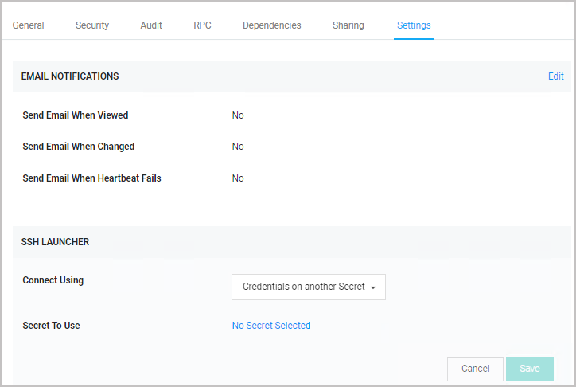
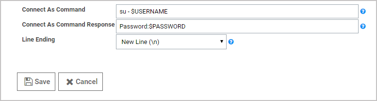

[title]: # (Using Connect As Command and SSH Proxy with PuTTY launcher)
[tags]: # (Connect As Command,PuTTY launcher,SSH proxy,Unix, root account)
[priority]: # (1000)
[display]: # (all)

# Using Connect As Command and SSH Proxy with PuTTY Launcher

Connect As Command is an advanced setting for the PuTTY launcher type that is used to automatically su or sudo from a Unix account secret after launching a PuTTY session.

To use this feature, you will need a Unix *root* account secret and a Unix *regular* account secret. The session typically launches as the Unix *regular* account secret that is specified in the **Secret To Use** field on a Unix *root* account secret's **Settings** page.

This procedure explains how to set a connect as secret when using SSH Proxy to allow connecting with a less privileged account and then using sudo or su to elevate privileges.

1. Make sure SSH proxy is enabled in Secret Server's global configuration settings.

1. Open a secret based on a template with SSH proxy enabled that specifies PuTTY as the launcher type to use.

   >**Note:** For this feature, we recommend building a custom secret based on a copy of the built-in **Unix Root Account (SSH)** template, and associating the PuTTY launcher with it.

1. Click the secret's **Settings** tab.

1. Next to **Connect Using**, select **Credentials on another Secret**.

1. Next to **Secret to Use**, click **No Selected Secret**.

   

1. Navigate to **Admin \> Secret Templates**.

1. Select a template from the drop-down and click **Edit**.

1. Scroll down the page and click **Configure Launcher**.

1. Locate the PuTTY launcher type and  click **Edit**.

1. Verify that the commands in the **Connect As Command** field are correct.

1. If you change anything, click **Save**.

   
