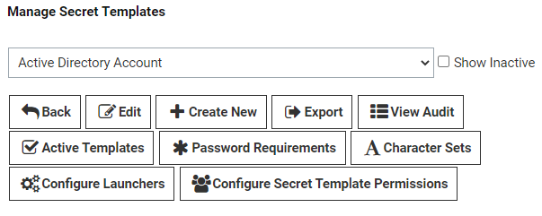
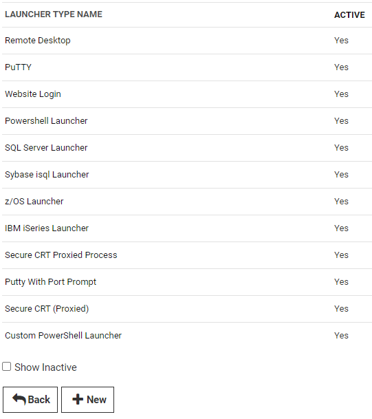
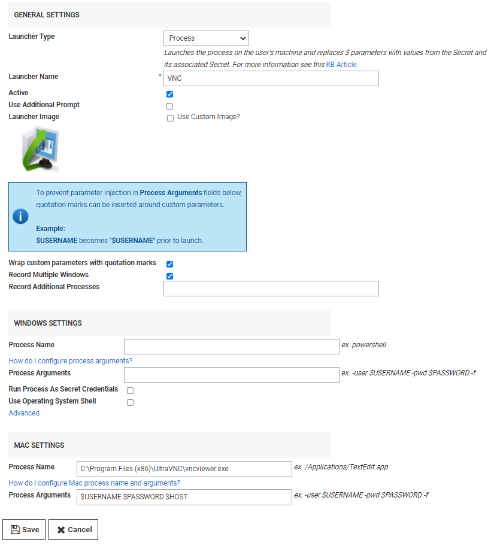

[title]: # (Ultra VNC Custom Launchers)
[tags]: # (vnc,custom,connection,launcher)
[priority]: # (1000)

# Creating and Implementing an Ultra VNC Custom Connection Launcher

Follow the steps below to create an Ultra Virtual Network Computing (VNC) custom connection launcher using Secret Server on a Windows machine.

## Create an Ultra VNC Custom Connection Launcher

1. Open Secret Server and click, **Admin** > **Secret Templates** > **Configure Launchers**

   

1. Click the **+New** button at the bottom of the window.

   

1. Under **General Settings**, enter the settings as described below, then click **Save**.
  
   **Launcher Type**: `Process`
  
   **Process Arguments**: `$USERNAME $PASSWORD $HOST`
  
   **Process Name**: `C:\Program Files (x86)\UltraVNC\vncviewer.exe`
  
   **Parameters**: `/user $USERNAME /password $PASSWORD -connect $HOST`

    >**Note:** You may need to change the Process Arguments if the names of these fields in your Secret Template are something other than "Username" "Password" and "Machine"

   

## Assign the Launcher to a Template

Assign the new launcher to an appropriate existing template. To build a new template specifically for VNC connections, see [Creating or Editing Secret Templates](../../../secret-templates/managing-secret-templates/creating-or-editing-secret-templates/index.md))

1. Open the template and click the "Configure Launcher" button.

   

1. Click **+Add New Launcher**

   

1. Select the VNC custom launcher you just created

1. Map the username and password fields accordingly.

1. Click **Save**.