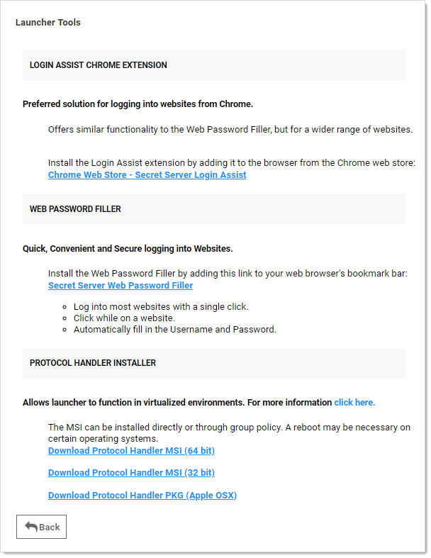

[title]: # (Enabling Launchers)
[tags]: # (Launcher)
[priority]: # (1000)

# Enabling Launchers

By default, the launcher is enabled by the **Enable Launcher** setting under **Admin > Configuration**.

The launcher can be deployed in two ways—with the ClickOnce or Protocol Handler applications. This can also be set in the configuration settings.

The Protocol Handler application allows the launcher to be used in virtualized environments or any environment in which the user does not have access to a Windows Temp directory. The Protocol Handler can be downloaded by clicking the  button on the Dashboard and selecting **Launcher Tools**:

For details, see the [Protocol Handler Launcher](https://updates.thycotic.net/links.ashx?ProtocolHandler).
