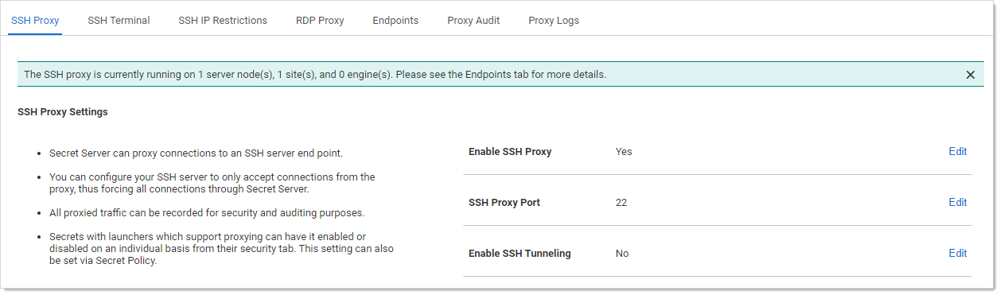
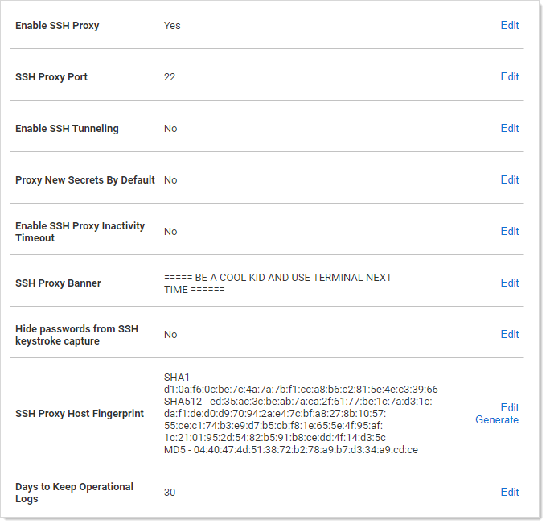

[title]: # (Configuring SSH Proxies for Launchers)
[tags]: # (Launcher)
[priority]: # (1000)

# Configuring SSH Proxies for Launchers

Launchers using an SSH connection can alternatively use SS as a proxy rather than the launcher connecting directly to the target system from the machine it is being launched from. 

> **Note:** Remote Desktop Services (RDS) is a special version of Secret Server Protocol Handler (SSPH) that can record keystrokes on its own, if configured in SS. See [Session Connector](../../session-connector/index.md) for details.

When proxying is enabled, all RDS sessions are routed through SS. You can configure your SSH server to only accept connections from the proxy, thus forcing all connections through Secret Server. All proxied traffic can be recorded for security and auditing. You can enable or disable proxying for individual launchers. You can also do this using a secret policy.

In SS Cloud, the distributed engine service also supports acting as a proxy for session launchers for greater network flexibility and offloading connections from the SS instance.

To configure this:

1. Select **Admin \> Proxying**. The SSH Proxy tab of the Proxying page appears:

   

   The settings are on the right:

   

1. Scroll down and click the desired **Edit** links to enter your SSH proxy configuration settings. 

   The **SSH Proxy Settings** are:
    - **Enable Proxy:** Enable or disable SSH proxying.
    - **SSH Proxy Port:** The port to proxy through. Changing this setting closes all active SSH proxy connections.
    - **Enable SSH Tunneling:** SSH Tunneling allows Remote Desktop Sessions to be proxied using the same proxy configuration settings.
    - **Proxy New Secrets by Default:** Enable proxying for applicable secrets when you create them.
   - **SSH Proxy Banner:** Users connecting through SSH proxy see this text banner. This is not the same as the SSH Terminal Banner.
   - **Hide Passwords from SSH Keystroke Capture:** By default proxying records keystrokes. This disables that.
   - **SSH Proxy Host Fingerprint**: The SS SSH private key. This can be generated using the **Generate** link.
   - **Days to Keep Operational Logs**: Number of days to store operational audit logs.

   The **SSH Block List Settings** are:

   - **Enable Block Listing:** Block incoming SSH proxy clients that connect and fail to authenticate.
   - **Auto Block Max Attempts:** How many times authentication can fail before the connection is blocked.
   - **Auto Block Time Frame (minutes):** How long to block connections after authentication tries are exhausted.

   The **Client Override IP Address Ranges** are IP address ranges that you can configure to always allow or always block the incoming connection. Click the **Add** link to add one. Examples:
   
   - 192.168.3.12
   - 192.168.42.147-192.168.42.194
   - 192.168.3.52/22

