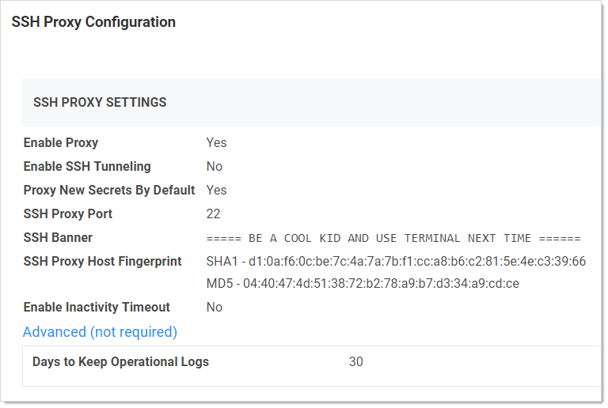
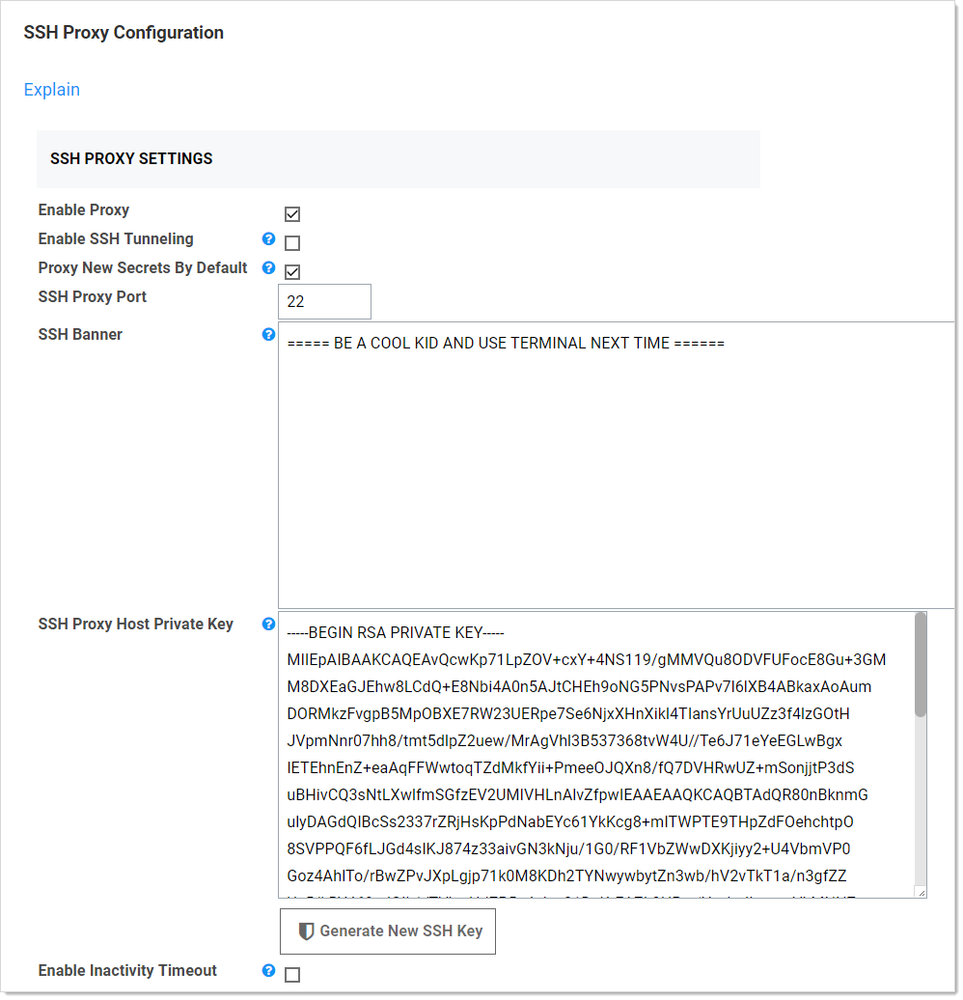

[title]: # (Configuring SSH Proxies for Launchers)
[tags]: # (Launcher)
[priority]: # (1000)

# Configuring SSH Proxies for Launchers

Launchers using an SSH connection can alternatively use SS as a proxy rather than the launcher connecting directly to the target system from the machine it is being launched from. When proxying is enabled, all RD sessions are routed through SS. In SS Cloud, the Distributed Engine service also supports acting as a proxy for session launchers for greater network flexibility and offloading connections from the SS instance.

To configure this:

1. Select **Admin \> SSH Proxy**:

   

1. Scroll down and click the **Edit** button to enter your SSH proxy configuration settings. The SSH Proxy Configuration page appears:

   

   The **SSH Proxy Settings** are:

    - **Enable Proxy:** Enable or disable SSH proxying.

    - **Enable SSH Tunneling:** SSH Tunneling allows Remote Desktop Sessions to be proxied using the same proxy configuration settings.
$1
$2
   - **SSH Banner:** Users connecting through SS see this text banner on the SSH client.

   - **SSH Proxy Private Key:** The SS SSH private key, this can be generated using the **Generate New SSH Key** button.
$1
$2
   The **SSH Terminal Settings** are:

   - **Enable Inactivity Timeout:** Enable or disable closing the SSH terminal session if there is inactivity for a defined number of seconds. When enabled, a **Timeout (seconds)** text box appears.

   - **Enable Terminal:**  Enable or disable the SSH terminal.

   - **SSH Terminal Banner:** The text banner you want displayed when somebody opens an SSH terminal session.

   > **Note:** For details about connecting to SS with an SSH terminal, see the [SSH Terminal Administration Guide](https://thycotic.force.com/support/s/article/SS-ADM-EXT-SSH-Terminal).

   > **Note:** To manipulate a secret via an SSH terminal, the secret’s proxy setting must be enabled, and the secret must be shared with the authenticated terminal user.

1. Click the edit icon next to one of the machines in the **Nodes** section.

   The **Nodes** settings are:

    - **Machine Name:** The public host name of the node server.

    - **SSH Public IP Address of Nodes:** The public IP that the client launcher connects to. In most cases, this can be the same as the SSH bind address;  however, there may be cases where the public IP or host differs from the private IP that SS should bind to, such as NAT or an Amazon EC2 instance.

    The **Sites** settings are:

    - **Proxy Enabled:** Enable or disable SSH proxying for a specific site.

    - **Site Name:** Site name or ID.

    - **SSH Port:** The port SS listens on. The default is 22.

    The **Engines** settings are:

    - **Friendly Name:** Human readable site name or ID.

    - **Hostname/IP Address:** The public hostname or IP that the client launcher connects to. In most cases this can be the same as the SSH Bind Address, however there may be cases where the public IP or host differs than the private IP that SS should bind to, such as NAT or an Amazon EC2 instance.

    - **SSH Bind Address:** The IP Address of the network adapter that the SS SSH listener should bind to. This should not be localhost or 127.0.0.1\. If you are not sure which bind IP Address to use, you may use 0.0.0.0, which binds to all IPv4 interfaces on the machine.

1. To enable secrets assigned to a site, edit the corresponding site and check the **Proxy Enabled** check box and optionally specify a custom SSH port.

1. The Distributed Engines on that site now appear in the **Engines** section, and you can configure the **Hostname/IP Address** and **SSH Bind Address** text boxes on each one. The default values are the FQDN of the machine and 0.0.0.0 which should work for many internal connections but may need to be edited depending on how users are connecting to them.

   > **Note:** The flow for when a user proxies through a Distributed Engine, rather than SS, is the same, except that rather than the user's session launcher connecting to the public host on the node, it connects to the public host of an engine that is part of a site the secret is assigned to.

1. Once SSH Proxy has been configured, secrets using an SSH launcher have a **Show Proxy Credentials** button available. Click it to display credentials that can be used to connect through SS to the target system, that is, where a user would like to start an SSH session manually.
