[title]: # (Secret Server Session Connector)
[tags]: # (Launcher, protocol handler, session connector, RDS)
[priority]: # (1000)
[display]: # (none)

# Secret Server Session Connector

## Overview

Normally, Secret Server (SS) requires installing additional software such as Connection Manager or protocol handler on the end-user computers to launch secrets, such as RDP, SSH, or custom, and optionally record the session. 

With Session Connector installed on an Remote Desktop Services (RDS) server, anyone who can download and launch a standard Remote Desktop Protocol (RDP) shortcut file can have the same experience. The RDS server itself runs a special RDS protocol handler as a remote app to record the sessions, so end-users do not need to install any additional software.

The Session Connector feature is largely scalable and can be set up using a single RDS server, a load-balanced cluster of RDS servers, or multiple load-balanced clusters of RDS servers. Before you set up the Session Connector feature, there are some baseline requirements for those RDS servers and on your domain.

## Connection Sequences

**Figure: Session Connector Connection Sequences for an RDS Server.**

**Figure: Session Connector Connection Sequences for Clustered RDS Servers.**

## Download

Session Connector is downloaded separately from SS. Go to [Session Connector Download](../session-connector-download/index.md)  for download links and hashes.

## Task 1: Review the RDS Server Prerequisites

- Each RDS server should be a 64-bit installation of Windows Server 2012, 2016 or 2019.

- You **MUST** have access to the console session (non-RDP) to install the Session Connector integration. This is in case of any of any errors during installation, which may disable RDP access to the server.

- Each RDS server must be domain joined. Configuration of the RDS feature requires being logged in as a domain user.

- Each RDS server needs to have a recent version of the C++ redistributable installed (v14.26.28720 or higher, May 2020):
  - Download: https://aka.ms/vs/16/release/vc_redist.x64.exe
  - More info: [The latest supported Visual C++ downloads](https://support.microsoft.com/en-us/help/2977003/the-latest-supported-visual-c-downloads)

- Each RDS server needs to have an credential available to manage temporary users.  This credential should be able to create and delete local users and add users to the Remote Desktop Users group. If you plan to use one or more load-balanced clusters of RDS servers, this credential should be a domain user and will be used for all servers inside of a cluster. We recommend one domain user per cluster. This credential will be referred to as the **RDS Credential**

- Each RDS server needs to have RDS installed. See the next section.

## Task 2: RDS Services Setup

### Step 1: Install Remote Desktop Services—Remote Desktop Session Host

> **Note:** Session Connector cannot function without this feature and will refuse to install if it is not present. **RDS requires additional remote desktop licensing from Microsoft.** This may also require installing the remote desktop licensing feature if you do not already have a licensing server available in your environment. See [Activate the Remote Desktop Services license server](https://docs.microsoft.com/en-us/windows-server/remote/remote-desktop-services/rds-activate-license-server) for details.

1. In Server Manager, click **Add roles and Features**. The Add Role and Features wizard appears.

1. Click the **Next \>** button. The Installation Type page appears.

1. Select **Role-based or feature-based installation**.

1. Click the **Server Roles** menu item (or press **Next \>** twice). The Select server roles page appears:

   

1. Click to select the Remote Desktop Services check box.

1. Click the **Next \>** button. The Select role services page appears:

   

1. Click to select the **Remote Desktop Session Host** check box.

1. Click the **Next \>** button. The Add features… page appears:

   

1. Click the **Cancel** button. A "Confirm installation selections" page appears.

1. Click the **Install** button.

### Step 2: Setup in Secret Server

1. Enable the **Session Connector** advanced configuration setting. For more instructions on this please follow the steps under **Configuring Session Connector Settings** below.
2. Go to **Admin \> Configuration \> General** tab.
3. Ensure the **Secret Server Custom URL** setting is set to a valid URL for your SS.  This URL is given out to protocol handler launches (including Session Connector and RDS protocol handler) to ensure it knows how to connect back to SS. Use HTTPS for maximum security. In fact, as of version 10.9, protocol handler and Session Connector both refuse to connect to HTTP.
4. Create a Secret for the **RDS Credentials** mentioned above. If the credential is a local account, use a Windows Local Account secret, and if it is a domain user, use an Active Directory secret.
5. Create application users in SS, one for each of the RDS server machines. See **Creating RDS Application Accounts** for details.
6. Share the secret created for the RDS credential mentioned above with the RDS application accounts that will be used by the RDS server(s). See **Application Account RDS Credential Sharing**.
7. Create Session Connector custom launchers. For example, if you wanted to run an RDPsession on the RDS server, you should configure a custom Session Connector launcher that uses the built-in RDP launcher as its child launcher. See **Configure Session Connector Custom Launchers**.
8. Assign your Session Connector custom launchers to the secret templates you want to launch from. See **Assign Session Connector Custom Launchers to Secret Templates**.
9. Configuration and setup is finished for SS, but there are still some things you need to do inside of the RDS servers before setup is complete.

### Step 3: Configuring Session Connector Settings

Enable Session Connector:

1. Go to `https://<your SS location>/Configuration Advanced.aspx`. I THOUGHT ONLY SUPPORT WAS ALLOWED TO GO TO THIS PAGE?
1. Click the **Edit** button at the bottom of the page.
1. Set **Session Connector** to **True**.
1. (Optional) Set **Session Connector Session Timeout** to **WHAT??**. Session Connector .RDP files are valid for this many seconds (only for a single use). The default value is 900 (15 minutes). If set to 0 or below, the default is used.
1. (Optional) Set **Session Connector Allow Connection Sharing** to **True**. This changes the value of "disableconnectionsharing" in the output Session Connector RDP files. If true, this speeds up concurrent launches into the same RDS server quite a bit by re-using the existing Windows sessions, at the risk of sometimes causing errors if launching a new session while an old session is in the middle of closing. The default is false.
1. Click the **Save** button.

### Subprocedures for Task 1

#### Creating RDS Application Accounts

1. Go to **Admin \> Users**.

1. Click the **Create New** button. The Edit User page appears:

   

3. Type in or set the account details. 

3. Ensure that the **Enabled** check box is selected.

3. Click the **Advanced** link. Additional parameters appear.

3. Click to select the **Application Account** check box. As an application account, the user can only log on through the application account API and does not require a separate user license.

   > **Note:** We recommend application account users because only API access is required by Session Connector, and they do not consume regular user licenses.  You may want to name the users to make it obvious which server they belong to. We recommend one user per RDS server for auditing purposes and to avoid one server with invalid credentials locking out the user, impacting all the other servers. See [Secret Server Software Development Kit for DevOps](../../api-scripting/sdk-cli/index.md) for more about the API.

3. Repeat this process for each RDS Server if you are clustering more than one.

**HOW ABOUT THE MANAGED BY DROPDOWN (USER ADMINS VS. USER OWNERS)? DO WE NEED TO SAY ANYTHING ABOUT 2FA?**

#### Enabling Application Account RDS Credential Sharing

Each RDS application account must have view access to the RDS Credential that the RDS server(s) use to manage the temporary Windows local accounts:

1. Go to the RDS credential secret you created earlier.

1. Click the **Sharing** tab:

   

1. Grant view access to the applicable application account users. That is usually one SS user account per RDS server. If you are using a cluster, this secret would be an Active Directory secret for a domain credential that all the RDS servers can use, and you would share it with each of the RDS application accounts for each RDS Server in the cluster using in their Session Connector configuration.

#### Configuring Session Connector Custom Launchers

You must create a custom launcher for each combination of and RDS server cluster and custom launcher type:

1. Go to **Admin \>  Secret Templates**.

1. Click the **Configure Launchers** button. The Launcher Types page appears.

1. Click the **New** button. The Launcher page appears:

   

1. Type or set the parameters as follows:
   
   - **Launcher Type:** Session Connector Launcher. This launcher type will not be visible until the Configuration Advanced Setting is enabled.
   - **Active:** Ensure this is selected.
   - **Record Keystrokes:** Check to record keystrokes in addition to video on related secrets with session monitoring enabled.
   - **Child Launcher Type:** Click to select the launcher type, such as Remote Desktop or PuTTY. § This is the real launcher type that runs on the RDS server to connect to the secret. 
   - **RDS Server Hostname:** IP or hostname (or clustered IP or hostname) for the RDS server or cluster. The RDS host is what makes the final connection to the endpoint.
   - **RDS Server Port:** Type the port. The default RDP port is TCP 3389.
   - **RDS Server Credentials:** Click the **RDS Credentials** link to pick the Secret configured above for credentials that can create and delete local users. If RDS Server Hostname points to a cluster, all servers must be able to use these credentials.
   
1. Click the **Save** button.

####  Assigning Session Connector Custom Launchers to Secret Templates

1. Go to **Admin \>  Secret Templates**. The Manage Secret Templates page appears:

   

1. Click the unlabeled dropdown to select a secret template that you want to allow Session Connector to launch from.

1. Click the **Edit** button to view that secret template. The Secret Template Designer page appears:

   

1.  Click the **Configure Launchers** button at the bottom of the page to open the launcher mappings. The Secret Template Edit Launcher Configuration page appears:

   

1. Click the Add New Launcher button. A page of the same name appears:

   

1.  Click to select the desired parameters for the launcher:

   

1. All secrets using this template are now ready to run Session Connector launches.

# Task 2: RDS Setup

### Step 1: Install the Secret Server RDS Protocol Handler

·     Install the **Secret Server** **RDS Protocol Handler** RDS server(s) - **SSProtocolHandlerRDS.msi**

o  Download URL: [**https://updates.thycotic.net/links.ashx?SessionConnector**](https://updates.thycotic.net/links.ashx?SessionConnector) - 

o  This special version of Protocol Handler can record keystrokes on its own, if configured in Secret Server.

o  Due to the optional keystroke recording (only done if configured in Secret Server), it may need to be whitelisted in any AV software running on the server.

§ Not currently necessary with Windows Defender.

o  **It does not auto-update itself**, unlike the regular version of Protocol Handler, since this could cause problems with multiple users running it at once on a single RDS server. Older versions will continue to work with new Secret Server releases until updated, but a manual update will be required on the RDS server(s) to take advantage of any new Protocol Handler features in future releases.

### Step 2: Add the Remote Desktop Collection and Application

·     Add the Remote Desktop Collection and Application:

o  While logged in as a domain user, go to Server Manager, click Remote Desktop Services on the left side.
 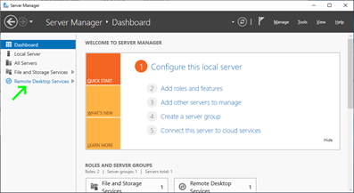

§ If logged in as a local user, you will see this error and be unable to configure RDS. Must be logged in as a domain user.
 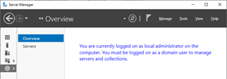

o  Add a RDS Collection for **Session Connector**.
 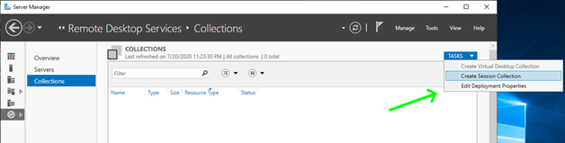

§ **Collection Name:** Session Connector

§ **RD Session Host:** add the local server from the left side (Server Pool) to the right side (Selected)

§ **User Groups:** leave the default of Domain Users

·     This is not actually used by Session Connector (it creates temporary local users), but RDS requires something to be selected.

§ **User Profile Disks:** unchecking this is fine, this is not used by Session Connector.

§ **Confirmation:** click Create.

o  Edit the Collection to configure advanced settings.

§ Click on the Collection on the left side.
 

§ In the Properties section, click **Tasks** / **Edit Properties**.
 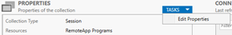

§ Click on the **Security** tab, **uncheck** “Allow connections only from computers running Remote Desktop with Network Level Authentication”. 

·     Necessary because Session Connector uses temporary one-time use local users which do not exist until a connection is authenticated with Secret Server, making them incompatible with NLA.
 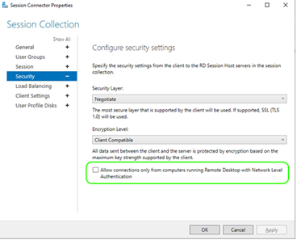

§ **Optional:** If you would like to restrict what can be mapped at the server level (drives/clipboard/etc), you can do so on the **Client Settings** tab. (This is also configurable in Secret Server on each Secret)

§ Click **OK** to save.

o  Add the RemoteApp for RDS Protocol Handler.

§ Click on the Collection on the left side.
 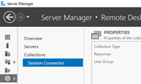

§ In the RemoteApp Programs section, click on **Tasks**, then **Publish RemoteApp Programs**.
 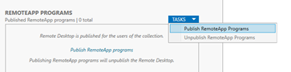

§ Click the “**Add…**” button, and browse to C:\Program Files\Thycotic Software Ltd\Secret Server Protocol Handler

§ Select RDPWin.exe and click “**Open**”

§ RDPWin will now be selected in the list. Click “**Next**”.
 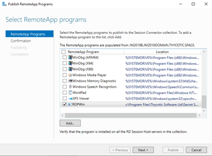

§ Click “**Publish**” to save, then click **Close**.

§ Right click on the RDPWin RemoteApp and click “**Edit Properties**”.
 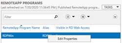

§ On the **Parameters** tab, select “Allow any command-line parameters”, then click **OK**.
 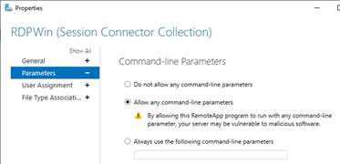

o  Configure RDS related Group Policy Settings

§ To configure on a single server, run the Group Policy Editor (gpedit.msc)

§ Go to Computer Configuration / Administrative Templates / Windows Components / Remote Desktop Services / Remote Desktop Session Host / Session Time Limits

§ Edit “Set time limit for logoff of RemoteApp sessions”

·     Set to Enabled, with RemoteApp session logoff delay of “Immediately”
 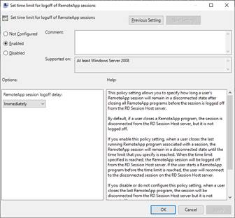

### Task 3: Install the Secret Server Session Connector

·     Install the **Secret Server Session Connector** on the RDS server(s) - **SSSessionConnector.msi**

o  Download URL: [**https://updates.thycotic.net/links.ashx?SessionConnector**](https://updates.thycotic.net/links.ashx?SessionConnector)

o  Setup will require you to enter the Secret Server URL, and Application Account Username/Password configured above.
 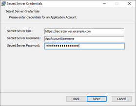

o  The Secret Server URL must start with https:// for security reasons, or the installer will not proceed.

o  When finished, this will prompt you to reboot the server, which really is necessary to restart all of the various Remote Desktop / Terminal Service services.

o  After the server reboots, it will be Session Connector listening on the Remote Desktop port (i.e. TCP 3389), and you can now use Session Connector Custom Launchers pointed at it.

### Task 4: Updating API Credentials

·     The credentials for the Secret Server Application Account are saved encrypted in the registry    

o  Restricted to the NETWORK SERVICE account (which Remote Desktop runs under) using DPAPI-NG

·     If the Application Account credentials change in the future, follow these steps to update them

o  Run Regedit.exe

o  Navigate to HKLM\SOFTWARE\Thycotic\SessionConnector

o  Edit “CredentialsEncrypted”, set it to 0

o  Edit “SecretServerUsername”, set it to the plain text new username

o  Edit “SecretServerPassword”, set it to the plain text new password

·     These credentials will then be encrypted upon their first use, either the next time someone launches a Session Connector session that hits this server, or if you reboot the entire server. If you refresh in Regedit once this happens, CredentialsEncrypted will be set back to “1” and an encrypted version of the username and password will be visible.

Launching

·     Now that it has been configured and installed, you should be able to launch Session Connector sessions.

·     Once configured, the Session Connector Custom Launchers will appear just like any other launcher on the associated Secret template types.

·     When clicked, a Remote Desktop shortcut (.RDP) file will be downloaded.

·     This .RDP file can then be opened by standard Remote Desktop clients like mstsc.exe in Windows or RoyalTS in OSX.

·     When launched, the end-user will connect to the RDS host configured on the Session Connector Custom Launcher.

·     The RDS host will then launch RDS Protocol Handler and connect to the actual destination machine.

# Troubleshooting

·     When launching a downloaded .RDP file, if Session Connector rejects the session due to any issues (including being expired based on the “Session Connector Session Timeout” setting), the user’s Remote Desktop client will receive a generic error about the RemoteApp being invalid

·     In the SS.log file, you can search for “SessionConnector” to find more details about why sessions may have been rejected

·     Session Connector will also log to the file “C:\Program Files\Thycotic Software Ltd\Secret Server Session Connector\log\SS-SC.log” on each individual RDS server. 

o  i.e. If the RDS server has trouble using the supplied **RDS Credential** to create a local user, it will be logged to this file

# Uninstalling

·     Secret Server Session Connector can be removed from “Add/Remove Programs” or “Apps & Features”

·     Once uninstalled, a reboot will be required to restore the default Remote Desktop behavior

·     Any related Session Connector Custom Launchers will need to be un-associated with any Secret Templates they were previously tied to. 

o  It is not currently possible to delete a Custom Launcher in Secret Server, but if unassociated with all Secret Templates, it will not appear on any actual Secrets.