[title]: # (Secret Server Session Connector)
[tags]: # (Launcher, protocol handler, session connector, RDS)
[priority]: # (1000)
[display]: # (all)

# Secret Server Session Connector

## Overview

Normally, Secret Server (SS) requires installing additional software such as Connection Manager or Secret Server Protocol Handler (SSPH) on the end-user computers to launch secrets, such as RDP, SSH, or custom, and optionally record the session. 

With Secret Server Session Connector (SSSC) installed on a Remote Desktop Services (RDS) server, anyone who can download and launch a standard Remote Desktop Protocol (RDP) shortcut file can have the same experience. The RDS server itself runs a special SSPH for RDS—SSPH (RDS) as a remote app to record the sessions, so end-users do not need to install any additional software.

The SSSC feature is largely scalable and can be set up using a single RDS server, a load-balanced cluster of RDS servers, or multiple load-balanced clusters of RDS servers. Before you set up the SSSC feature, there are some baseline requirements for those RDS servers and on your domain.

> **Note:** SSSC (RDP) is sometimes referred to as RDPWin in this topic. RDPWin is the internal development name for SSSC (RDP).

**Table:** Terms and Definitions

| Term       | Definition                                                   |
| ---------- | ------------------------------------------------------------ |
| RDP        | *Remote Desktop Protocol*. A Microsoft protocol for remote control of computers. |
| RDPWin     | The internal development name for SSSC (RDP).                |
| RDS        | *Remote Desktop Services*. Remote control services (using RDP) provided by a dedicated server or servers. |
| SSPH       | *Secret Server Protocol Handler*. SSPH is an application on an end-user's machine. It enables communication between SS and that client machine. It also provides the files needed by secret launchers. |
| SSPH (RDP) | *Secret Server Protocol Handler, RDP Version*. A special SSPH that adds RDP functionality, specifically, keystroke detection. |

## Connection Sequences

**Figure: Session Connector Connection Sequences for an RDS Server.**

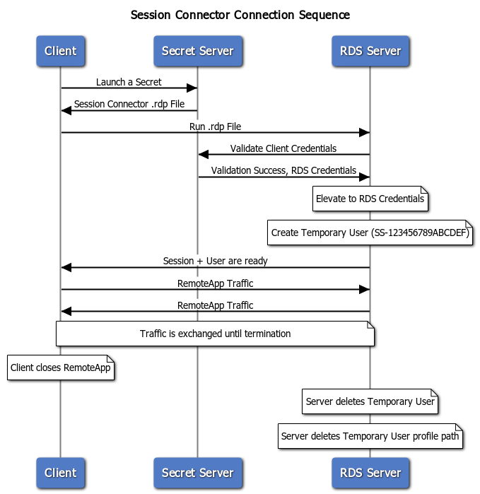

**Figure: Session Connector Connection Sequences for Clustered RDS Servers.**

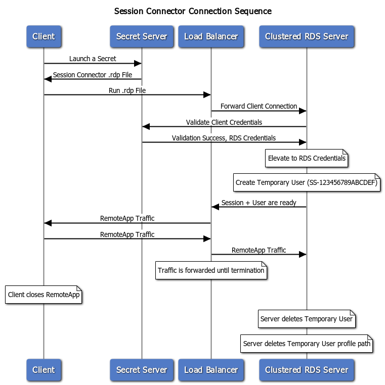

## Download

Session Connector is downloaded separately from SS. Go to [Session Connector Download](../session-connector-download/index.md)  for download links and hashes.

## Task 1: Review the RDS Server Prerequisites

- Each RDS server should be a 64-bit installation of Windows Server 2012, 2016 or 2019.
- You **MUST** have access to the console session (non-RDP) to install the SSSC integration. This is in case of any of any errors during installation, which may disable RDP access to the server.
- Each RDS server must be domain joined. Configuration of the RDS feature requires being logged in as a domain user.
- Each RDS server needs to have a recent version of the C++ redistributable installed (v14.26.28720 or higher, May 2020):
  - Download: https://aka.ms/vs/16/release/vc_redist.x64.exe
  - More info: [The latest supported Visual C++ downloads](https://support.microsoft.com/en-us/help/2977003/the-latest-supported-visual-c-downloads)

- Each RDS server needs to have a credential available to manage temporary users.  This credential should be able to create and delete local users and add users to the Remote Desktop Users group. If you plan to use one or more load-balanced clusters of RDS servers, this credential should be a domain user and will be used for all servers inside of a cluster. We recommend one domain user per cluster. This credential will be referred to as the **RDS Credential**
- Each RDS server needs to have RDS installed. See the next section.

## Task 2: RDS Services Setup

### Step 1: Install Remote Desktop Services—Remote Desktop Session Host

> **Note:** SSSC cannot function without this feature and will refuse to install if it is not present. **RDS requires additional remote desktop licensing from Microsoft.** This may also require installing the remote desktop licensing feature if you do not already have a licensing server available in your environment. See [Activate the Remote Desktop Services license server](https://docs.microsoft.com/en-us/windows-server/remote/remote-desktop-services/rds-activate-license-server) for details.

1. In Server Manager, click **Add roles and Features**. The Add Role and Features wizard appears.
1. Click the **Next \>** button. The Installation Type page appears.
1. Select **Role-based or feature-based installation**.
1. Click the **Server Roles** menu item (or press **Next \>** twice). The Select server roles page appears:

   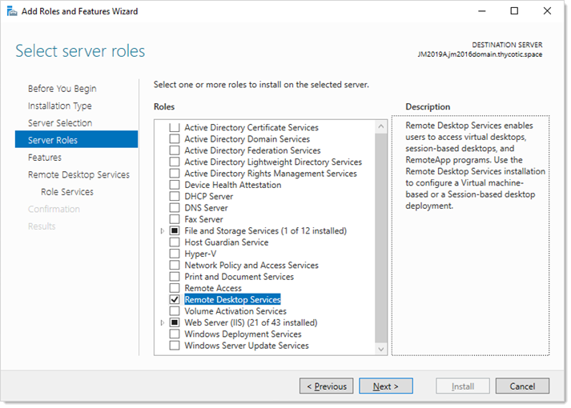

1. Click to select the **Remote Desktop Services** check box.
1. Click the **Next \>** button. The Select role services page appears:

   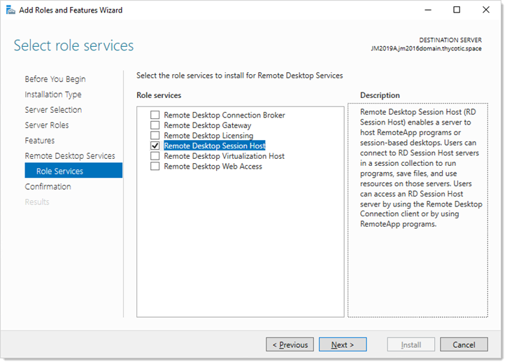

1. Click to select the **Remote Desktop Session Host** check box.
1. Click the **Next \>** button. The Add features… page appears:

   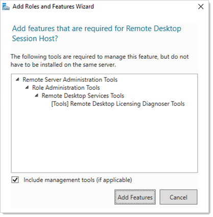

1. Click the **Add Features** button. A "Confirm installation selections" page appears.
1. Click the **Install** button.

### Step 2: Setup in Secret Server

1. Enable the **Session Connector** advanced configuration setting. For more instructions on this please follow the steps under **Configuring Session Connector Settings** below.
2. Go to **Admin \> Configuration \> General** tab.
3. Ensure the **Secret Server Custom URL** setting is set to a valid URL for your SS.  This URL is given out to SSPH launches (including SSSC and RDS SSPH) to ensure it knows how to connect back to SS. Use HTTPS for maximum security. In fact, as of SS version 10.9, SSPH and SSSC both refuse to connect to HTTP.
4. Create a Secret for the **RDS Credentials** mentioned above. If the credential is a local account, use a Windows Local Account secret, and if it is a domain user, use an Active Directory secret.
5. Create application users in SS, one for each of the RDS server machines. See **Creating RDS Application Accounts** for details.
6. Share the secret created for the RDS credential mentioned above with the RDS application accounts that will be used by the RDS server(s). See **Application Account RDS Credential Sharing**.
7. Create SSSC custom launchers. For example, if you wanted to run an RDP session on the RDS server, you should configure a custom SSSC launcher that uses the built-in RDP launcher as its child launcher. See **Configure Session Connector Custom Launchers**.
8. Assign your SSSC custom launchers to the secret templates you want to launch from. See **Assign Session Connector Custom Launchers to Secret Templates**.
9. Configuration and setup is finished for SS, but there are still some things you need to do inside of the RDS servers before setup is complete.

### Step 3: Configuring Session Connector Settings

Enable SSSC:

1. Go to `https://<your SS location>/ConfigurationAdvanced.aspx`. 
1. Click the **Edit** button at the bottom of the page.

   > **Important:** Do not change any other settings on this page without consulting Thycotic Support. Your SS installation could malfunction.

1. Set **Session Connector** to **True**.
1. (Optional) Set **Session Connector Session Timeout** if you do not want to use the 900-second default (15 minutes). SSSC .RDP files are valid for this many seconds (only for a single use). If set to 0 or below, the default is used.
1. (Optional) Set **Session Connector Allow Connection Sharing** to **True**. This changes the value of "disableconnectionsharing" in the output SSSC RDP files. If true, this speeds up concurrent launches into the same RDS server quite a bit by re-using the existing Windows sessions, at the risk of sometimes causing errors if launching a new session while an old session is in the middle of closing. The default is false.
1. Click the **Save** button.

### Subprocedures for Task 1

#### Creating RDS Application Accounts

1. Go to **Admin \> Users**.
1. Click the **Create New** button. The Edit User page appears:

   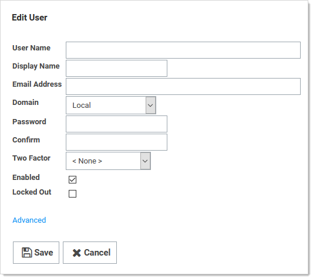

3. Type in or set the account details. 
3. Ensure that the **Enabled** check box is selected.
5. Click the **Advanced** link. Additional parameters appear:

   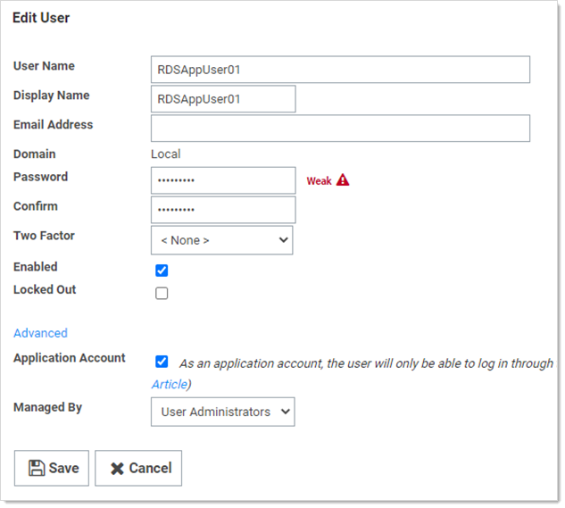

   > **Note:** Leave the Two Factor and Managed By controls set to their defaults, \<None\> and User Administrators. Because this account is for SSSC and not a human being, 2FA is not appropriate.

3. Click to select the **Application Account** check box. As an application account, the user can only log on through the application account API and does not require a separate user license.

   > **Note:** We recommend application account users because only API access is required by SSSC, and they do not consume regular user licenses.  You may want to name the users to make it obvious which server they belong to. We recommend one user per RDS server for auditing purposes and to avoid one server with invalid credentials locking out the user, impacting all the other servers. See [REST Web Services API Reference and Download](../../api-scripting/rest-api-reference-download/index.md) for more about the API.

7. Click the **Save** button.
8. Repeat this process for each RDS server if you are clustering more than one.

#### Enabling Application Account RDS Credential Sharing

Each RDS application account must have view access to the RDS Credential that the RDS server(s) use to manage the temporary Windows local accounts:

1. Go to the RDS credential secret you created earlier.
1. Click the **Sharing** tab:

   

1. Grant view access to the applicable application account users. That is usually one SS user account per RDS server. If you are using a cluster, this secret would be an Active Directory secret for a domain credential that all the RDS servers can use, and you would share it with each of the RDS application accounts for each RDS Server in the cluster using in their SSSC configuration.

#### Configuring Session Connector Custom Launchers

You must create a custom launcher for each combination of and RDS server cluster and custom launcher type:

1. Go to **Admin \>  Secret Templates**.
1. Click the **Configure Launchers** button. The Launcher Types page appears.
1. Click the **New** button. The Launcher page appears:

   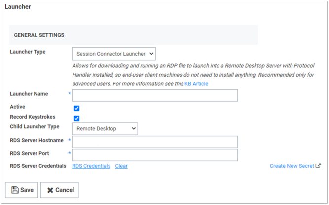

1. Type or set the parameters as follows:

   - **Launcher Type:** Session Connector Launcher. This launcher type will not be visible until the Configuration Advanced Setting is enabled.
   - **Active:** Ensure this is selected.
   - **Record Keystrokes:** Check to record keystrokes in addition to video on related secrets with session monitoring enabled.
   - **Child Launcher Type:** Click to select the launcher type, such as Remote Desktop or PuTTY. This is the real launcher type that runs on the RDS server to connect to the secret. 
   - **RDS Server Hostname:** IP or hostname for the RDS server or cluster.
   - **RDS Server Port:** Type the port. The default RDP port is TCP 3389.
   - **RDS Server Credentials:** Click the **RDS Credentials** link to pick the Secret configured above for credentials that can create and delete local users. If RDS Server Hostname points to a cluster, all servers must be able to use these credentials.

1. Click the **Save** button.

####  Assigning Session Connector Custom Launchers to Secret Templates

1. Go to **Admin \>  Secret Templates**. The Manage Secret Templates page appears:

   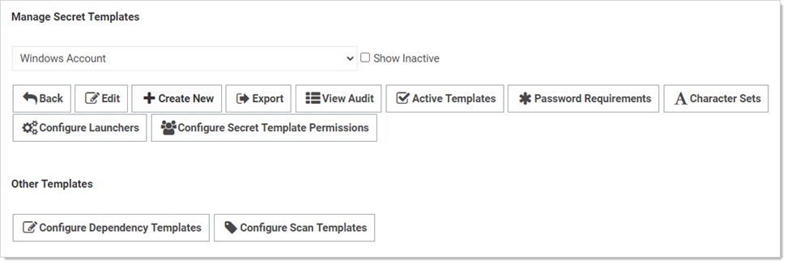

1. Click the unlabeled dropdown to select a secret template that you want to allow SSSC to launch from.
1. Click the **Edit** button to view that secret template. The Secret Template Designer page appears:

   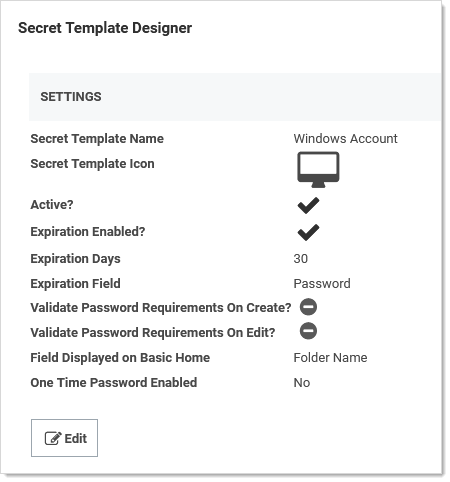

1. Click the **Configure Launchers** button at the bottom of the page to open the launcher mappings. The Secret Template Edit Launcher Configuration page appears:

   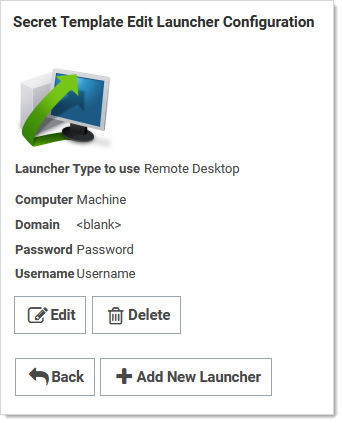

1. Click the **Add New Launcher** button. A page of the same name appears:

   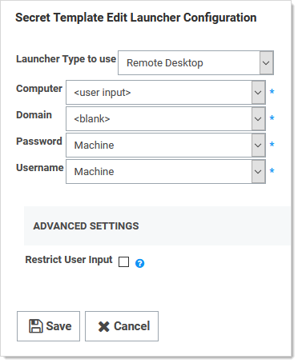

1. Click to select the desired parameters for the launcher:

   

1. All secrets using this template are now ready to run SSSC launches.

# Task 2: RDS Setup

### Step 1: Install the Secret Server RDS Protocol Handler

1. Go to the [Session Connector Download](../session-connector-download/index.md) page.
1. Download the SSPH (RDP) installer file,  `SSProtocolHandlerRDS.msi` .
1. (Optional) Ensure the listed hash value matches that for the file.

> **Note:** SSPH (RDP) is a special version of SSPH that can record keystrokes on its own, if configured in SS. Due to this optional keystroke recording, you may need to whitelist the SSPH (RDP) file in any antivirus software running on the server. This is not currently necessary with Windows Defender.

> **Note:** SSPH (RDP) does not auto-update itself, unlike SSPH, because this could cause problems with multiple users running it at once on a single RDS server. Older SSPH (RDP) versions will continue to work with new SS releases until updated, but a manual update is required on the RDS server(s) to take advantage of any future SSPH (RDP) features.

### Step 2: Add the Remote Desktop Collection and Application

1. While logged in as a domain user, go to Server Manager:

   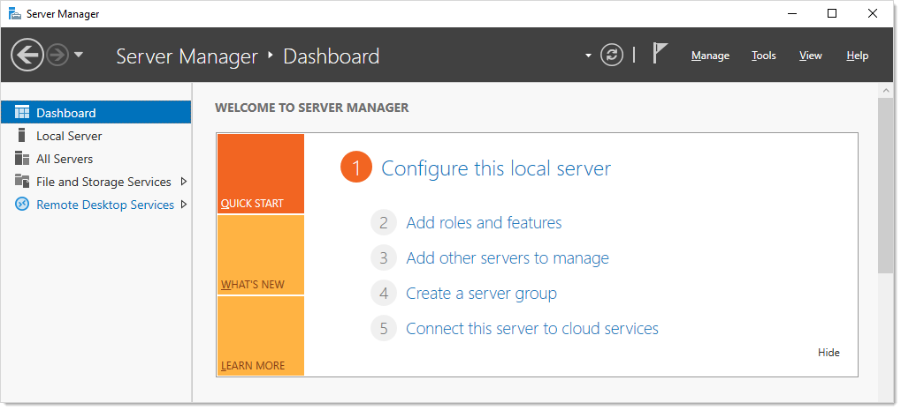

1. Click the **Remote Desktop Services** menu item on the left. The Overview page appears:

   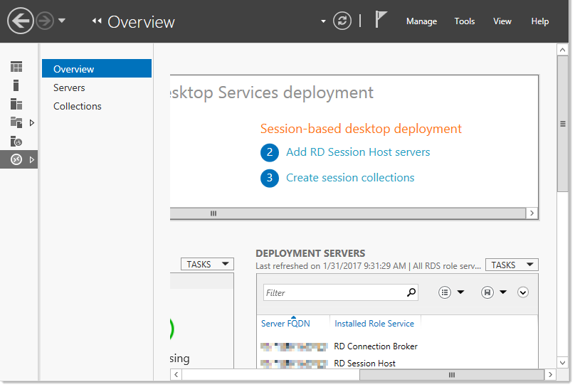

   > **Note:** If you logged on as a local user, you will see this error and be unable to configure RDS. You must be logged on as a domain user. 
   >
   > 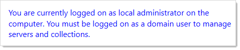

1. Click the Collections menu item. The Collections page appears:

   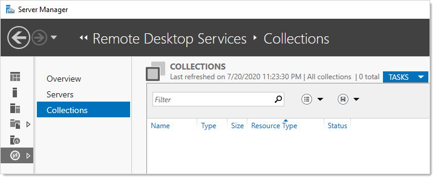

1. Click the **Tasks** dropdown list and select **Create Session Collection**. The **Create Collection** wizard appears on the Before You Begin page:

   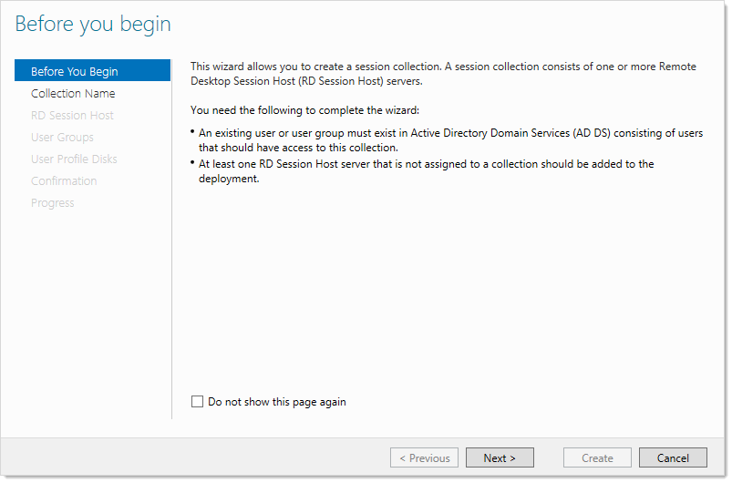

1. Click the **Next \>** button to arrive at the Collection Name page:

   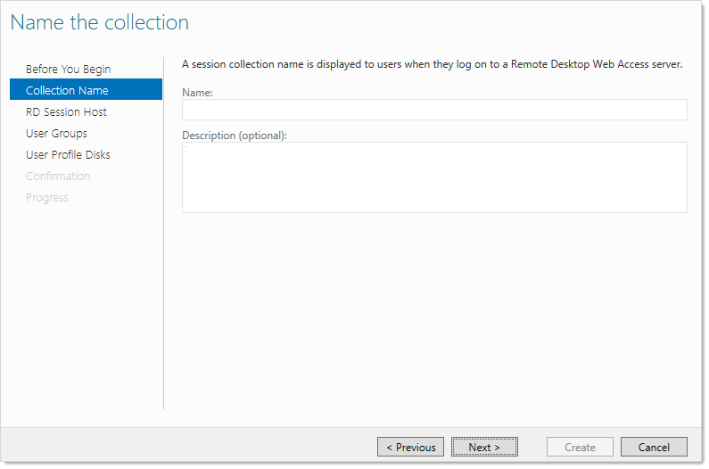

1. Type `Session Connector` in the **Name** text box. 
1. Click the **Next \>** button. The Specify RD Session Host Servers page appears:

   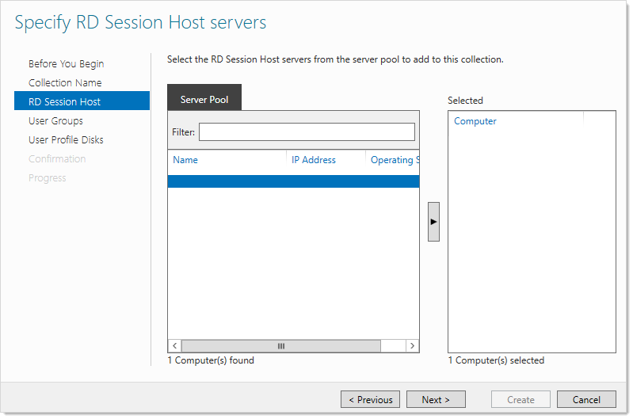

1. Add the local server from the left side (**Server Pool**) to the right side (**Selected**).
1. Click the **Next \>** button. The User Groups page appears:

   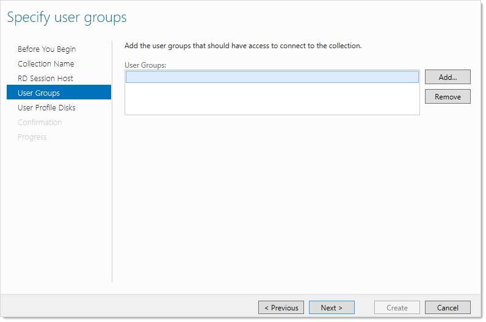
   
1. Select **Domain Users** in the **User Groups** list. This is not actually used by SSSC (it creates temporary local users), but RDS requires that something is selected.
1. Click the **Next \>** button. The User Profiles page appears.

   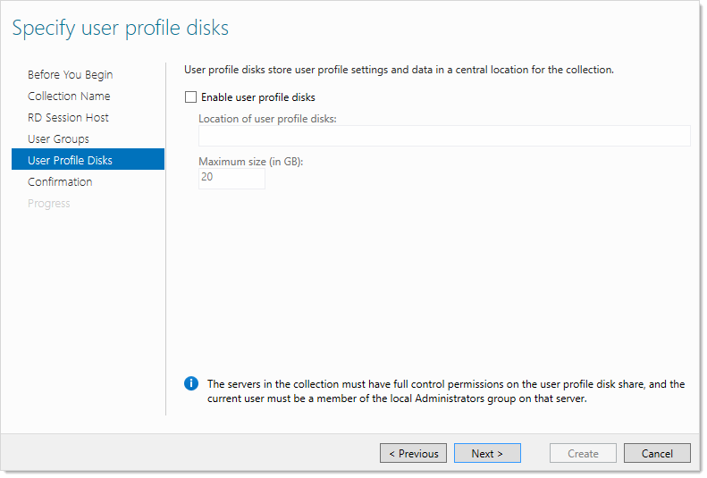
   
1. Click to select the **Enable user profile disks** check box. SSSC does not use user profile disks. We select the check box to enable the Create button.
1. Click the **Create** button. The collection is created, and the wizard disappears. The SSSC is now listed under Collections: 

   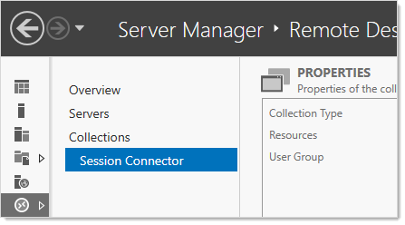
   
1. Click the **Tasks** dropdown list in the **Properties** section and select **Edit Properties**. The Properties  popup appears.
1. In the left menu, click **Security**:

   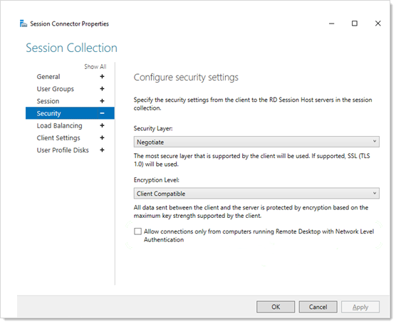
   
1. Click to deselect the **Allow connections only from computers…** check box. This necessary because SSSC uses temporary one-time use local users that do not exist until a connection is authenticated with SS, making them incompatible with network-level authentication.
1. (Optional) If you want to restrict what can be mapped at the server level, such as drives, you can do so on the **Client Settings** tab. This is also configurable in SS on each secret.
1. Click the **OK** button. The popup disappears.
1. Click the collection name in the menu on the left.

1. In the **RemoteApp Programs** section, click the **Tasks** dropdown and select **Publish RemoteApp Programs**.
1. Click the **Add…** button to add the RemoteApp for RDS protocol handler. A dialog box appears.
1. Navigate to `C:\Program Files\Thycotic Software Ltd\Secret Server Protocol Handler`.
1. Select `RDPWin.exe`.

1. Click the **Open** button. The dialog closes, and RDPWin (SSSH (RDP)) is now selected in the list:

    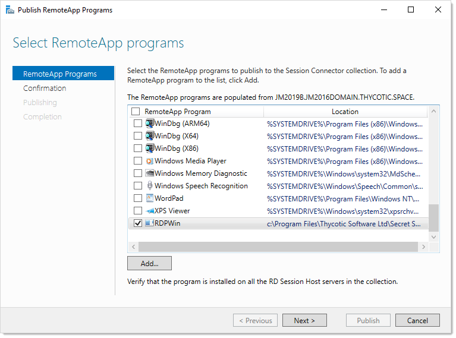

1. Click the **Next \>** button. The Confirmation page appears.
1. Click the **Publish** button to save.
1. Click the **Close** button.
1. On the RemoteApp Programs page, right click **RDPWin RemoteApp** and select **Edit Properties**. A property page appears.

1. Click the Parameters menu item on the left:

    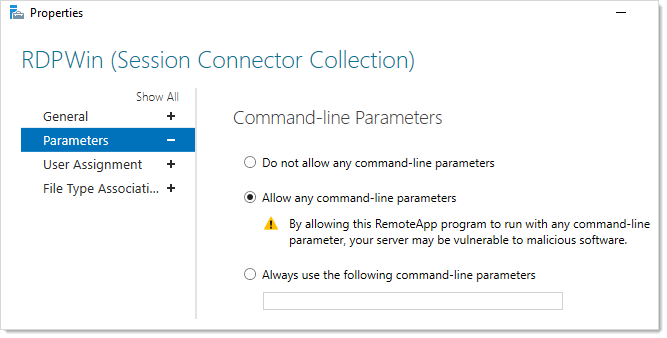

1. Click to select the **Allow any command-line parameters** selection button.
1. Click the **OK** button.

### Step 3: Configure RDS-related Group Policy Settings

To configure on a single server:

1. Run the Group Policy Editor (gpedit.msc).
1. Go to **Computer Configuration \> Administrative Templates \>  Windows Components \>  Remote Desktop Services \> Remote Desktop Session Host \>  Session Time Limits**.
1. Click **Set time limit for logoff of RemoteApp sessions** to edit it. Its properties appear:

   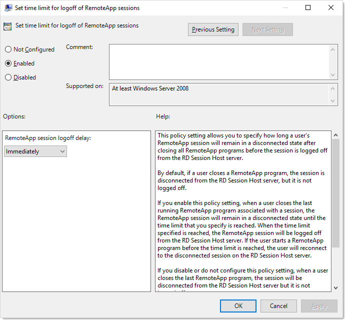

1. Click the selection buttons to select **Enabled**.
1. Click the **RemoteApp session logoff delay** dropdown list and select **Immediately**.
1. Click the **OK** button to save. 

### Task 4: Install the Secret Server Session Connector

1. Go to the [Session Connector Download](../session-connector-download/index.md) page.
1. Download the `SSSessionConnector.msi`  SSSC installer file.
1. (Optional) Ensure the listed hash value matches that for the file.
1. Run the file.
1. When prompted, type the SS URL and application account username and password you previously configured. The SS URL must start with `https://` for security reasons, or the installer will not proceed.
1. When the installation is finished, you are prompted to reboot the server. This is to restart all of the remote desktop and terminal service services.
1. Once the server reboots, it will be a SSSC listening on the RDP port (TCP 3389). You can now use the SSSC custom launchers connected to it.

### Task 5: Updating API Credentials

The credentials for the SA application account are saved encrypted in the registry. The credentials are restricted to the NETWORK SERVICE account, which Remote Desktop runs under using DPAPI-NG.

If those application account credentials change in the future, follow these steps to update them:

1. Run the Windows Registry Editor, `Regedit.exe`.
1. Navigate to `HKLM\SOFTWARE\Thycotic\SessionConnector`.
1. Set **CredentialsEncrypted** to 0.
1. Set **SecretServerUsername** to the plain text new username.

1. Set **SecretServerPassword** to the plain text new password.

These credentials are encrypted upon their first use, either the next time someone launches a SSSC session that hits this server, or if you reboot the entire server. Once this happens, returning to the Registry Editor, CredentialsEncrypted will be set back to “1,” and an encrypted version of the username and password will be visible.

### Task 6: Launching Session Connector Sessions

Now that it has been configured and installed, you should be able to launch SSSC sessions.

Once configured, the SSSC custom launchers appear just like any other launcher on the associated secret template types. When clicked, a Remote Desktop shortcut (.RDP) file is downloaded. This .RDP file can then be opened by standard Remote Desktop clients, such as mstsc.exe in Windows or RoyalTS in OSX.

When launched, the end-user will connect to the RDS host configured on the SSSC custom launcher. The RDS host then launches the RDS protocol handler and connects to the actual destination machine.

# Troubleshooting Session Connector

When launching a downloaded .RDP file, if SSSC rejects the session due to any issues (including being expired based on the “Session Connector Session Timeout” setting), the user’s Remote Desktop client will receive a generic error about the RemoteApp being invalid.

In the `SS.log` file, you can search for “SessionConnector” to find details about why sessions may have been rejected.

Session Connector will also log to the file `C:\Program Files\Thycotic Software Ltd\Secret Server Session Connector\log\SS-SC.log` on each RDS server. That is, If the RDS server has trouble using the supplied RDS credential to create a local user, it is logged to this file

# Uninstalling Session Connector

Secret Server Session Connector can be removed from “Add/Remove Programs” or “Apps & Features.” Once uninstalled, a reboot is required to restore the default Remote Desktop behavior.

Any related SSSC custom launchers need to be un-associated with any secret templates they were previously tied to. 

> **Note:** It is not currently possible to delete a custom launcher in SS, but if it is unassociated with all secret templates, it will not appear on any secrets.