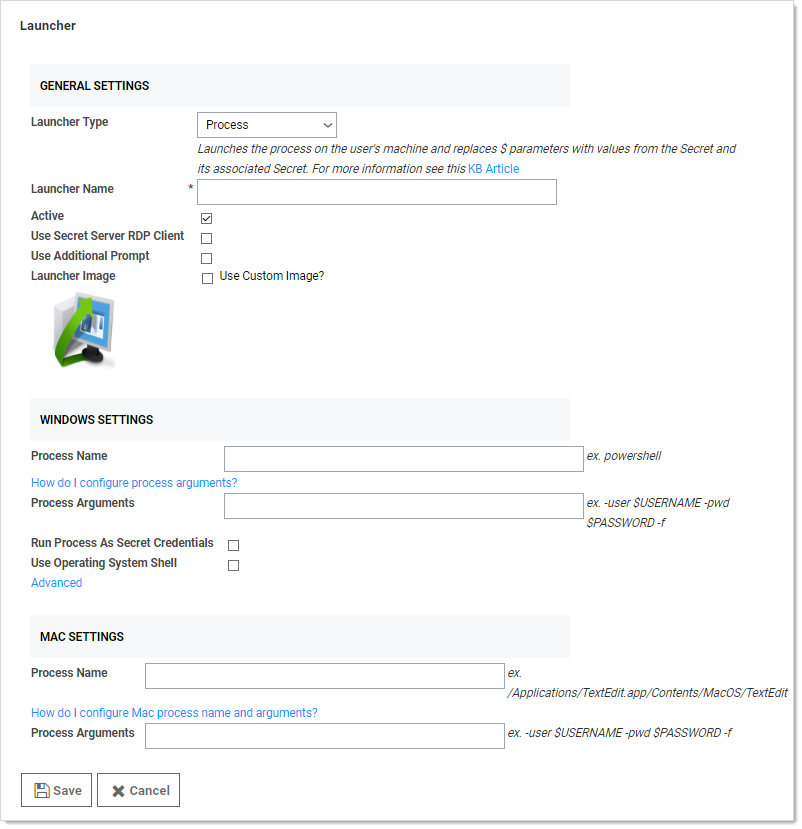

[title]: # "Custom Launchers"
[tags]: # "Launcher"
[priority]: # "30"

# Custom Launchers

SS can configure a program to run when clicking the launcher on a secret. You can customize process launchers to work with any application that can be started by command-line and passes values to the command-line from the secret text fields. For process launchers to work, the client machine needs to have the program installed and typically needs the program folder in the PATH environment variable.

There are three types of custom launchers to choose from:

- **Process:** Launch a process on the client machine that connects directly to the target system from the client.

- **Proxied SSH Process:** Launch a process on the client machine that proxies its connection to the target system through SS.

> **Note:** See [Configuring SSH Proxies for Launchers](../..//launcher-configuration-and-support/configuring-ssh-proxies-for-launchers/index.md).

- **Batch File:** Launch a batch file from the client machine.

To create a new custom launcher:

1. Select **Secret Templates** from the **Admin** main menu item. The Manage Secret Templates page appears:

   

1. Click the **Configure Launchers** button.

1. Click the **New** button.  The Launcher page appears:

   

The following settings are available in the General Settings section:

> **Note:** Not all of the following are available for all types of launchers.

- **Launcher Type:** Select Process, Proxied SSH Process, or Batch File.
- **Launcher Name:** Name of the launcher that is displayed to the user.
- **Active:** Whether the launcher is active for use.
- **User Secret Server RDP Client:** Use the RDP client.
- **Use Additional Prompt:** User is prompted for additional information when using the launcher. When selected, the Additional Prompt Field Name text box appears.
- **Additional Prompt Field Name:** Name of the text field that is prompted for when the user uses the launcher. This value can be referenced in the process arguments with a `$` prefix.
- **Launcher Image:** Upload a custom image for the launcher.

The following setting are available in the Windows Settings section:

- **Process Name:** Name of the process that is launched. Example: `powershell`
- **Batch File:** As an alternative to opening a process, upload a `.bat` file that is downloaded and executed on the client when the user runs a launcher. The file is deleted from the client after execution.
- **Process Arguments:** Process arguments depend on the process that is being launched. View the built-in SQL Server launcher for examples on how the text-entry fields are substituted. For greater flexibility, other secrets can be linked on the Launcher tab on the secret. The text-entry field values from those secrets can also be used in the process arguments using the same prefix `$[1][FieldName]` syntax as the SSH custom commands. There is a launcher specific token `$SESSIONKEY` that can be passed to the command line. This passes an identifier to the customer launcher that can be used to anonymously check in the secret using the CheckInSecretByKey Web service method. Example: `-user $USERNAME -pwd $PASSWORD -f`. See [Configuring Custom Launcher Process Arguments](https://thycotic.force.com/support/s/article/Configuring-Custom-Launcher-Process-Arguments) (KB) for details.
- **Run Process as Secret Credentials:** The process authenticates with the secret credentials (username, domain, and password) instead of the client user that is using the launcher. This can be overridden at the secret level to use a privileged account to run the process.
- **Use Operating System Shell**: Use the OS shell for the launcher. Useful for processes requiring UAC confirmation.

The following settings are available in the Advanced Windows Settings section, which is accessible by clicking the **Advanced** link:

- **Escape Character:** The character to use as an escape character in passwords. Escape characters are required to allow the use of characters that are otherwise not allowed in passwords because they have special meaning to the launcher's target application. 
- **Characters to Escape:** The characters that require escaping for the target application. 

The following setting are available in the Mac Settings section:

- **Process Name:** Name of the process that is launched. Example: `/Applications/TextEdit.app/Contents/MacOS/TextEdit`
- **Process Arguments:** Process arguments depend on the process that is being launched. View the built-in SQL Server launcher for examples on how the text-entry fields are substituted. For greater flexibility, other secrets can be linked on the Launcher tab on the secret. The text-entry field values from those secrets can also be used in the process arguments using the same prefix `$[1][FieldName]` syntax as the SSH custom commands. There is a launcher specific token `$SESSIONKEY` that can be passed to the command line. This passes an identifier to the customer launcher that can be used to anonymously check in the secret using the CheckInSecretByKey Web service method. Example: `-user $USERNAME -pwd $PASSWORD -f`. See [Configuring Custom Launcher Process Arguments](https://thycotic.force.com/support/s/article/Configuring-Custom-Launcher-Process-Arguments) (KB) for details.
