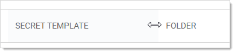

[title]: # (Customizing the All-Secrets Page)
[tags]: # (Secret)
[priority]: # (20)

# Customizing the All-Secrets Page

On the main menu, there is a **Secrets** folder tree. When you click on the root or any subfolder, you see a list of all the secrets in that folder with multiple columns. You can customize what you see in one of three ways:

## Customizing Visible Columns

You can display additional columns on the grid by clicking the icon. This data can be either secret metadata or template text-entry fields that have been set to be available for viewing. To select additional columns to display, click the **Advanced** link and then the **Column Selection** link. You can display the following metadata fields:

- Auto Change Enabled
- Checked out
- Checkout Enabled
- Created
- Days until Expiration
- Deleted
- Double Lock Enabled
- Expiration Field Changed
- Folder
- Inherits Permissions
- Heartbeat
- Hide Password
- Last Accessed
- Machine
- Notes
- Requires Approval
- Requires Comment
- Secret Template
- Username

## Filtering Search Results

You can filter secret search results by selecting a folder on the left, either by clicking it or using the search text-entry field above the folder tree. On the right side of the widget, secrets can be filtered further by specifying search criteria in the top text box. The Advanced section allows filtering by secret template and status, as well as the option to include secrets contained in subfolders. Advanced criteria only remain in effect while those options are expanded (visible).

## Sizing Columns

You can resize any of the columns by hovering the cursor over the border between them till it turns into a double arrow:

Click and drag to resize the column.
