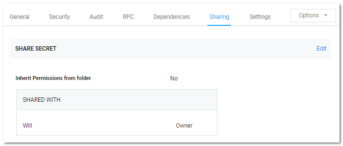
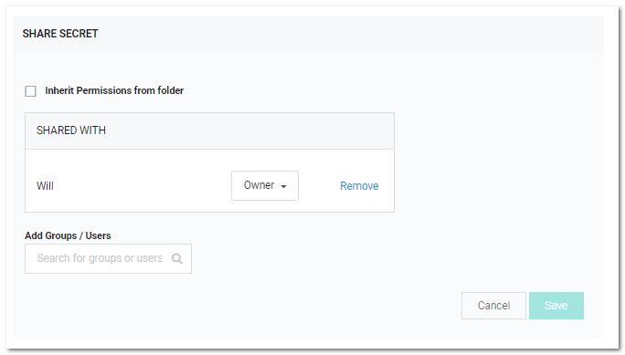

[title]: # (Sharing Secrets)
[tags]: # (Share Secret)
[priority]: # (1000)

# Sharing Secrets

Sharing passwords is crucial for information technology teams. Due to the sensitive nature of sharing secure information, SS ensures shared passwords are tracked and guarded.

## Permissions

There are three permission levels to choose from when sharing secrets with another user or group:

- **View:** User may see all secret data, such as username and password, and metadata, such as permissions, auditing, history, and security settings.

- **Edit:** User may edit the secret data. Also allows users to move the secret to another folder unless the Inherit Permissions from Folder setting is turned on, in which case the user needs Owner permissions to move the secret.

- **List:** User may see the secret in a list, such as a list returned by running a search, but not to view any more details about a secret or edit it.

- **Owner:** User may change all the secret's metadata.

> **Note:** Password text-entry fields are not visible if a secret has a launcher and the Hide Launcher Password setting is on or the user does not have the View Launcher Password role permission.

Secrets can be shared with either groups or individual users. The Secret Sharing section allows secrets to be configured for access.

## Procedure

To add or remove secret sharing:

> **Note:** To simplify the sharing process, new secrets automatically inherit the settings from the folder they are stored in. That is, we enable the **Inherit Permissions from Folder** check box on the **Sharing Edit** page by default, so secrets inherit all the parent folders' sharing settings. As long as this check box is selected, you cannot set the permissions for the secret. For more on folder security, see the [Folders](../../../secret-folders/index.md) section.
$1
$2$1
$2
   
$1
$2
   
$1
$2$1
$2$1
$2$1
$2$1
$2$1
$2
You can also modify sharing settings for users or groups that already have sharing enabled for the secret. If a user or group is not displayed, they do not have access to the secret.
