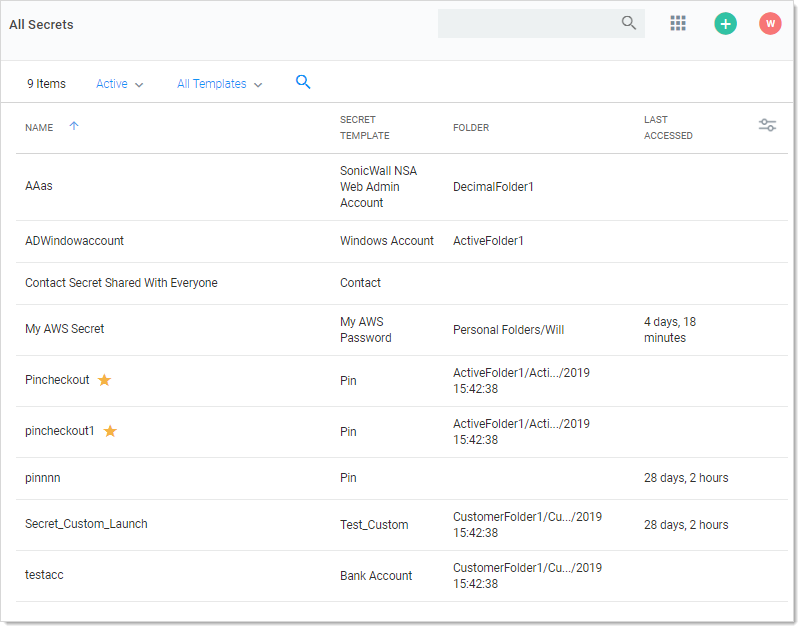
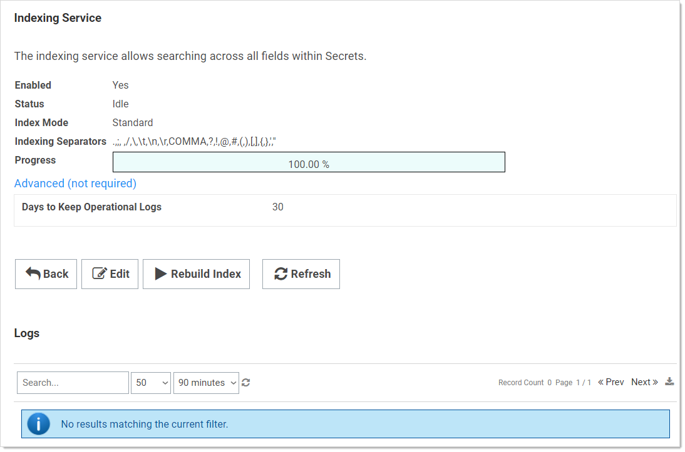
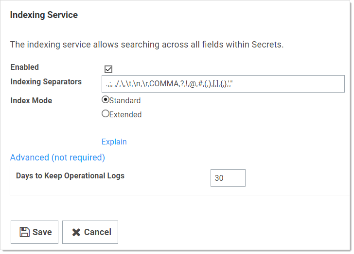

[title]: # (Searching and Search Indexer)
[tags]: # (Search)
[priority]: # (30)

# Searching and Search Indexer

## Searching for Secrets

To search for secrets:

1. Click the **Secrets** menu item in the main menu. The All Secrets page appears:

   

1. Type the secret name or other text in the unlabeled search text box at the top of the page.

1. Click the  button. The All Secrets table only displays matching secrets. Searches search for all text-entry fields that are configured as searchable on the secret's template if the extended search indexer is enabled.

   > **Important:** If the search indexer is not enabled, searches are only performed on the **Secret Name** text field.

## Search Indexer

The _search indexer_ allows searching on all text-entry fields set to searchable on the template. To enable and configure the search indexer:

1. Click the **Admin** button on the main menu and select **See All**. The Administration page appears:

   

1. Type and then click Search Indexer in the Search text box. The Indexing Service page appears:

   

1. Click the **Edit** button. The page becomes editable:

   

1. Ensure the **Enabled** check box is selected.

1. Click either the **Standard** or **Extended** selection button.

   - *Standard search mode* is the default and searches on whole words in a field value. For example, a field value of "My AWS Secret" would match when you search for *My AWS Secret*, *My*, or *Secret*.

   - *Extended search mode* searches for whole words or a partial words by up to twelve characters. For example, a field value of "My AWS Secret" would match when you search for *My AWS Secret*, *My*, *Secret*, *WS*, or *ecret*. This is more useful, but may impact search performance and creates a larger index table.

   > **Note:** Indexing separators are used to split the text text-entry fields into search terms. By default, the separators are semi-colon, space, forward slash, back slash, tab (\t), new-line (\n), return (\r), and comma. Changes to the indexing separators require a full rebuild of the search index.

1. Change the **Days to Keep Operational Logs** text box to set the period to keep indexing-related logs that might contain PII. SS automatically deletes logs older than that (in days).

1. Click the **Save** button. The Indexing Service page reappears, and the indexing begins in the background.  Depending on the size of the SS installation, it may take awhile. Progress is shown on the Progress bar.

1. If you changed the indexing separators, click the **Rebuild Index** button.
