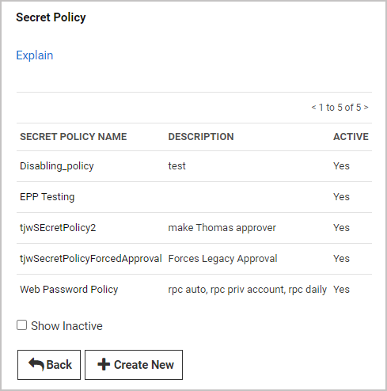

[title]: # (How to Create a Secret Policy)
[tags]: # (create,security,policy,setting,enforced)
[priority]: # (1000)

# How to Create a Secret Policy

A secret policy is a set of rules that you can apply all at once to multiple secrets. For example, a secret policy could include rules about remote password changing or security settings, and you could apply all of the rules as a single policy to multiple secrets, whether the secrets reside in the same folder or different folders.

Follow the procedure below to create a secret policy:

1. Click **Admin \> Secret Policies**.

1. In the **Secret Policy** window, click **Create New**.

   

1. The next **Secret Policy** window, enter a **Secret Policy Name** and **Description** for your new security policy.

   

   Because you are creating a brand-new secret policy, the value in the **SETTING** column for every policy item is **\<Not Set\>**.

   

1. In a row for one of the policy items, click the **\<Not Set\>** setting. The field drops down to display all three settings available: **\<Not Set\>**, **Default**, and **Enforced**.

   

   The meanings of these settings are as follows:

   * **\<Not Set\>** means the policy item will not be activated on any secret you attach the policy to.

   * **Default** means the policy item will be activated on all secrets you attach the policy to. After you attach the policy to secrets, you can go into individual secrets and change this setting on any policy item.

   * **Enforced** means the policy item will be activated on all secrets you attach the policy to. After you attach the policy to secrets, you cannot change this setting on any policy item.

1. Leave **\<Not Set\>** in the **SETTING** column, or change **\<Not Set\>** to either **Default** or **Enforced**. When you change a setting to **Default** or **Enforced**, additional controls appear in the **VALUE** column, enabling you to perform actions such as activating the policy item setting, selecting an associated secret, creating a new associated secret, or selecting an option from a drop-down list. If a checkbox appears in the **VALUE** column, it means that even though you changed the drop-down setting to **Default** or **Enforced**, your new setting will not be activated for the policy item until you check the box.

   

1. When you have made your selections for all policy items in your secret policy, check the box next to **Active** just below the **Description** field. Checking the **Active** box activates the secret policy you have just created, making the policy visible and available for use where applicable in Secret Server. If you do not click the box next to **Active** now, you can still click **Save**, then come back later to check the **Active** box.

1. At the bottom of the **Secret Policy** window, click **Save**.
