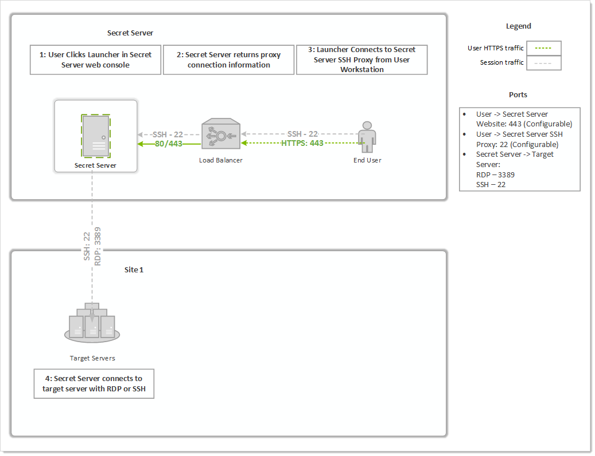

[title]: # (SSH Proxy Configuration)
[tags]: # (SSH Proxy,Networking)
[priority]: # ()

# SSH Proxy Configuration

The Secret Server proxy routes SSH and RDP sessions and helps protect the endpoint credentials. There are two configuration options for proxying:

- Proxy through the SS Web application
- Proxy through a distributed engine

> **Note:** To learn more about RDP Proxying, please see [RDP Proxy Configuration](../../rdp-proxy/rdp-proxy-configuration/index.md).

##  Enabling Proxy

1. Go to **Admin \> SSH Proxy**.
1. Enable **SSH Proxying**.
1. Generate a new key.
1. To enable proxying on Web nodes, edit the row in the **Endpoints** tab to set the **Public Host** and **Bind IP Address**. For a standard server, these can be the same, but if the public IP of the server is not set on the server (such as a load balancer or an EC2 instance with an elastic IP), they will be different.
1. To enable proxying for a specific site and all engines within that site, edit the row in the **Sites** section and enable proxying and set the **SSH Port**.
1. The engines for the sites are listed in the **Engines** section. The **Hostname/IP Address** is the public host or IP the launcher connects to and the **SSH Bind Address** is the IP on the server that the SSH proxy is listen on. Again, these will typically be the same, but may be different if the resolvable IP or host of the engine machine is different than the IP on the network adapter on the machine.
1. Enable proxying on a secret with a PuTTY launcher. The launcher now connects to the assigned site, which is set on the **General** tab. If the site has proxying enabled, it will go through the engines available in the site, otherwise it will use the SS Web application proxy.

## Web Application Proxy Performance

### Minimum Hardware

- Intel 3.7 GHz Quad Core
- 16 GB of RAM
- 100 MB/s plus network capability

### Session Activity

We tested sessions with standard usage, such as opening and modifying files and navigating the file system on Linux. On Windows, the activity was opening MMC snap-ins, editing files, and copying files through the RDP session. If you have constant large file transfers across multiple concurrent sessions or otherwise transferring large amounts of data (such as streaming a video through an RDP session), the maximum concurrent sessions will be significantly reduced.

**Table:** Concurrent Proxy Sessions

| **Protocol** | **Concurrent Sessions** |
| ------------ | ----------------------- |
| SSH          | 300                     |
| RDP          | 100                     |

## Proxy Connections

Connections from the user to the proxy are over SSH, and you can configure the port. The user's machine will connect to either an sngine SSH proxy or the SS Web application SSH proxy. 

**Figure:** Default Secret Server Web Application Proxy (example)



**Figure:** Proxy through a Distributed Engine (example)


## SSH Proxy with Multiple Nodes

If you are using clustering with SS, you can pick exactly which of your nodes act as a SSH proxy by going to the **Admin \> SSH Proxy** page and scrolling down to the **Nodes** section. For each node you wish to be a proxy, configure the **SSH Public Host** (must be an IP address, not a DNS name) and the **SSH Bind IP Address** (use 0.0.0.0 to easily bind to all IPv4 Ps on a server). There is no need to configure all nodes if you do not want them all to be proxies.

As soon as the IPs are saved for each node, the node should start listening on the SSH proxy port. You can  verify that with netstat. If you do not see the node listening on your chosen port, perform an IIS reset and hit its SS website. It should be listening once SS starts up again. For example:

```bat
C:\Users\Administrator>netstat -ano | find ":22"
TCP  0.0.0.0:22  0.0.0.0:0  LISTENING  3600
```

Now, when a user connects to the SS Web page, if the node they are hitting is setup to be a SSH proxy, they will connect to that node's SSH public host IP. If the node they are connected to is not setup to be a SSH proxy, then users will round robin between the other nodes that are SSH proxies and connect to their SSH public host IP.
