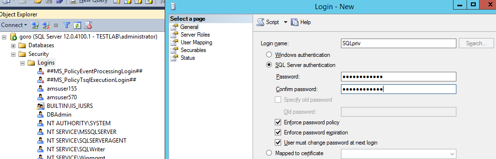
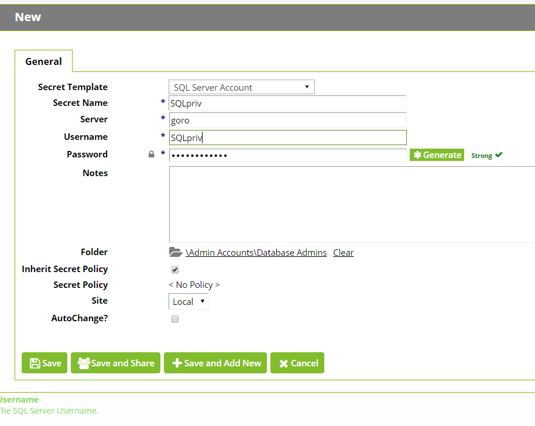
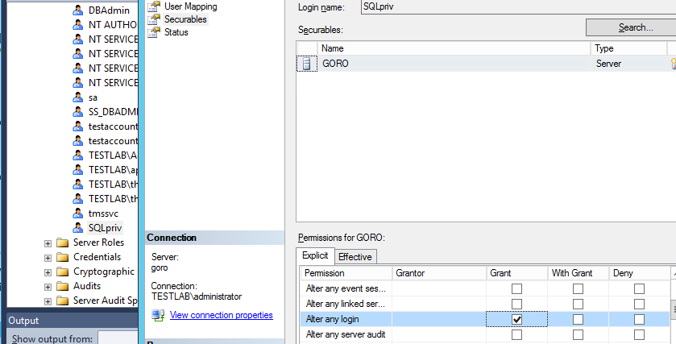
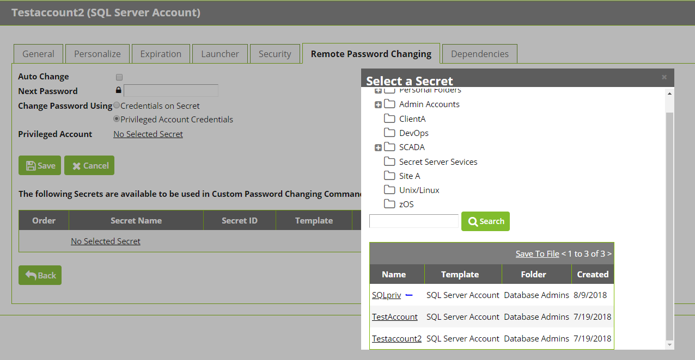

[title]: # (Creating and Using a SQL Server Privileged Account)
[tags]: # (Setup,Install,sql server)
[priority]: #	(1000)
[display]: # (none)

# Creating and Using a SQL Server Privileged Account  

==Added but not polished—invisible==

## Overview

This document will enable the user to password change SQL accounts using a privileged account. Enabling the takeover of those accounts without knowing their password.

 

## Create Account

Open SQL Server Management Studio and connect to your database server.

Expand the root level security folder then right click on the Logins folder

Select New Login

Give account a Login name and select SQL authentication. 

                               

Now go to Secret Server and create a secret using the **SQL Server Account** template. Give it the same Username as the Login name you are creating. For best security click the generate button on the secret password field and copy that password to the account creation wizard in SQL Server Management Studio and then Click OK and save your secret. 

 

## Assign Permissions

Right click on the SQL login and click properties. Select Securables from the left column then select Grant for Alter any login.

 

 

 

## Utilize Account  

In Secret Server select the SQL account secret you are going to have leverage your new privileged account. Select the Remote Password Changing tab and click Edit. Where it says “Change Password Using” select the “Privileged Account Credentials” radio button. Then select the underlined text “No Selected Secret” and find the secret we created for our privileged account in the first section, select it and save. Now click the “Change password remotely” button and provide or generate a new password and click Change. You have now successfully changed a SQL account password using a privileged account. 

 

 

You can also assign the account to be used by multiple secrets by creating a secret policy and apply that policy to a folder. 